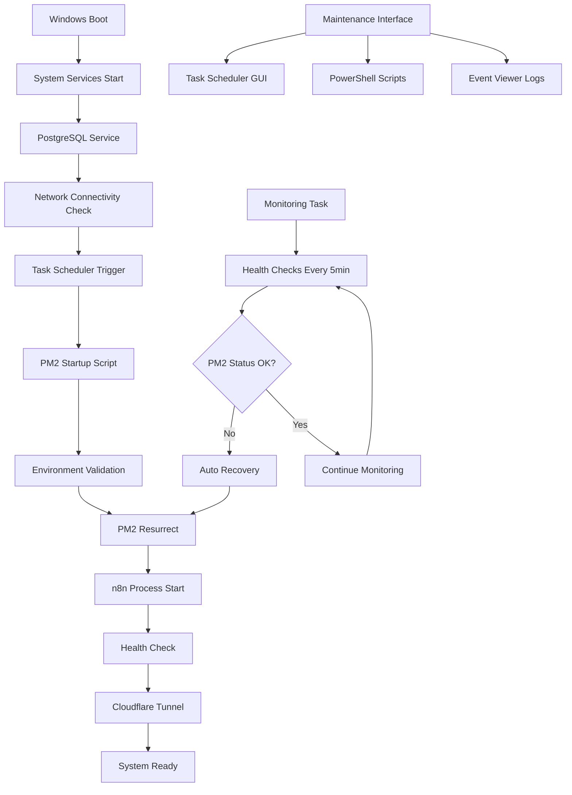
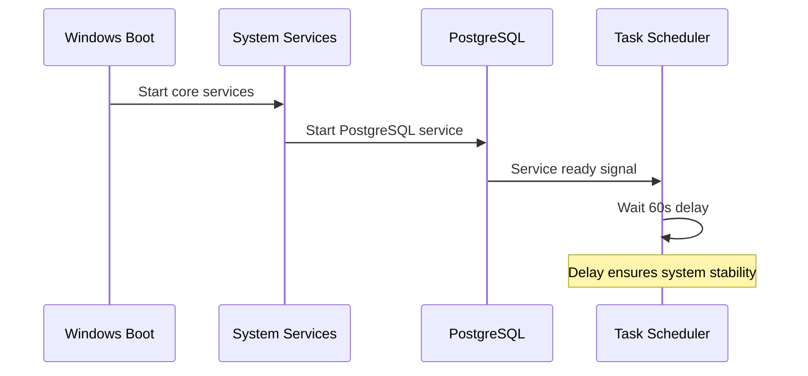
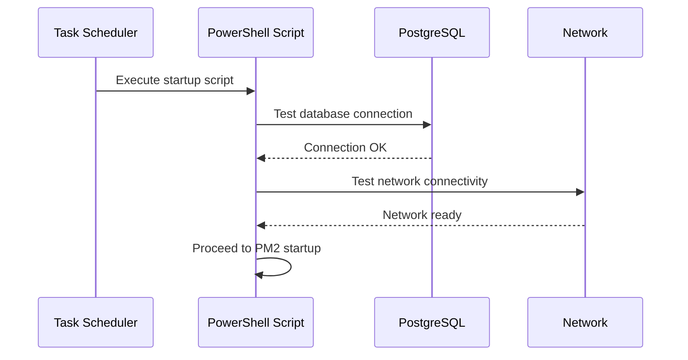
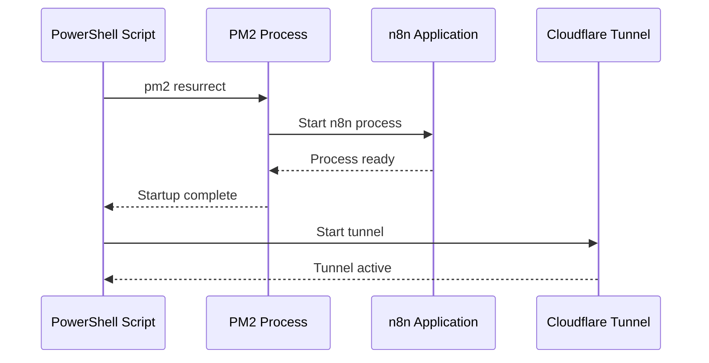
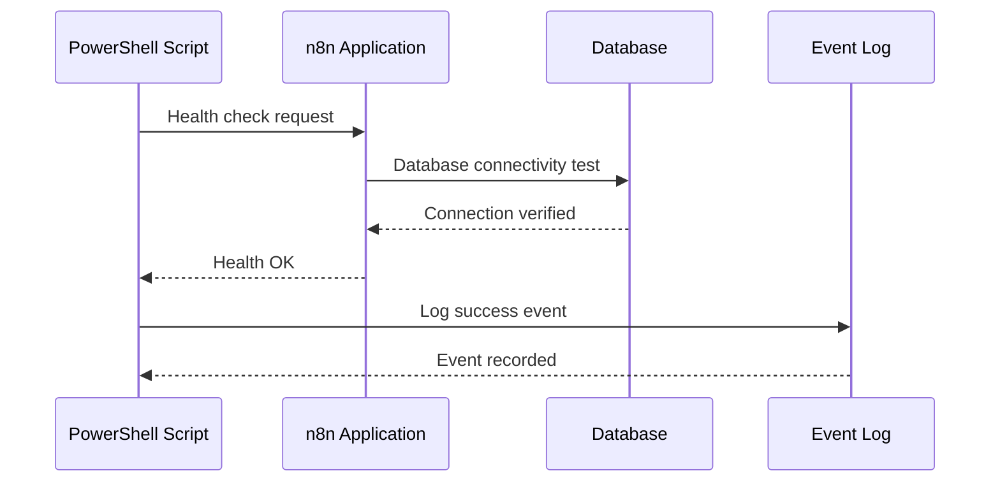

# PM2 Auto-Startup Architecture Design
## Task Scheduler Based Solution for Strangematic.com

---

## 🏗️ EXECUTIVE ARCHITECTURE OVERVIEW

**Recommended Solution:** **Windows Task Scheduler** với multi-layered startup sequence
**Primary Focus:** Reliability + Ease of Maintenance cho Product Designer workflow
**Target Environment:** ${DOMAIN_PRIMARY} trên ${SYSTEM_MODEL}

### Architecture Principles
1. **Reliability First**: Robust startup sequence với dependency management
2. **Maintenance Simplicity**: GUI-based management với PowerShell automation
3. **Conservative Resource Usage**: Tuân thủ ${HARDWARE_RAM_ALLOCATED_N8N} RAM limit
4. **Domain Integration**: Full compatibility với strangematic.com infrastructure

---

## 🎯 SYSTEM ARCHITECTURE DIAGRAM



---

## 🔧 CORE COMPONENTS ARCHITECTURE

### 1. Primary Startup Task
**Task Name:** `StrangematicHub-AutoStart`
**Trigger:** System Startup (Delayed 60 seconds)
**Security Context:** SYSTEM account
**Priority:** High

```xml
<!-- Task XML Configuration Template -->
<Task version="1.4" xmlns="http://schemas.microsoft.com/windows/2004/02/mit/task">
  <RegistrationInfo>
    <Description>Strangematic n8n Automation Hub Auto-Startup</Description>
    <Author>Strangematic Automation</Author>
  </RegistrationInfo>
  <Triggers>
    <BootTrigger>
      <Enabled>true</Enabled>
      <Delay>PT60S</Delay>
    </BootTrigger>
  </Triggers>
  <Principals>
    <Principal id="Author">
      <UserId>S-1-5-18</UserId>
      <RunLevel>HighestAvailable</RunLevel>
    </Principal>
  </Principals>
  <Settings>
    <MultipleInstancesPolicy>IgnoreNew</MultipleInstancesPolicy>
    <DisallowStartIfOnBatteries>false</DisallowStartIfOnBatteries>
    <StopIfGoingOnBatteries>false</StopIfGoingOnBatteries>
    <AllowHardTerminate>true</AllowHardTerminate>
    <StartWhenAvailable>true</StartWhenAvailable>
    <RunOnlyIfNetworkAvailable>true</RunOnlyIfNetworkAvailable>
    <IdleSettings>
      <StopOnIdleEnd>false</StopOnIdleEnd>
      <RestartOnIdle>false</RestartOnIdle>
    </IdleSettings>
    <AllowStartOnDemand>true</AllowStartOnDemand>
    <Enabled>true</Enabled>
    <Hidden>false</Hidden>
    <RunOnlyIfIdle>false</RunOnlyIfIdle>
    <DisallowStartOnRemoteAppSession>false</DisallowStartOnRemoteAppSession>
    <UseUnifiedSchedulingEngine>true</UseUnifiedSchedulingEngine>
    <WakeToRun>false</WakeToRun>
    <ExecutionTimeLimit>PT10M</ExecutionTimeLimit>
    <Priority>4</Priority>
    <RestartOnFailure>
      <Interval>PT1M</Interval>
      <Count>3</Count>
    </RestartOnFailure>
  </Settings>
  <Actions Context="Author">
    <Exec>
      <Command>PowerShell.exe</Command>
      <Arguments>-ExecutionPolicy Bypass -File "C:\Github\n8n-tp\scripts\pm2-auto-startup.ps1"</Arguments>
      <WorkingDirectory>C:\Github\n8n-tp</WorkingDirectory>
    </Exec>
  </Actions>
</Task>
```

### 2. Health Monitoring Task
**Task Name:** `StrangematicHub-HealthMonitor`
**Trigger:** Every 5 minutes after system startup
**Purpose:** Continuous health monitoring và auto-recovery

### 3. Startup Script Architecture
**File:** `scripts/pm2-auto-startup.ps1`
**Purpose:** Intelligent startup sequence với dependency validation

```powershell
# Architecture Overview - pm2-auto-startup.ps1
function Start-StrangematicHub {
    # Phase 1: Environment Validation
    Test-Prerequisites
    
    # Phase 2: Dependency Checks
    Wait-ForPostgreSQL
    Wait-ForNetworkConnectivity
    
    # Phase 3: PM2 Startup
    Start-PM2Process
    
    # Phase 4: Health Validation
    Test-N8NHealth
    
    # Phase 5: Cloudflare Tunnel
    Start-CloudflareTunnel
    
    # Phase 6: Final Verification
    Confirm-SystemReady
}
```

---

## 🔄 STARTUP SEQUENCE FLOW

### Phase 1: System Boot (0-60 seconds)


### Phase 2: Dependency Validation (60-90 seconds)


### Phase 3: PM2 & n8n Startup (90-120 seconds)


### Phase 4: Health Verification (120-150 seconds)


---

## 🛡️ RELIABILITY MECHANISMS

### 1. Dependency Management
**PostgreSQL Dependency:**
```powershell
function Wait-ForPostgreSQL {
    $maxAttempts = 30
    $attempt = 0
    
    do {
        try {
            $connection = Test-NetConnection -ComputerName localhost -Port 5432
            if ($connection.TcpTestSucceeded) {
                Write-EventLog -LogName Application -Source "StrangematicHub" -EventId 1001 -Message "PostgreSQL ready"
                return $true
            }
        }
        catch {
            Start-Sleep -Seconds 2
            $attempt++
        }
    } while ($attempt -lt $maxAttempts)
    
    throw "PostgreSQL not available after 60 seconds"
}
```

**Network Connectivity:**
```powershell
function Wait-ForNetworkConnectivity {
    $testHosts = @("8.8.8.8", "1.1.1.1", "app.strangematic.com")
    
    foreach ($host in $testHosts) {
        $result = Test-NetConnection -ComputerName $host -Port 443 -InformationLevel Quiet
        if ($result) {
            Write-EventLog -LogName Application -Source "StrangematicHub" -EventId 1002 -Message "Network connectivity verified: $host"
            return $true
        }
    }
    
    throw "Network connectivity not available"
}
```

### 2. Error Recovery Mechanisms
**Automatic Retry Logic:**
- Task Scheduler: 3 retries với 1-minute intervals
- Script-level: Exponential backoff cho network operations
- PM2-level: Built-in process restart capabilities

**Fallback Procedures:**
```powershell
function Start-PM2Process {
    try {
        # Primary method: pm2 resurrect
        pm2 resurrect
        Start-Sleep -Seconds 10
        
        $status = pm2 jlist | ConvertFrom-Json
        if ($status.Count -eq 0) {
            throw "No processes restored"
        }
    }
    catch {
        Write-EventLog -LogName Application -Source "StrangematicHub" -EventId 2001 -Message "PM2 resurrect failed, using ecosystem config"
        
        # Fallback: Start from ecosystem config
        pm2 start "C:\Github\n8n-tp\ecosystem-stable.config.js" --env production
    }
}
```

### 3. Health Monitoring Architecture
**Continuous Monitoring Task:**
```xml
<!-- Health Monitor Task Configuration -->
<Triggers>
    <TimeTrigger>
        <Repetition>
            <Interval>PT5M</Interval>
            <StopAtDurationEnd>false</StopAtDurationEnd>
        </Repetition>
        <StartBoundary>2025-01-01T00:05:00</StartBoundary>
        <Enabled>true</Enabled>
    </TimeTrigger>
</Triggers>
```

**Health Check Logic:**
```powershell
function Test-SystemHealth {
    $healthStatus = @{
        PM2Process = Test-PM2Health
        N8NEndpoint = Test-N8NEndpoint
        DatabaseConnection = Test-DatabaseHealth
        MemoryUsage = Test-MemoryUsage
        DiskSpace = Test-DiskSpace
    }
    
    $criticalFailures = $healthStatus.GetEnumerator() | Where-Object { $_.Value -eq $false }
    
    if ($criticalFailures.Count -gt 0) {
        Invoke-AutoRecovery -FailedComponents $criticalFailures
    }
}
```

---

## 🔧 MAINTENANCE INTERFACE DESIGN

### 1. GUI Management Tools
**Primary Interface:** Task Scheduler MMC Snap-in
- Location: `taskschd.msc`
- Tasks location: `Task Scheduler Library\Strangematic`
- Real-time status monitoring
- Manual trigger capabilities
- History và logging access

**PowerShell Management Module:**
```powershell
# Strangematic PM2 Management Module
Import-Module StrangematicPM2Management

# Available commands:
Get-StrangematicStatus          # Overall system status
Start-StrangematicHub          # Manual startup
Stop-StrangematicHub           # Graceful shutdown
Restart-StrangematicHub        # Full restart cycle
Test-StrangematicHealth        # Health check
Get-StrangematicLogs           # Recent logs
Reset-StrangematicTasks        # Recreate tasks
```

### 2. Logging Architecture
**Event Log Integration:**
- Source: "StrangematicHub"
- Log: Application
- Event IDs:
  - 1000-1999: Information events
  - 2000-2999: Warning events  
  - 3000-3999: Error events

**File-based Logging:**
```
C:\Github\n8n-tp\logs\
├── startup\
│   ├── startup-YYYY-MM-DD.log
│   └── health-monitor-YYYY-MM-DD.log
├── pm2\
│   ├── pm2-combined.log
│   ├── pm2-out.log
│   └── pm2-error.log
└── n8n\
    └── n8n-YYYY-MM-DD.log
```

### 3. Remote Management Capabilities
**UltraViewer Integration:**
- Task Scheduler GUI accessible
- PowerShell remoting enabled
- Event Viewer remote access
- File system access cho log review

**PowerShell Remoting:**
```powershell
# Remote management session
Enter-PSSession -ComputerName STRANGE -Credential $adminCreds

# Remote health check
Invoke-Command -ComputerName STRANGE -ScriptBlock { Get-StrangematicStatus }
```

---

## 📊 PERFORMANCE OPTIMIZATION

### 1. Resource Allocation
**Memory Management:**
- Task Scheduler overhead: ~10MB
- PowerShell script execution: ~50MB peak
- Total additional overhead: <100MB
- Well within ${HARDWARE_RAM_TOTAL} capacity

**CPU Usage:**
- Startup phase: <5% CPU for 2-3 minutes
- Monitoring phase: <1% CPU continuous
- Compatible với ${HARDWARE_CPU_CORES} cores limit

### 2. Startup Time Optimization
**Target Timeline:**
- System boot to Task trigger: 60 seconds
- Dependency validation: 30 seconds  
- PM2 startup: 30 seconds
- Health verification: 30 seconds
- **Total startup time: ~2.5 minutes**

**Optimization Strategies:**
```powershell
# Parallel dependency checks
$jobs = @()
$jobs += Start-Job -ScriptBlock { Test-PostgreSQL }
$jobs += Start-Job -ScriptBlock { Test-NetworkConnectivity }
$jobs += Start-Job -ScriptBlock { Test-DiskSpace }

# Wait for all jobs to complete
$jobs | Wait-Job | Receive-Job
```

### 3. Disk I/O Optimization
**Log Rotation:**
```powershell
# Automatic log cleanup
function Optimize-LogFiles {
    $logPath = "C:\Github\n8n-tp\logs"
    $retentionDays = 30
    
    Get-ChildItem $logPath -Recurse -File | 
        Where-Object { $_.LastWriteTime -lt (Get-Date).AddDays(-$retentionDays) } |
        Remove-Item -Force
}
```

---

## 🔐 SECURITY ARCHITECTURE

### 1. Execution Context
**Task Security:**
- Run as: SYSTEM account
- Highest available privileges
- No interactive logon required
- Secure credential storage

**Script Security:**
```powershell
# Execution policy bypass for startup script only
Set-ExecutionPolicy -ExecutionPolicy Bypass -Scope Process -Force

# Validate script integrity
$scriptHash = Get-FileHash "C:\Github\n8n-tp\scripts\pm2-auto-startup.ps1"
if ($scriptHash.Hash -ne $expectedHash) {
    throw "Script integrity check failed"
}
```

### 2. Network Security
**Cloudflare Tunnel Integration:**
- Zero port forwarding required
- Encrypted tunnel to Cloudflare Edge
- Domain validation: app.strangematic.com
- Certificate-based authentication

**Database Security:**
- Local PostgreSQL connection only
- No external database exposure
- Connection string encryption
- Credential rotation support

### 3. Access Control
**Administrative Access:**
- Task modification requires Administrator privileges
- PowerShell module requires elevated session
- Event log access controlled by Windows ACL
- Remote access via UltraViewer authentication

---

## 🚨 ERROR HANDLING & RECOVERY

### 1. Failure Scenarios & Responses

**PostgreSQL Not Available:**
```powershell
if (-not (Test-PostgreSQL)) {
    Write-EventLog -LogName Application -Source "StrangematicHub" -EventId 3001 -EntryType Error -Message "PostgreSQL not available"
    
    # Attempt to start PostgreSQL service
    Start-Service postgresql-x64-17 -ErrorAction SilentlyContinue
    Start-Sleep -Seconds 30
    
    if (-not (Test-PostgreSQL)) {
        throw "Critical: PostgreSQL service failed to start"
    }
}
```

**PM2 Process Failure:**
```powershell
function Invoke-PM2Recovery {
    try {
        # Kill any hung PM2 processes
        Get-Process -Name "PM2*" -ErrorAction SilentlyContinue | Stop-Process -Force
        
        # Clear PM2 daemon
        pm2 kill
        
        # Restart from ecosystem config
        pm2 start ecosystem-stable.config.js --env production
        
        # Verify startup
        Start-Sleep -Seconds 30
        $processes = pm2 jlist | ConvertFrom-Json
        
        if ($processes.Count -eq 0) {
            throw "PM2 recovery failed"
        }
        
        Write-EventLog -LogName Application -Source "StrangematicHub" -EventId 1003 -Message "PM2 recovery successful"
    }
    catch {
        Write-EventLog -LogName Application -Source "StrangematicHub" -EventId 3002 -EntryType Error -Message "PM2 recovery failed: $_"
        throw
    }
}
```

**Network Connectivity Issues:**
```powershell
function Handle-NetworkFailure {
    # Wait for network with exponential backoff
    $attempt = 1
    $maxAttempts = 10
    
    do {
        Start-Sleep -Seconds ([Math]::Pow(2, $attempt))
        
        if (Test-NetworkConnectivity) {
            Write-EventLog -LogName Application -Source "StrangematicHub" -EventId 1004 -Message "Network connectivity restored after $attempt attempts"
            return $true
        }
        
        $attempt++
    } while ($attempt -le $maxAttempts)
    
    # Continue without network for local operations
    Write-EventLog -LogName Application -Source "StrangematicHub" -EventId 2002 -EntryType Warning -Message "Starting in offline mode"
    return $false
}
```

### 2. Rollback Procedures
**Task Rollback:**
```powershell
function Restore-PreviousConfiguration {
    # Export current task configuration
    schtasks /query /tn "StrangematicHub-AutoStart" /xml > "C:\temp\current-task-backup.xml"
    
    # Restore from backup
    schtasks /delete /tn "StrangematicHub-AutoStart" /f
    schtasks /create /xml "C:\temp\known-good-task.xml" /tn "StrangematicHub-AutoStart"
    
    Write-EventLog -LogName Application -Source "StrangematicHub" -EventId 1005 -Message "Task configuration restored from backup"
}
```

**PM2 Configuration Rollback:**
```powershell
function Restore-PM2Configuration {
    # Stop current processes
    pm2 stop all
    pm2 delete all
    
    # Restore from known-good ecosystem config
    pm2 start "C:\Github\n8n-tp\ecosystem-stable.config.js.backup" --env production
    
    # Save new configuration
    pm2 save --force
}
```

---

## 📈 MONITORING & ALERTING

### 1. Health Metrics Collection
**Key Performance Indicators:**
```powershell
$healthMetrics = @{
    StartupTime = Measure-StartupDuration
    MemoryUsage = Get-ProcessMemoryUsage -ProcessName "node"
    CPUUsage = Get-ProcessCPUUsage -ProcessName "node"
    DatabaseResponseTime = Test-DatabaseLatency
    EndpointResponseTime = Test-EndpointLatency -Url "https://app.strangematic.com"
    DiskSpaceAvailable = Get-DiskSpace -Drive "C:"
    UptimeHours = Get-ProcessUptime -ProcessName "node"
}
```

**Alerting Thresholds:**
- Memory usage > 8GB: Warning
- Memory usage > 12GB: Critical
- CPU usage > 80% for 5 minutes: Warning
- Database response > 1000ms: Warning
- Endpoint response > 5000ms: Critical
- Disk space < 50GB: Warning
- Disk space < 20GB: Critical

### 2. Event Log Monitoring
**Critical Events to Monitor:**
- Event ID 3001-3999: All error events
- Event ID 2001-2999: Warning events (review daily)
- Event ID 1001-1999: Success events (trending analysis)

**Automated Alerting:**
```powershell
# Daily health report
function Send-HealthReport {
    $events = Get-WinEvent -FilterHashtable @{LogName='Application'; ProviderName='StrangematicHub'; StartTime=(Get-Date).AddDays(-1)}
    
    $report = @{
        ErrorCount = ($events | Where-Object {$_.LevelDisplayName -eq 'Error'}).Count
        WarningCount = ($events | Where-Object {$_.LevelDisplayName -eq 'Warning'}).Count
        InfoCount = ($events | Where-Object {$_.LevelDisplayName -eq 'Information'}).Count
        SystemUptime = Get-SystemUptime
        N8NUptime = Get-ProcessUptime -ProcessName "node"
    }
    
    # Send report via n8n webhook (self-monitoring)
    Invoke-RestMethod -Uri "https://app.strangematic.com/webhook/health-report" -Method POST -Body ($report | ConvertTo-Json)
}
```

---

## 🎯 INTEGRATION POINTS

### 1. Existing Infrastructure Integration
**PM2 Ecosystem Configs:**
- [`ecosystem-stable.config.js`](ecosystem-stable.config.js): Production configuration
- [`ecosystem-development.config.js`](ecosystem-development.config.js): Development configuration
- Automatic environment detection

**Database Integration:**
- PostgreSQL service dependency
- Connection validation before startup
- Database health monitoring
- Automatic reconnection handling

**Cloudflare Tunnel Integration:**
- Tunnel startup after n8n is ready
- Certificate validation
- Domain routing verification
- Tunnel health monitoring

### 2. System Variables Integration
**Centralized Configuration:**
```powershell
# Load system variables from centralized config
$systemVars = Get-Content "C:\Github\n8n-tp\.cursor\rules\00-system-variables.mdc" | ConvertFrom-Yaml

$config = @{
    Domain = $systemVars.DOMAIN_PRIMARY
    DatabaseHost = $systemVars.DATABASE_HOST
    DatabasePort = $systemVars.DATABASE_PORT
    N8NPort = $systemVars.PORT_N8N_MAIN
    MaxMemory = $systemVars.HARDWARE_RAM_ALLOCATED_N8N
    MaxCPUCores = $systemVars.CPU_CORES_N8N_MAX
}
```

### 3. Maintenance Script Integration
**Existing Scripts Enhancement:**
- [`start-pm2-production.ps1`](start-pm2-production.ps1): Enhanced với Task Scheduler integration
- New health check scripts
- Automated backup procedures
- Configuration validation tools

---

## 🔄 DEPLOYMENT ARCHITECTURE

### 1. Installation Components
**Required Files:**
```
C:\Github\n8n-tp\
├── scripts\
│   ├── pm2-auto-startup.ps1           # Main startup script
│   ├── pm2-health-monitor.ps1         # Health monitoring script
│   ├── install-startup-tasks.ps1      # Task installation script
│   └── uninstall-startup-tasks.ps1    # Cleanup script
├── config\
│   ├── startup-task.xml               # Task Scheduler configuration
│   ├── health-monitor-task.xml        # Health monitor configuration
│   └── startup-config.json            # Runtime configuration
└── logs\
    └── startup\                       # Startup-specific logs
```

**Installation Sequence:**
1. Copy script files to target locations
2. Create Event Log source
3. Import Task Scheduler configurations
4. Validate task creation
5. Test startup sequence
6. Enable tasks

### 2. Configuration Management
**Environment-Specific Configs:**
```json
{
  "production": {
    "delaySeconds": 60,
    "maxRetries": 3,
    "healthCheckInterval": 300,
    "logLevel": "INFO",
    "enableTunnel": true
  },
  "development": {
    "delaySeconds": 30,
    "maxRetries": 5,
    "healthCheckInterval": 60,
    "logLevel": "DEBUG",
    "enableTunnel": false
  }
}
```

### 3. Validation & Testing
**Pre-deployment Tests:**
- Task creation validation
- Script execution permissions
- Database connectivity
- Network accessibility
- PM2 configuration validation
- Event log source creation

**Post-deployment Verification:**
- Simulated system restart
- Startup timing measurement
- Health check validation
- Error scenario testing
- Recovery procedure testing

---

*Architecture design completed cho ${DOMAIN_PRIMARY} automation hub với focus on reliability và ease of maintenance cho Product Designer workflow trên ${SYSTEM_MODEL} hardware.*