# PM2 Auto-Startup Implementation Roadmap
## Task Scheduler Solution for Strangematic.com

---

## 🎯 EXECUTIVE IMPLEMENTATION SUMMARY

**Solution:** Windows Task Scheduler với intelligent startup sequence
**Target System:** ${SYSTEM_MODEL} - ${DOMAIN_PRIMARY}
**Implementation Focus:** Reliability + Ease of Maintenance
**Estimated Timeline:** 3-5 hours total deployment time
**Risk Level:** Low (non-disruptive, rollback-friendly)

### Key Success Metrics
- ✅ **Zero-touch startup**: System auto-starts after Windows restart
- ✅ **Sub-3-minute boot**: Full system ready trong 2.5 minutes
- ✅ **Maintenance simplicity**: GUI-based management
- ✅ **Error recovery**: Automatic failure handling
- ✅ **Production stability**: No disruption to current operations

---

## 📋 IMPLEMENTATION PHASES OVERVIEW

```mermaid
gantt
    title PM2 Auto-Startup Implementation Timeline
    dateFormat  HH:mm
    axisFormat %H:%M
    
    section Phase 1: Preparation
    Backup Current Config    :done, prep1, 00:00, 30m
    Create Scripts          :done, prep2, after prep1, 45m
    Test Environment Setup  :done, prep3, after prep2, 30m
    
    section Phase 2: Core Implementation
    Task Scheduler Config   :impl1, after prep3, 45m
    Script Integration     :impl2, after impl1, 30m
    Dependency Setup       :impl3, after impl2, 30m
    
    section Phase 3: Testing & Validation
    Unit Testing           :test1, after impl3, 45m
    Integration Testing    :test2, after test1, 30m
    System Restart Test    :test3, after test2, 15m
    
    section Phase 4: Production Deployment
    Production Deployment  :prod1, after test3, 30m
    Monitoring Setup       :prod2, after prod1, 30m
    Documentation         :prod3, after prod2, 30m
```



**Total Implementation Time: 4.5 hours**
**Recommended Schedule: Single maintenance window**

---

## 🔧 PHASE 1: PREPARATION & BACKUP (1 hour 45 minutes)

### 1.1 Current System Backup (30 minutes)

**Critical Backup Items:**
```powershell
# Backup Script - backup-current-pm2-config.ps1
$backupPath = "C:\temp\pm2-backup-$(Get-Date -Format 'yyyy-MM-dd-HHmm')"
New-Item -Path $backupPath -ItemType Directory -Force

# 1. PM2 Configuration Backup
pm2 save --force
Copy-Item "$env:USERPROFILE\.pm2\*" "$backupPath\pm2-config\" -Recurse -Force

# 2. Current Ecosystem Configs
Copy-Item "C:\Github\n8n-tp\ecosystem-*.config.js" "$backupPath\ecosystem-configs\" -Force

# 3. Current Startup Scripts
Copy-Item "C:\Github\n8n-tp\start-*.ps1" "$backupPath\startup-scripts\" -Force

# 4. Current Task Scheduler Tasks (if any)
schtasks /query /fo CSV | Out-File "$backupPath\current-tasks.csv"

# 5. Registry Startup Entries
reg export "HKLM\SOFTWARE\Microsoft\Windows\CurrentVersion\Run" "$backupPath\registry-startup.reg"

Write-Host "Backup completed: $backupPath" -ForegroundColor Green
```

**Validation Checklist:**
- [ ] PM2 dump.pm2 file backed up
- [ ] Ecosystem configs backed up
- [ ] Current startup scripts backed up
- [ ] Task Scheduler state documented
- [ ] Registry startup entries exported

### 1.2 Script Development (45 minutes)

**Primary Startup Script Creation:**
```powershell
# File: scripts/pm2-auto-startup.ps1
# Purpose: Main startup orchestration script

param(
    [string]$Environment = "production",
    [int]$MaxRetries = 3,
    [int]$DelaySeconds = 60
)

# Import system variables
$systemVarsPath = "C:\Github\n8n-tp\.cursor\rules\00-system-variables.mdc"
$config = Import-SystemVariables -Path $systemVarsPath

function Start-StrangematicHub {
    [CmdletBinding()]
    param()
    
    try {
        Write-EventLog -LogName Application -Source "StrangematicHub" -EventId 1000 -Message "Starting Strangematic Hub auto-startup sequence"
        
        # Phase 1: Environment Validation
        Test-Prerequisites
        
        # Phase 2: Dependency Checks
        Wait-ForPostgreSQL -TimeoutSeconds 60
        Wait-ForNetworkConnectivity -TimeoutSeconds 30
        
        # Phase 3: PM2 Startup
        Start-PM2Process -Environment $Environment
        
        # Phase 4: Health Validation
        Test-N8NHealth -TimeoutSeconds 60
        
        # Phase 5: Cloudflare Tunnel (if production)
        if ($Environment -eq "production") {
            Start-CloudflareTunnel
        }
        
        # Phase 6: Final Verification
        Confirm-SystemReady
        
        Write-EventLog -LogName Application -Source "StrangematicHub" -EventId 1001 -Message "Strangematic Hub startup completed successfully"
        return $true
    }
    catch {
        Write-EventLog -LogName Application -Source "StrangematicHub" -EventId 3000 -EntryType Error -Message "Startup failed: $_"
        throw
    }
}

function Test-Prerequisites {
    # Verify PM2 installation
    if (-not (Get-Command pm2 -ErrorAction SilentlyContinue)) {
        throw "PM2 not found in PATH"
    }
    
    # Verify Node.js installation
    if (-not (Get-Command node -ErrorAction SilentlyContinue)) {
        throw "Node.js not found in PATH"
    }
    
    # Verify n8n source code
    if (-not (Test-Path "C:\Github\n8n-tp\packages\cli\bin\n8n")) {
        throw "n8n source code not found"
    }
    
    # Verify ecosystem config
    if (-not (Test-Path "C:\Github\n8n-tp\ecosystem-stable.config.js")) {
        throw "Ecosystem configuration not found"
    }
    
    Write-EventLog -LogName Application -Source "StrangematicHub" -EventId 1002 -Message "Prerequisites validation completed"
}

function Wait-ForPostgreSQL {
    param([int]$TimeoutSeconds = 60)
    
    $maxAttempts = $TimeoutSeconds / 2
    $attempt = 0
    
    do {
        try {
            $connection = Test-NetConnection -ComputerName localhost -Port 5432 -InformationLevel Quiet
            if ($connection) {
                # Additional validation: actual database connection
                $testQuery = "SELECT 1"
                $connectionString = "Host=localhost;Port=5432;Database=strangematic_n8n;Username=strangematic_user;Password=postgres123"
                
                # Use .NET PostgreSQL connection for validation
                Add-Type -Path "C:\Program Files\PostgreSQL\17\bin\Npgsql.dll" -ErrorAction SilentlyContinue
                
                Write-EventLog -LogName Application -Source "StrangematicHub" -EventId 1003 -Message "PostgreSQL service ready"
                return $true
            }
        }
        catch {
            Start-Sleep -Seconds 2
            $attempt++
        }
    } while ($attempt -lt $maxAttempts)
    
    throw "PostgreSQL not available after $TimeoutSeconds seconds"
}

function Wait-ForNetworkConnectivity {
    param([int]$TimeoutSeconds = 30)
    
    $testHosts = @("8.8.8.8", "1.1.1.1")
    $maxAttempts = $TimeoutSeconds / 5
    $attempt = 0
    
    do {
        foreach ($host in $testHosts) {
            $result = Test-NetConnection -ComputerName $host -Port 53 -InformationLevel Quiet
            if ($result) {
                Write-EventLog -LogName Application -Source "StrangematicHub" -EventId 1004 -Message "Network connectivity verified: $host"
                return $true
            }
        }
        
        Start-Sleep -Seconds 5
        $attempt++
    } while ($attempt -lt $maxAttempts)
    
    # Continue without external network for local operations
    Write-EventLog -LogName Application -Source "StrangematicHub" -EventId 2000 -EntryType Warning -Message "Starting in offline mode - external network not available"
    return $false
}

function Start-PM2Process {
    param([string]$Environment = "production")
    
    try {
        # Set working directory
        Set-Location "C:\Github\n8n-tp"
        
        # Kill any existing PM2 daemon to ensure clean start
        pm2 kill 2>$null
        
        # Start from ecosystem config
        if ($Environment -eq "production") {
            pm2 start ecosystem-stable.config.js --env production
        } else {
            pm2 start ecosystem-development.config.js --env development
        }
        
        # Wait for processes to initialize
        Start-Sleep -Seconds 15
        
        # Verify processes are running
        $processes = pm2 jlist | ConvertFrom-Json
        if ($processes.Count -eq 0) {
            throw "No PM2 processes started"
        }
        
        # Save PM2 configuration
        pm2 save --force
        
        Write-EventLog -LogName Application -Source "StrangematicHub" -EventId 1005 -Message "PM2 processes started successfully: $($processes.Count) processes"
        return $true
    }
    catch {
        Write-EventLog -LogName Application -Source "StrangematicHub" -EventId 3001 -EntryType Error -Message "PM2 startup failed: $_"
        throw
    }
}

function Test-N8NHealth {
    param([int]$TimeoutSeconds = 60)
    
    $maxAttempts = $TimeoutSeconds / 5
    $attempt = 0
    $healthUrl = if ($Environment -eq "production") { "https://app.strangematic.com" } else { "http://localhost:5679" }
    
    do {
        try {
            $response = Invoke-WebRequest -Uri $healthUrl -TimeoutSec 10 -UseBasicParsing
            if ($response.StatusCode -eq 200) {
                Write-EventLog -LogName Application -Source "StrangematicHub" -EventId 1006 -Message "n8n health check passed: $healthUrl"
                return $true
            }
        }
        catch {
            Start-Sleep -Seconds 5
            $attempt++
        }
    } while ($attempt -lt $maxAttempts)
    
    throw "n8n health check failed after $TimeoutSeconds seconds"
}

function Start-CloudflareTunnel {
    try {
        # Check if cloudflared is running
        $cloudflaredProcess = Get-Process -Name "cloudflared" -ErrorAction SilentlyContinue
        
        if (-not $cloudflaredProcess) {
            # Start Cloudflare tunnel
            Start-Process -FilePath "C:\cloudflared\cloudflared.exe" -ArgumentList "tunnel", "run", "automation-hub-prod" -WindowStyle Hidden
            Start-Sleep -Seconds 10
        }
        
        # Verify tunnel is active
        $tunnelTest = Test-NetConnection -ComputerName "app.strangematic.com" -Port 443 -InformationLevel Quiet
        if ($tunnelTest) {
            Write-EventLog -LogName Application -Source "StrangematicHub" -EventId 1007 -Message "Cloudflare tunnel active"
            return $true
        }
    }
    catch {
        Write-EventLog -LogName Application -Source "StrangematicHub" -EventId 2001 -EntryType Warning -Message "Cloudflare tunnel startup warning: $_"
        # Continue without tunnel - not critical for local operations
        return $false
    }
}

function Confirm-SystemReady {
    $systemStatus = @{
        PostgreSQL = Test-NetConnection -ComputerName localhost -Port 5432 -InformationLevel Quiet
        PM2Processes = (pm2 jlist | ConvertFrom-Json).Count -gt 0
        N8NEndpoint = $null
        CloudflareTunnel = Get-Process -Name "cloudflared" -ErrorAction SilentlyContinue
        MemoryUsage = [math]::Round((Get-Process -Name "node" | Measure-Object WorkingSet -Sum).Sum / 1GB, 2)
        DiskSpace = [math]::Round((Get-WmiObject -Class Win32_LogicalDisk -Filter "DeviceID='C:'").FreeSpace / 1GB, 2)
    }
    
    try {
        $healthUrl = if ($Environment -eq "production") { "https://app.strangematic.com" } else { "http://localhost:5679" }
        $response = Invoke-WebRequest -Uri $healthUrl -TimeoutSec 5 -UseBasicParsing
        $systemStatus.N8NEndpoint = $response.StatusCode -eq 200
    }
    catch {
        $systemStatus.N8NEndpoint = $false
    }
    
    $statusMessage = "System Ready - PostgreSQL: $($systemStatus.PostgreSQL), PM2: $($systemStatus.PM2Processes), n8n: $($systemStatus.N8NEndpoint), Memory: $($systemStatus.MemoryUsage)GB, Disk: $($systemStatus.DiskSpace)GB"
    Write-EventLog -LogName Application -Source "StrangematicHub" -EventId 1008 -Message $statusMessage
    
    return $systemStatus
}

# Main execution
if ($MyInvocation.InvocationName -ne '.') {
    Start-StrangematicHub
}
```

**Health Monitor Script Creation:**
```powershell
# File: scripts/pm2-health-monitor.ps1
# Purpose: Continuous health monitoring và auto-recovery

param(
    [string]$Environment = "production"
)

function Test-SystemHealth {
    $healthStatus = @{
        Timestamp = Get-Date
        PM2Process = Test-PM2Health
        N8NEndpoint = Test-N8NEndpoint
        DatabaseConnection = Test-DatabaseHealth
        MemoryUsage = Get-MemoryUsage
        DiskSpace = Get-DiskSpace
        ProcessUptime = Get-ProcessUptime
    }
    
    # Check for critical failures
    $criticalFailures = @()
    
    if (-not $healthStatus.PM2Process) { $criticalFailures += "PM2Process" }
    if (-not $healthStatus.N8NEndpoint) { $criticalFailures += "N8NEndpoint" }
    if (-not $healthStatus.DatabaseConnection) { $criticalFailures += "DatabaseConnection" }
    if ($healthStatus.MemoryUsage -gt 12) { $criticalFailures += "MemoryUsage" }
    if ($healthStatus.DiskSpace -lt 20) { $criticalFailures += "DiskSpace" }
    
    if ($criticalFailures.Count -gt 0) {
        Write-EventLog -LogName Application -Source "StrangematicHub" -EventId 2002 -EntryType Warning -Message "Health check failures detected: $($criticalFailures -join ', ')"
        
        # Attempt auto-recovery for PM2 issues
        if ($criticalFailures -contains "PM2Process" -or $criticalFailures -contains "N8NEndpoint") {
            Invoke-AutoRecovery
        }
    } else {
        Write-EventLog -LogName Application -Source "StrangematicHub" -EventId 1009 -Message "Health check passed - all systems operational"
    }
    
    return $healthStatus
}

function Test-PM2Health {
    try {
        $processes = pm2 jlist | ConvertFrom-Json
        return $processes.Count -gt 0 -and ($processes | Where-Object { $_.pm2_env.status -eq "online" }).Count -gt 0
    }
    catch {
        return $false
    }
}

function Test-N8NEndpoint {
    try {
        $healthUrl = if ($Environment -eq "production") { "https://app.strangematic.com" } else { "http://localhost:5679" }
        $response = Invoke-WebRequest -Uri $healthUrl -TimeoutSec 10 -UseBasicParsing
        return $response.StatusCode -eq 200
    }
    catch {
        return $false
    }
}

function Test-DatabaseHealth {
    try {
        $connection = Test-NetConnection -ComputerName localhost -Port 5432 -InformationLevel Quiet
        return $connection
    }
    catch {
        return $false
    }
}

function Get-MemoryUsage {
    try {
        $nodeProcesses = Get-Process -Name "node" -ErrorAction SilentlyContinue
        if ($nodeProcesses) {
            return [math]::Round(($nodeProcesses | Measure-Object WorkingSet -Sum).Sum / 1GB, 2)
        }
        return 0
    }
    catch {
        return 0
    }
}

function Get-DiskSpace {
    try {
        $disk = Get-WmiObject -Class Win32_LogicalDisk -Filter "DeviceID='C:'"
        return [math]::Round($disk.FreeSpace / 1GB, 2)
    }
    catch {
        return 0
    }
}

function Get-ProcessUptime {
    try {
        $nodeProcess = Get-Process -Name "node" -ErrorAction SilentlyContinue | Select-Object -First 1
        if ($nodeProcess) {
            return [math]::Round((Get-Date) - $nodeProcess.StartTime).TotalHours, 2)
        }
        return 0
    }
    catch {
        return 0
    }
}

function Invoke-AutoRecovery {
    Write-EventLog -LogName Application -Source "StrangematicHub" -EventId 2003 -EntryType Warning -Message "Initiating auto-recovery sequence"
    
    try {
        # Stop current PM2 processes
        pm2 stop all
        Start-Sleep -Seconds 5
        
        # Kill PM2 daemon
        pm2 kill
        Start-Sleep -Seconds 5
        
        # Restart from ecosystem config
        Set-Location "C:\Github\n8n-tp"
        if ($Environment -eq "production") {
            pm2 start ecosystem-stable.config.js --env production
        } else {
            pm2 start ecosystem-development.config.js --env development
        }
        
        # Wait for startup
        Start-Sleep -Seconds 30
        
        # Verify recovery
        $processes = pm2 jlist | ConvertFrom-Json
        if ($processes.Count -gt 0) {
            pm2 save --force
            Write-EventLog -LogName Application -Source "StrangematicHub" -EventId 1010 -Message "Auto-recovery completed successfully"
            return $true
        } else {
            throw "Recovery failed - no processes started"
        }
    }
    catch {
        Write-EventLog -LogName Application -Source "StrangematicHub" -EventId 3002 -EntryType Error -Message "Auto-recovery failed: $_"
        return $false
    }
}

# Main execution
if ($MyInvocation.InvocationName -ne '.') {
    Test-SystemHealth
}
```

### 1.3 Test Environment Setup (30 minutes)

**Development Environment Preparation:**
```powershell
# Create test environment
$testPath = "C:\temp\pm2-startup-test"
New-Item -Path $testPath -ItemType Directory -Force

# Copy scripts for testing
Copy-Item "C:\Github\n8n-tp\scripts\pm2-auto-startup.ps1" "$testPath\"
Copy-Item "C:\Github\n8n-tp\scripts\pm2-health-monitor.ps1" "$testPath\"

# Create test ecosystem config
$testEcosystem = @"
module.exports = {
  apps: [{
    name: 'test-n8n',
    script: 'node',
    args: 'packages/cli/bin/n8n',
    cwd: 'C:/Github/n8n-tp',
    instances: 1,
    exec_mode: 'fork',
    autorestart: true,
    max_memory_restart: '500M',
    env: {
      NODE_ENV: 'test',
      N8N_PORT: 5680,
      DB_TYPE: 'postgresdb',
      DB_POSTGRESDB_HOST: 'localhost',
      DB_POSTGRESDB_PORT: 5432,
      DB_POSTGRESDB_DATABASE: 'strangematic_n8n_test',
      DB_POSTGRESDB_USER: 'strangematic_user',
      DB_POSTGRESDB_PASSWORD: 'postgres123'
    }
  }]
}
"@

$testEcosystem | Out-File "$testPath\ecosystem-test.config.js" -Encoding UTF8
```

**Validation Tests:**
- [ ] Script syntax validation
- [ ] PowerShell execution policy check
- [ ] Event log source creation test
- [ ] Database connectivity test
- [ ] PM2 command availability test

---

## ⚙️ PHASE 2: CORE IMPLEMENTATION (1 hour 45 minutes)

### 2.1 Task Scheduler Configuration (45 minutes)

**Primary Startup Task Creation:**
```xml
<!-- File: config/startup-task.xml -->
<?xml version="1.0" encoding="UTF-16"?>
<Task version="1.4" xmlns="http://schemas.microsoft.com/windows/2004/02/mit/task">
  <RegistrationInfo>
    <Date>2025-08-01T10:00:00</Date>
    <Author>Strangematic Automation</Author>
    <Description>Strangematic n8n Automation Hub Auto-Startup</Description>
    <URI>\Strangematic\Hub-AutoStart</URI>
  </RegistrationInfo>
  <Triggers>
    <BootTrigger>
      <Enabled>true</Enabled>
      <Delay>PT60S</Delay>
    </BootTrigger>
  </Triggers>
  <Principals>
    <Principal id="Author">
      <UserId>S-1-5-18</UserId>
      <RunLevel>HighestAvailable</RunLevel>
    </Principal>
  </Principals>
  <Settings>
    <MultipleInstancesPolicy>IgnoreNew</MultipleInstancesPolicy>
    <DisallowStartIfOnBatteries>false</DisallowStartIfOnBatteries>
    <StopIfGoingOnBatteries>false</StopIfGoingOnBatteries>
    <AllowHardTerminate>true</AllowHardTerminate>
    <StartWhenAvailable>true</StartWhenAvailable>
    <RunOnlyIfNetworkAvailable>true</RunOnlyIfNetworkAvailable>
    <IdleSettings>
      <StopOnIdleEnd>false</StopOnIdleEnd>
      <RestartOnIdle>false</RestartOnIdle>
    </IdleSettings>
    <AllowStartOnDemand>true</AllowStartOnDemand>
    <Enabled>true</Enabled>
    <Hidden>false</Hidden>
    <RunOnlyIfIdle>false</RunOnlyIfIdle>
    <DisallowStartOnRemoteAppSession>false</DisallowStartOnRemoteAppSession>
    <UseUnifiedSchedulingEngine>true</UseUnifiedSchedulingEngine>
    <WakeToRun>false</WakeToRun>
    <ExecutionTimeLimit>PT10M</ExecutionTimeLimit>
    <Priority>4</Priority>
    <RestartOnFailure>
      <Interval>PT1M</Interval>
      <Count>3</Count>
    </RestartOnFailure>
  </Settings>
  <Actions Context="Author">
    <Exec>
      <Command>PowerShell.exe</Command>
      <Arguments>-ExecutionPolicy Bypass -WindowStyle Hidden -File "C:\Github\n8n-tp\scripts\pm2-auto-startup.ps1" -Environment "production"</Arguments>
      <WorkingDirectory>C:\Github\n8n-tp</WorkingDirectory>
    </Exec>
  </Actions>
</Task>
```

**Health Monitor Task Creation:**
```xml
<!-- File: config/health-monitor-task.xml -->
<?xml version="1.0" encoding="UTF-16"?>
<Task version="1.4" xmlns="http://schemas.microsoft.com/windows/2004/02/mit/task">
  <RegistrationInfo>
    <Date>2025-08-01T10:00:00</Date>
    <Author>Strangematic Automation</Author>
    <Description>Strangematic n8n Health Monitor</Description>
    <URI>\Strangematic\Hub-HealthMonitor</URI>
  </RegistrationInfo>
  <Triggers>
    <TimeTrigger>
      <Repetition>
        <Interval>PT5M</Interval>
        <StopAtDurationEnd>false</StopAtDurationEnd>
      </Repetition>
      <StartBoundary>2025-01-01T00:05:00</StartBoundary>
      <Enabled>true</Enabled>
    </TimeTrigger>
  </Triggers>
  <Principals>
    <Principal id="Author">
      <UserId>S-1-5-18</UserId>
      <RunLevel>HighestAvailable</RunLevel>
    </Principal>
  </Principals>
  <Settings>
    <MultipleInstancesPolicy>IgnoreNew</MultipleInstancesPolicy>
    <DisallowStartIfOnBatteries>false</DisallowStartIfOnBatteries>
    <StopIfGoingOnBatteries>false</StopIfGoingOnBatteries>
    <AllowHardTerminate>true</AllowHardTerminate>
    <StartWhenAvailable>true</StartWhenAvailable>
    <RunOnlyIfNetworkAvailable>false</RunOnlyIfNetworkAvailable>
    <IdleSettings>
      <StopOnIdleEnd>false</StopOnIdleEnd>
      <RestartOnIdle>false</RestartOnIdle>
    </IdleSettings>
    <AllowStartOnDemand>true</AllowStartOnDemand>
    <Enabled>true</Enabled>
    <Hidden>false</Hidden>
    <RunOnlyIfIdle>false</RunOnlyIfIdle>
    <DisallowStartOnRemoteAppSession>false</DisallowStartOnRemoteAppSession>
    <UseUnifiedSchedulingEngine>true</UseUnifiedSchedulingEngine>
    <WakeToRun>false</WakeToRun>
    <ExecutionTimeLimit>PT5M</ExecutionTimeLimit>
    <Priority>6</Priority>
  </Settings>
  <Actions Context="Author">
    <Exec>
      <Command>PowerShell.exe</Command>
      <Arguments>-ExecutionPolicy Bypass -WindowStyle Hidden -File "C:\Github\n8n-tp\scripts\pm2-health-monitor.ps1" -Environment "production"</Arguments>
      <WorkingDirectory>C:\Github\n8n-tp</WorkingDirectory>
    </Exec>
  </Actions>
</Task>
```

**Task Installation Script:**
```powershell
# File: scripts/install-startup-tasks.ps1
# Purpose: Install Task Scheduler tasks

param(
    [switch]$Force
)

function Install-StartupTasks {
    try {
        # Create Event Log source
        if (-not [System.Diagnostics.EventLog]::SourceExists("StrangematicHub")) {
            New-EventLog -LogName Application -Source "StrangematicHub"
            Write-Host "Created Event Log source: StrangematicHub" -ForegroundColor Green
        }
        
        # Create Strangematic folder in Task Scheduler
        $taskFolder = "\Strangematic"
        try {
            $schedule = New-Object -ComObject Schedule.Service
            $schedule.Connect()
            $rootFolder = $schedule.GetFolder("\")
            $rootFolder.CreateFolder($taskFolder)
            Write-Host "Created Task Scheduler folder: $taskFolder" -ForegroundColor Green
        }
        catch {
            # Folder might already exist
            Write-Host "Task Scheduler folder already exists or created: $taskFolder" -ForegroundColor Yellow
        }
        
        # Install Primary Startup Task
        $startupTaskPath = "C:\Github\n8n-tp\config\startup-task.xml"
        if (Test-Path $startupTaskPath) {
            if ($Force) {
                schtasks /delete /tn "Strangematic\Hub-AutoStart" /f 2>$null
            }
            
            $result = schtasks /create /xml $startupTaskPath /tn "Strangematic\Hub-AutoStart"
            if ($LASTEXITCODE -eq 0) {
                Write-Host "Installed startup task: Strangematic\Hub-AutoStart" -ForegroundColor Green
            } else {
                throw "Failed to install startup task: $result"
            }
        } else {
            throw "Startup task XML not found: $startupTaskPath"
        }
        
        # Install Health Monitor Task
        $healthTaskPath = "C:\Github\n8n-tp\config\health-monitor-task.xml"
        if (Test-Path $healthTaskPath) {
            if ($Force) {
                schtasks /delete /tn "Strangematic\Hub-HealthMonitor" /f 2>$null
            }
            
            $result = schtasks /create /xml $healthTaskPath /tn "Strangematic\Hub-HealthMonitor"
            if ($LASTEXITCODE -eq 0) {
                Write-Host "Installed health monitor task: Strangematic\Hub-HealthMonitor" -ForegroundColor Green
            } else {
                throw "Failed to install health monitor task: $result"
            }
        } else {
            throw "Health monitor task XML not found: $healthTaskPath"
        }
        
        # Verify task installation
        $tasks = schtasks /query /fo CSV | ConvertFrom-Csv | Where-Object { $_.TaskName -like "*Strangematic*" }
        Write-Host "Installed tasks:" -ForegroundColor Cyan
        $tasks | ForEach-Object { Write-Host "  - $($_.TaskName): $($_.Status)" -ForegroundColor White }
        
        Write-Host "Task installation completed successfully!" -ForegroundColor Green
        return $true
    }
    catch {
        Write-Error "Task installation failed: $_"
        return $false
    }
}

# Main execution
if ($MyInvocation.InvocationName -ne '.') {
    Install-StartupTasks -Force:$Force
}
```

### 2.2 Script Integration (30 minutes)

**PowerShell Module Creation:**
```powershell
# File: scripts/StrangematicPM2Management.psm1
# Purpose: PowerShell module for easy management

function Get-StrangematicStatus {
    <#
    .SYNOPSIS
    Get overall Strangematic system status
    #>
    
    $status = @{
        Timestamp = Get-Date
        Tasks = @
        Tasks = @()
        PM2Status = @()
        SystemHealth = @{}
        Services = @{}
    }
    
    # Get Task Scheduler status
    try {
        $tasks = schtasks /query /fo CSV | ConvertFrom-Csv | Where-Object { $_.TaskName -like "*Strangematic*" }
        $status.Tasks = $tasks | ForEach-Object { 
            @{
                Name = $_.TaskName
                Status = $_.Status
                NextRun = $_."Next Run Time"
                LastRun = $_."Last Run Time"
                LastResult = $_."Last Result"
            }
        }
    }
    catch {
        $status.Tasks = @{ Error = "Failed to query tasks: $_" }
    }
    
    # Get PM2 status
    try {
        $pm2List = pm2 jlist | ConvertFrom-Json
        $status.PM2Status = $pm2List | ForEach-Object {
            @{
                Name = $_.name
                Status = $_.pm2_env.status
                PID = $_.pid
                CPU = $_.monit.cpu
                Memory = [math]::Round($_.monit.memory / 1MB, 2)
                Uptime = $_.pm2_env.pm_uptime
                Restarts = $_.pm2_env.restart_time
            }
        }
    }
    catch {
        $status.PM2Status = @{ Error = "Failed to query PM2: $_" }
    }
    
    # Get system health
    try {
        $status.SystemHealth = @{
            MemoryUsage = [math]::Round((Get-Process -Name "node" -ErrorAction SilentlyContinue | Measure-Object WorkingSet -Sum).Sum / 1GB, 2)
            DiskSpace = [math]::Round((Get-WmiObject -Class Win32_LogicalDisk -Filter "DeviceID='C:'").FreeSpace / 1GB, 2)
            CPUUsage = [math]::Round((Get-WmiObject -Class Win32_Processor | Measure-Object LoadPercentage -Average).Average, 2)
            Uptime = [math]::Round(((Get-Date) - (Get-CimInstance Win32_OperatingSystem).LastBootUpTime).TotalHours, 2)
        }
    }
    catch {
        $status.SystemHealth = @{ Error = "Failed to get system health: $_" }
    }
    
    # Get service status
    try {
        $services = @("postgresql-x64-17", "cloudflared")
        $status.Services = $services | ForEach-Object {
            $service = Get-Service -Name $_ -ErrorAction SilentlyContinue
            if ($service) {
                @{
                    Name = $service.Name
                    Status = $service.Status
                    StartType = $service.StartType
                }
            } else {
                @{
                    Name = $_
                    Status = "NotFound"
                    StartType = "Unknown"
                }
            }
        }
    }
    catch {
        $status.Services = @{ Error = "Failed to query services: $_" }
    }
    
    return $status
}

function Start-StrangematicHub {
    <#
    .SYNOPSIS
    Manually start Strangematic Hub
    #>
    
    try {
        Write-Host "Starting Strangematic Hub..." -ForegroundColor Yellow
        
        # Run startup task manually
        schtasks /run /tn "Strangematic\Hub-AutoStart"
        
        # Wait for completion
        Start-Sleep -Seconds 30
        
        # Check status
        $status = Get-StrangematicStatus
        if ($status.PM2Status.Count -gt 0 -and $status.PM2Status[0].Status -eq "online") {
            Write-Host "Strangematic Hub started successfully!" -ForegroundColor Green
            return $true
        } else {
            Write-Warning "Startup may have failed. Check logs for details."
            return $false
        }
    }
    catch {
        Write-Error "Failed to start Strangematic Hub: $_"
        return $false
    }
}

function Stop-StrangematicHub {
    <#
    .SYNOPSIS
    Gracefully stop Strangematic Hub
    #>
    
    try {
        Write-Host "Stopping Strangematic Hub..." -ForegroundColor Yellow
        
        # Stop PM2 processes
        pm2 stop all
        
        # Disable tasks temporarily
        schtasks /change /tn "Strangematic\Hub-AutoStart" /disable
        schtasks /change /tn "Strangematic\Hub-HealthMonitor" /disable
        
        Write-Host "Strangematic Hub stopped successfully!" -ForegroundColor Green
        return $true
    }
    catch {
        Write-Error "Failed to stop Strangematic Hub: $_"
        return $false
    }
}

function Restart-StrangematicHub {
    <#
    .SYNOPSIS
    Restart Strangematic Hub
    #>
    
    try {
        Write-Host "Restarting Strangematic Hub..." -ForegroundColor Yellow
        
        # Stop first
        Stop-StrangematicHub | Out-Null
        Start-Sleep -Seconds 10
        
        # Re-enable tasks
        schtasks /change /tn "Strangematic\Hub-AutoStart" /enable
        schtasks /change /tn "Strangematic\Hub-HealthMonitor" /enable
        
        # Start
        Start-StrangematicHub
    }
    catch {
        Write-Error "Failed to restart Strangematic Hub: $_"
        return $false
    }
}

function Test-StrangematicHealth {
    <#
    .SYNOPSIS
    Run comprehensive health check
    #>
    
    Write-Host "Running Strangematic Health Check..." -ForegroundColor Cyan
    
    $healthResults = @{
        PostgreSQL = $false
        PM2Process = $false
        N8NEndpoint = $false
        DiskSpace = $false
        Memory = $false
        Tasks = $false
    }
    
    # Test PostgreSQL
    try {
        $pgTest = Test-NetConnection -ComputerName localhost -Port 5432 -InformationLevel Quiet
        $healthResults.PostgreSQL = $pgTest
        Write-Host "  PostgreSQL: $(if($pgTest){'✓ OK'}else{'✗ FAIL'})" -ForegroundColor $(if($pgTest){'Green'}else{'Red'})
    }
    catch {
        Write-Host "  PostgreSQL: ✗ ERROR - $_" -ForegroundColor Red
    }
    
    # Test PM2
    try {
        $pm2Processes = pm2 jlist | ConvertFrom-Json
        $healthResults.PM2Process = $pm2Processes.Count -gt 0
        Write-Host "  PM2 Processes: $(if($pm2Processes.Count -gt 0){'✓ OK (' + $pm2Processes.Count + ' processes)'}else{'✗ FAIL'})" -ForegroundColor $(if($pm2Processes.Count -gt 0){'Green'}else{'Red'})
    }
    catch {
        Write-Host "  PM2 Processes: ✗ ERROR - $_" -ForegroundColor Red
    }
    
    # Test n8n endpoint
    try {
        $response = Invoke-WebRequest -Uri "https://app.strangematic.com" -TimeoutSec 10 -UseBasicParsing
        $healthResults.N8NEndpoint = $response.StatusCode -eq 200
        Write-Host "  n8n Endpoint: $(if($response.StatusCode -eq 200){'✓ OK (HTTP ' + $response.StatusCode + ')'}else{'✗ FAIL (HTTP ' + $response.StatusCode + ')'})" -ForegroundColor $(if($response.StatusCode -eq 200){'Green'}else{'Red'})
    }
    catch {
        Write-Host "  n8n Endpoint: ✗ ERROR - $_" -ForegroundColor Red
    }
    
    # Test disk space
    try {
        $disk = Get-WmiObject -Class Win32_LogicalDisk -Filter "DeviceID='C:'"
        $freeGB = [math]::Round($disk.FreeSpace / 1GB, 2)
        $healthResults.DiskSpace = $freeGB -gt 20
        Write-Host "  Disk Space: $(if($freeGB -gt 20){'✓ OK (' + $freeGB + 'GB free)'}else{'⚠ WARNING (' + $freeGB + 'GB free)'})" -ForegroundColor $(if($freeGB -gt 20){'Green'}else{'Yellow'})
    }
    catch {
        Write-Host "  Disk Space: ✗ ERROR - $_" -ForegroundColor Red
    }
    
    # Test memory usage
    try {
        $nodeProcesses = Get-Process -Name "node" -ErrorAction SilentlyContinue
        if ($nodeProcesses) {
            $memoryGB = [math]::Round(($nodeProcesses | Measure-Object WorkingSet -Sum).Sum / 1GB, 2)
            $healthResults.Memory = $memoryGB -lt 12
            Write-Host "  Memory Usage: $(if($memoryGB -lt 12){'✓ OK (' + $memoryGB + 'GB used)'}else{'⚠ WARNING (' + $memoryGB + 'GB used)'})" -ForegroundColor $(if($memoryGB -lt 12){'Green'}else{'Yellow'})
        } else {
            Write-Host "  Memory Usage: ✗ No node processes found" -ForegroundColor Red
        }
    }
    catch {
        Write-Host "  Memory Usage: ✗ ERROR - $_" -ForegroundColor Red
    }
    
    # Test tasks
    try {
        $tasks = schtasks /query /fo CSV | ConvertFrom-Csv | Where-Object { $_.TaskName -like "*Strangematic*" -and $_.Status -eq "Ready" }
        $healthResults.Tasks = $tasks.Count -ge 2
        Write-Host "  Scheduled Tasks: $(if($tasks.Count -ge 2){'✓ OK (' + $tasks.Count + ' tasks ready)'}else{'✗ FAIL (' + $tasks.Count + ' tasks ready)'})" -ForegroundColor $(if($tasks.Count -ge 2){'Green'}else{'Red'})
    }
    catch {
        Write-Host "  Scheduled Tasks: ✗ ERROR - $_" -ForegroundColor Red
    }
    
    # Overall health
    $healthyCount = ($healthResults.Values | Where-Object { $_ -eq $true }).Count
    $totalChecks = $healthResults.Count
    
    Write-Host "`nOverall Health: $healthyCount/$totalChecks checks passed" -ForegroundColor $(if($healthyCount -eq $totalChecks){'Green'}elseif($healthyCount -ge ($totalChecks * 0.8)){'Yellow'}else{'Red'})
    
    return $healthResults
}

function Get-StrangematicLogs {
    <#
    .SYNOPSIS
    Get recent Strangematic logs
    #>
    
    param(
        [int]$Hours = 24,
        [string]$LogType = "All"
    )
    
    $logs = @{}
    
    # Event logs
    if ($LogType -eq "All" -or $LogType -eq "Events") {
        try {
            $eventLogs = Get-WinEvent -FilterHashtable @{
                LogName = 'Application'
                ProviderName = 'StrangematicHub'
                StartTime = (Get-Date).AddHours(-$Hours)
            } -ErrorAction SilentlyContinue
            
            $logs.Events = $eventLogs | ForEach-Object {
                @{
                    TimeCreated = $_.TimeCreated
                    Id = $_.Id
                    LevelDisplayName = $_.LevelDisplayName
                    Message = $_.Message
                }
            }
        }
        catch {
            $logs.Events = @{ Error = "Failed to get event logs: $_" }
        }
    }
    
    # PM2 logs
    if ($LogType -eq "All" -or $LogType -eq "PM2") {
        try {
            $pm2LogPath = "C:\Github\n8n-tp\logs"
            if (Test-Path $pm2LogPath) {
                $logFiles = Get-ChildItem "$pm2LogPath\*.log" | Sort-Object LastWriteTime -Descending | Select-Object -First 5
                $logs.PM2Files = $logFiles | ForEach-Object {
                    @{
                        Name = $_.Name
                        LastModified = $_.LastWriteTime
                        Size = [math]::Round($_.Length / 1KB, 2)
                        Path = $_.FullName
                    }
                }
            }
        }
        catch {
            $logs.PM2Files = @{ Error = "Failed to get PM2 logs: $_" }
        }
    }
    
    # Task Scheduler logs
    if ($LogType -eq "All" -or $LogType -eq "Tasks") {
        try {
            $taskLogs = Get-WinEvent -FilterHashtable @{
                LogName = 'Microsoft-Windows-TaskScheduler/Operational'
                StartTime = (Get-Date).AddHours(-$Hours)
            } -ErrorAction SilentlyContinue | Where-Object { $_.Message -like "*Strangematic*" }
            
            $logs.TaskScheduler = $taskLogs | ForEach-Object {
                @{
                    TimeCreated = $_.TimeCreated
                    Id = $_.Id
                    LevelDisplayName = $_.LevelDisplayName
                    Message = $_.Message
                }
            }
        }
        catch {
            $logs.TaskScheduler = @{ Error = "Failed to get task scheduler logs: $_" }
        }
    }
    
    return $logs
}

function Reset-StrangematicTasks {
    <#
    .SYNOPSIS
    Recreate Strangematic tasks from configuration
    #>
    
    param([switch]$Force)
    
    try {
        Write-Host "Resetting Strangematic tasks..." -ForegroundColor Yellow
        
        # Remove existing tasks
        schtasks /delete /tn "Strangematic\Hub-AutoStart" /f 2>$null
        schtasks /delete /tn "Strangematic\Hub-HealthMonitor" /f 2>$null
        
        # Reinstall tasks
        $installResult = & "C:\Github\n8n-tp\scripts\install-startup-tasks.ps1" -Force:$Force
        
        if ($installResult) {
            Write-Host "Tasks reset successfully!" -ForegroundColor Green
            return $true
        } else {
            Write-Warning "Task reset may have failed. Check installation script output."
            return $false
        }
    }
    catch {
        Write-Error "Failed to reset tasks: $_"
        return $false
    }
}

# Export module functions
Export-ModuleMember -Function Get-StrangematicStatus, Start-StrangematicHub, Stop-StrangematicHub, Restart-StrangematicHub, Test-StrangematicHealth, Get-StrangematicLogs, Reset-StrangematicTasks
```

### 2.3 Dependency Setup (30 minutes)

**PostgreSQL Service Dependency Configuration:**
```powershell
# File: scripts/configure-service-dependencies.ps1
# Purpose: Configure service startup dependencies

function Configure-ServiceDependencies {
    try {
        # Ensure PostgreSQL starts before our tasks
        $pgService = Get-Service -Name "postgresql-x64-17" -ErrorAction SilentlyContinue
        if ($pgService) {
            # Set PostgreSQL to automatic startup
            Set-Service -Name "postgresql-x64-17" -StartupType Automatic
            Write-Host "PostgreSQL service set to automatic startup" -ForegroundColor Green
        } else {
            Write-Warning "PostgreSQL service not found. Please verify installation."
        }
        
        # Configure Cloudflare tunnel service (if exists)
        $cfService = Get-Service -Name "cloudflared" -ErrorAction SilentlyContinue
        if ($cfService) {
            Set-Service -Name "cloudflared" -StartupType Automatic
            Write-Host "Cloudflare tunnel service set to automatic startup" -ForegroundColor Green
        } else {
            Write-Host "Cloudflare tunnel service not found (optional)" -ForegroundColor Yellow
        }
        
        # Create startup delay for our tasks to ensure services are ready
        Write-Host "Task startup delay configured: 60 seconds after boot" -ForegroundColor Green
        
        return $true
    }
    catch {
        Write-Error "Failed to configure service dependencies: $_"
        return $false
    }
}

# Main execution
if ($MyInvocation.InvocationName -ne '.') {
    Configure-ServiceDependencies
}
```

**Network Connectivity Validation:**
```powershell
# File: scripts/validate-network-setup.ps1
# Purpose: Validate network configuration for domain environment

function Test-NetworkConfiguration {
    $networkTests = @{
        LocalDatabase = $false
        ExternalDNS = $false
        DomainResolution = $false
        HTTPSConnectivity = $false
        CloudflareEdge = $false
    }
    
    Write-Host "Testing network configuration..." -ForegroundColor Cyan
    
    # Test local database connectivity
    try {
        $dbTest = Test-NetConnection -ComputerName localhost -Port 5432 -InformationLevel Quiet
        $networkTests.LocalDatabase = $dbTest
        Write-Host "  Local Database (5432): $(if($dbTest){'✓'}else{'✗'})" -ForegroundColor $(if($dbTest){'Green'}else{'Red'})
    }
    catch {
        Write-Host "  Local Database (5432): ✗ ERROR" -ForegroundColor Red
    }
    
    # Test external DNS
    try {
        $dnsTest = Test-NetConnection -ComputerName "8.8.8.8" -Port 53 -InformationLevel Quiet
        $networkTests.ExternalDNS = $dnsTest
        Write-Host "  External DNS (8.8.8.8:53): $(if($dnsTest){'✓'}else{'✗'})" -ForegroundColor $(if($dnsTest){'Green'}else{'Red'})
    }
    catch {
        Write-Host "  External DNS (8.8.8.8:53): ✗ ERROR" -ForegroundColor Red
    }
    
    # Test domain resolution
    try {
        $domainTest = Resolve-DnsName -Name "app.strangematic.com" -ErrorAction SilentlyContinue
        $networkTests.DomainResolution = $domainTest -ne $null
        Write-Host "  Domain Resolution (app.strangematic.com): $(if($domainTest){'✓'}else{'✗'})" -ForegroundColor $(if($domainTest){'Green'}else{'Red'})
    }
    catch {
        Write-Host "  Domain Resolution (app.strangematic.com): ✗ ERROR" -ForegroundColor Red
    }
    
    # Test HTTPS connectivity
    try {
        $httpsTest = Test-NetConnection -ComputerName "app.strangematic.com" -Port 443 -InformationLevel Quiet
        $networkTests.HTTPSConnectivity = $httpsTest
        Write-Host "  HTTPS Connectivity (app.strangematic.com:443): $(if($httpsTest){'✓'}else{'✗'})" -ForegroundColor $(if($httpsTest){'Green'}else{'Red'})
    }
    catch {
        Write-Host "  HTTPS Connectivity (app.strangematic.com:443): ✗ ERROR" -ForegroundColor Red
    }
    
    # Test Cloudflare edge connectivity
    try {
        $cfTest = Test-NetConnection -ComputerName "1.1.1.1" -Port 443 -InformationLevel Quiet
        $networkTests.CloudflareEdge = $cfTest
        Write-Host "  Cloudflare Edge (1.1.1.1:443): $(if($cfTest){'✓'}else{'✗'})" -ForegroundColor $(if($cfTest){'Green'}else{'Red'})
    }
    catch {
        Write-Host "  Cloudflare Edge (1.1.1.1:443): ✗ ERROR" -ForegroundColor Red
    }
    
    $passedTests = ($networkTests.Values | Where-Object { $_ -eq $true }).Count
    $totalTests = $networkTests.Count
    
    Write-Host "`nNetwork Configuration: $passedTests/$totalTests tests passed" -ForegroundColor $(if($passedTests -eq $totalTests){'Green'}elseif($passedTests -ge 3){'Yellow'}else{'Red'})
    
    return $networkTests
}

# Main execution
if ($MyInvocation.InvocationName -ne '.') {
    Test-NetworkConfiguration
}
```

---

## 🧪 PHASE 3: TESTING & VALIDATION (1 hour 30 minutes)

### 3.1 Unit Testing (45 minutes)

**Script Function Testing:**
```powershell
# File: tests/Test-StartupScripts.ps1
# Purpose: Unit tests for startup scripts

function Test-StartupScriptFunctions {
    Write-Host "Running startup script unit tests..." -ForegroundColor Cyan
    
    $testResults = @{
        Prerequisites = $false
        PostgreSQLWait = $false
        NetworkWait = $false
        PM2Start = $false
        HealthCheck = $false
        EventLogging = $false
    }
    
    # Import the startup script functions
    . "C:\Github\n8n-tp\scripts\pm2-auto-startup.ps1"
    
    # Test Prerequisites
    try {
        Test-Prerequisites
        $testResults.Prerequisites = $true
        Write-Host "  ✓ Prerequisites test passed" -ForegroundColor Green
    }
    catch {
        Write-Host "  ✗ Prerequisites test failed: $_" -ForegroundColor Red
    }
    
    # Test PostgreSQL wait function
    try {
        $pgResult = Wait-ForPostgreSQL -TimeoutSeconds 10
        $testResults.PostgreSQLWait = $pgResult
        Write-Host "  ✓ PostgreSQL wait test passed" -ForegroundColor Green
    }
    catch {
        Write-Host "  ✗ PostgreSQL wait test failed: $_" -ForegroundColor Red
    }
    
    # Test Network wait function
    try {
        $netResult = Wait-ForNetworkConnectivity -TimeoutSeconds 10
        $testResults.NetworkWait = $netResult
        Write-Host "  ✓ Network wait test passed" -ForegroundColor Green
    }
    catch {
        Write-Host "  ✗ Network wait test failed: $_" -ForegroundColor Red
    }
    
    # Test Event Logging
    try {
        Write-EventLog -LogName Application -Source "StrangematicHub" -EventId 9999 -Message "Unit test event"
        $testResults.EventLogging = $true
        Write-Host "  ✓ Event logging test passed" -ForegroundColor Green
    }
    catch {
        Write-Host "  ✗ Event logging test failed: $_" -ForegroundColor Red
    }
    
    $passedTests = ($testResults.Values | Where-Object { $_ -eq $true }).Count
    $totalTests = $testResults.Count
    
    Write-Host "`nUnit Tests: $passedTests/$totalTests passed" -ForegroundColor $(if($passedTests -eq $totalTests){'Green'}else{'Yellow'})
    
    return $testResults
}

function Test-TaskConfiguration {
    Write-Host "Testing Task Scheduler configuration..." -ForegroundColor Cyan
    
    $taskTests = @{
        TasksExist = $false
        TasksEnabled = $false
        TasksRunnable = $false
        XMLValid = $false
    }
    
    # Test if tasks exist
    try {
        $tasks = schtasks /query /fo CSV | ConvertFrom-Csv | Where-Object { $_.TaskName -like "*Strangematic*" }
        $taskTests.TasksExist = $tasks.Count -ge 2
        Write-Host "  Tasks Exist: $(if($tasks.Count -ge 2){'✓ (' + $tasks.Count + ' tasks)'}else{'✗ (' + $tasks.Count + ' tasks)'})" -ForegroundColor $(if($tasks.Count -ge 2){'Green'}else{'Red'})
    }
    catch {
        Write-Host "  Tasks Exist: ✗ ERROR - $_" -ForegroundColor Red
    }
    
    # Test if tasks are enabled
    try {
        $enabledTasks = schtasks /query /fo CSV | ConvertFrom-Csv | Where-Object { $_.TaskName -like "*Strangematic*" -and $_.Status -eq "Ready" }
        $taskTests.TasksEnabled = $enabledTasks.Count -ge 2
        Write-Host "  Tasks Enabled: $(if($enabledTasks.Count -ge 2){'✓ (' + $enabledTasks.Count + ' enabled)'}else{'✗ (' + $enabledTasks.Count + ' enabled)'})" -ForegroundColor $(if($enabledTasks.Count -ge 2){'Green'}else{'Red'})
    }
    catch {
        Write-Host "  Tasks Enabled: ✗ ERROR - $_" -ForegroundColor Red
    }
    
    # Test if tasks can be run manually
    try {
        # Test run the health monitor task (safer than startup task)
        $runResult = schtasks /run /tn "Strangematic\Hub-HealthMonitor"
        $taskTests.TasksRunnable = $LASTEXITCODE -eq 0
        Write-Host "  Tasks Runnable: $(if($LASTEXITCODE -eq 0){'✓'}else{'✗'})" -ForegroundColor $(if($LASTEXITCODE -eq 0){'Green'}else{'Red'})
    }
    catch {
        Write-Host "  Tasks Runnable: ✗ ERROR - $_" -ForegroundColor Red
    }
    
    # Test XML configuration validity
    try {
        $xmlFiles = @("C:\Github\n8n-tp\config\startup-task.xml", "C:\Github\n8n-tp\config\health-monitor-task.xml")
        $validXML = $true
        
        foreach ($xmlFile in $xmlFiles) {
            if (Test-Path $xmlFile) {
                try {
                    [xml]$xml = Get-Content $xmlFile
                    # Basic validation - check if it has required elements
                    if (-not $xml.Task -or -not $xml.Task.Actions -or -not $xml.Task.Triggers) {
                        $validXML = $false
                        break
                    }
                }
                catch {
                    $validXML = $false
                    break
                }
            } else {
                $validXML = $false
                break
            }
        }
        
        $taskTests.XMLValid = $validXML
        Write-Host "  XML Configuration: $(if($validXML){'✓'}else{'✗'})" -ForegroundColor $(if($validXML){'Green'}else{'Red'})
    }
    catch {
        Write-Host "  XML Configuration: ✗ ERROR - $_" -ForegroundColor Red
    }
    
    $passedTests = ($taskTests.Values | Where-Object { $_ -eq $true }).Count
    $totalTests = $taskTests.Count
    
    Write-Host "`nTask Configuration Tests: $passedTests/$totalTests passed" -ForegroundColor $(if($passedTests -eq $totalTests){'Green'}else{'Yellow'})
    
    return $taskTests
}

# Main execution
if ($MyInvocation.InvocationName -ne '.') {
    $scriptTests = Test-StartupScriptFunctions
    $taskTests = Test-TaskConfiguration
    
    $allTests = @{}
    $scriptTests.GetEnumerator() | ForEach-Object { $allTests["Script_$($_.Key)"] = $_.Value }
    $taskTests.GetEnumerator() | ForEach-Object { $allTests["Task_$($_.Key)"] = $_.Value }
    
    $totalPassed = ($allTests.Values | Where-Object { $_ -eq $true }).Count
    $totalTests = $allTests.Count
    
    Write-Host "`n=== OVERALL UNIT TEST RESULTS ===" -ForegroundColor Cyan
    Write-Host "Passed: $totalPassed/$totalTests tests" -ForegroundColor $(if($totalPassed -eq $totalTests){'Green'}else{'Yellow'})
    
    if ($totalPassed -lt $totalTests) {
        Write-Host "Some tests failed. Review the output above for details." -ForegroundColor Yellow
        return $false
    } else {
        Write-Host "All unit tests passed! Ready for integration testing." -ForegroundColor Green
        return $true
    }
}
```

### 3.2 Integration Testing (30 minutes)

**End-to-End Integration Test:**
```powershell
# File: tests/Test-Integration.ps1
# Purpose: Integration testing for complete startup sequence

function Test-IntegrationSequence {
    Write-Host "=== INTEGRATION TEST: Complete Startup Sequence ===" -ForegroundColor Cyan
    
    $integrationResults = @{
        InitialCleanup = $false
        TaskExecution = $false
        ServiceStartup = $false
        HealthValidation = $false
        EndpointAccess = $false
        MonitoringActive = $false
    }
    
    try {
        # Phase 1: Initial Cleanup
        Write-Host "`n1. Initial Cleanup..." -ForegroundColor Yellow
        pm2 stop all 2>$null
        pm2 kill 2>$null
        Start-Sleep -Seconds 5
        $integrationResults.InitialCleanup = $true
        Write-Host "   ✓ Initial cleanup completed" -ForegroundColor Green
        
        # Phase 2: Execute Startup Task
        Write-Host "`n2. Executing Startup Task..." -ForegroundColor Yellow
        $taskResult = schtasks /run /tn "Strangematic\Hub-AutoStart"
        if ($LASTEXITCODE -eq 0) {
            $integrationResults.TaskExecution = $true
            Write-Host "   ✓ Startup task executed successfully" -ForegroundColor Green
        } else {
            throw "Task execution failed with exit code: $LASTEXITCODE"
        }
        
        # Phase 3: Wait for Service Startup
        Write-Host "`n3. Waiting for Service Startup (60 seconds)..." -ForegroundColor Yellow
        Start-Sleep -Seconds 60
        
        $pm2Processes = pm2 jlist | ConvertFrom-Json
        if ($pm2Processes.Count -gt 0) {
            $onlineProcesses = $pm2Processes | Where-Object { $_.pm2_env.status -eq "online" }
            if ($onlineProcesses.Count -gt 0) {
                $integrationResults.ServiceStartup = $true
                Write-Host "   ✓ PM2 services started ($
($onlineProcesses.Count) online)" -ForegroundColor Green
            } else {
                throw "PM2 processes started but none are online"
            }
        } else {
            throw "No PM2 processes started"
        }
        
        # Phase 4: Health Validation
        Write-Host "`n4. Health Validation..." -ForegroundColor Yellow
        Start-Sleep -Seconds 30  # Additional time for n8n to fully initialize
        
        # Test database connectivity
        $dbTest = Test-NetConnection -ComputerName localhost -Port 5432 -InformationLevel Quiet
        if (-not $dbTest) {
            throw "Database connectivity test failed"
        }
        
        # Test PM2 health
        $pm2Health = pm2 jlist | ConvertFrom-Json | Where-Object { $_.pm2_env.status -eq "online" }
        if ($pm2Health.Count -eq 0) {
            throw "PM2 health check failed"
        }
        
        $integrationResults.HealthValidation = $true
        Write-Host "   ✓ Health validation passed" -ForegroundColor Green
        
        # Phase 5: Endpoint Access Test
        Write-Host "`n5. Testing Endpoint Access..." -ForegroundColor Yellow
        try {
            $response = Invoke-WebRequest -Uri "https://app.strangematic.com" -TimeoutSec 30 -UseBasicParsing
            if ($response.StatusCode -eq 200) {
                $integrationResults.EndpointAccess = $true
                Write-Host "   ✓ Endpoint access successful (HTTP $($response.StatusCode))" -ForegroundColor Green
            } else {
                Write-Host "   ⚠ Endpoint returned HTTP $($response.StatusCode)" -ForegroundColor Yellow
            }
        }
        catch {
            Write-Host "   ⚠ Endpoint access failed: $_" -ForegroundColor Yellow
            # Not critical for local testing
        }
        
        # Phase 6: Monitoring Active
        Write-Host "`n6. Verifying Monitoring..." -ForegroundColor Yellow
        $monitorTask = schtasks /query /tn "Strangematic\Hub-HealthMonitor" /fo CSV | ConvertFrom-Csv
        if ($monitorTask -and $monitorTask.Status -eq "Ready") {
            $integrationResults.MonitoringActive = $true
            Write-Host "   ✓ Health monitoring task active" -ForegroundColor Green
        } else {
            Write-Host "   ✗ Health monitoring task not ready" -ForegroundColor Red
        }
        
    }
    catch {
        Write-Host "   ✗ Integration test failed: $_" -ForegroundColor Red
    }
    
    # Results Summary
    Write-Host "`n=== INTEGRATION TEST RESULTS ===" -ForegroundColor Cyan
    $passedPhases = ($integrationResults.Values | Where-Object { $_ -eq $true }).Count
    $totalPhases = $integrationResults.Count
    
    $integrationResults.GetEnumerator() | ForEach-Object {
        $status = if ($_.Value) { "✓ PASS" } else { "✗ FAIL" }
        $color = if ($_.Value) { "Green" } else { "Red" }
        Write-Host "  $($_.Key): $status" -ForegroundColor $color
    }
    
    Write-Host "`nOverall: $passedPhases/$totalPhases phases passed" -ForegroundColor $(if($passedPhases -eq $totalPhases){'Green'}elseif($passedPhases -ge ($totalPhases * 0.8)){'Yellow'}else{'Red'})
    
    return $integrationResults
}

# Main execution
if ($MyInvocation.InvocationName -ne '.') {
    Test-IntegrationSequence
}
```

### 3.3 System Restart Test (15 minutes)

**Restart Simulation Test:**
```powershell
# File: tests/Test-SystemRestart.ps1
# Purpose: Simulate system restart to test auto-startup

function Test-SystemRestartSimulation {
    Write-Host "=== SYSTEM RESTART SIMULATION TEST ===" -ForegroundColor Cyan
    
    $restartTest = @{
        PreRestartBackup = $false
        ServiceShutdown = $false
        TaskDisable = $false
        TaskEnable = $false
        AutoStartup = $false
        PostRestartValidation = $false
    }
    
    try {
        # Phase 1: Pre-restart backup
        Write-Host "`n1. Creating pre-restart backup..." -ForegroundColor Yellow
        pm2 save --force
        $restartTest.PreRestartBackup = Test-Path "$env:USERPROFILE\.pm2\dump.pm2"
        Write-Host "   $(if($restartTest.PreRestartBackup){'✓'}else{'✗'}) PM2 configuration saved" -ForegroundColor $(if($restartTest.PreRestartBackup){'Green'}else{'Red'})
        
        # Phase 2: Simulate service shutdown
        Write-Host "`n2. Simulating service shutdown..." -ForegroundColor Yellow
        pm2 stop all
        pm2 kill
        $restartTest.ServiceShutdown = (pm2 jlist | ConvertFrom-Json).Count -eq 0
        Write-Host "   $(if($restartTest.ServiceShutdown){'✓'}else{'✗'}) Services stopped" -ForegroundColor $(if($restartTest.ServiceShutdown){'Green'}else{'Red'})
        
        # Phase 3: Temporarily disable tasks (to test manual enable)
        Write-Host "`n3. Testing task disable/enable..." -ForegroundColor Yellow
        schtasks /change /tn "Strangematic\Hub-AutoStart" /disable
        $disableResult = schtasks /query /tn "Strangematic\Hub-AutoStart" /fo CSV | ConvertFrom-Csv
        $restartTest.TaskDisable = $disableResult.Status -eq "Disabled"
        Write-Host "   $(if($restartTest.TaskDisable){'✓'}else{'✗'}) Task disabled" -ForegroundColor $(if($restartTest.TaskDisable){'Green'}else{'Red'})
        
        # Phase 4: Re-enable tasks
        schtasks /change /tn "Strangematic\Hub-AutoStart" /enable
        $enableResult = schtasks /query /tn "Strangematic\Hub-AutoStart" /fo CSV | ConvertFrom-Csv
        $restartTest.TaskEnable = $enableResult.Status -eq "Ready"
        Write-Host "   $(if($restartTest.TaskEnable){'✓'}else{'✗'}) Task re-enabled" -ForegroundColor $(if($restartTest.TaskEnable){'Green'}else{'Red'})
        
        # Phase 5: Simulate auto-startup
        Write-Host "`n4. Simulating auto-startup..." -ForegroundColor Yellow
        schtasks /run /tn "Strangematic\Hub-AutoStart"
        Start-Sleep -Seconds 90  # Wait for full startup sequence
        
        $pm2Processes = pm2 jlist | ConvertFrom-Json
        $restartTest.AutoStartup = $pm2Processes.Count -gt 0 -and ($pm2Processes | Where-Object { $_.pm2_env.status -eq "online" }).Count -gt 0
        Write-Host "   $(if($restartTest.AutoStartup){'✓'}else{'✗'}) Auto-startup successful" -ForegroundColor $(if($restartTest.AutoStartup){'Green'}else{'Red'})
        
        # Phase 6: Post-restart validation
        Write-Host "`n5. Post-restart validation..." -ForegroundColor Yellow
        Start-Sleep -Seconds 30
        
        $validationChecks = @{
            DatabaseConnectivity = Test-NetConnection -ComputerName localhost -Port 5432 -InformationLevel Quiet
            PM2ProcessesOnline = (pm2 jlist | ConvertFrom-Json | Where-Object { $_.pm2_env.status -eq "online" }).Count -gt 0
            TasksReady = (schtasks /query /fo CSV | ConvertFrom-Csv | Where-Object { $_.TaskName -like "*Strangematic*" -and $_.Status -eq "Ready" }).Count -ge 2
        }
        
        $allValidationsPassed = ($validationChecks.Values | Where-Object { $_ -eq $true }).Count -eq $validationChecks.Count
        $restartTest.PostRestartValidation = $allValidationsPassed
        
        Write-Host "   Database: $(if($validationChecks.DatabaseConnectivity){'✓'}else{'✗'})" -ForegroundColor $(if($validationChecks.DatabaseConnectivity){'Green'}else{'Red'})
        Write-Host "   PM2 Processes: $(if($validationChecks.PM2ProcessesOnline){'✓'}else{'✗'})" -ForegroundColor $(if($validationChecks.PM2ProcessesOnline){'Green'}else{'Red'})
        Write-Host "   Tasks Ready: $(if($validationChecks.TasksReady){'✓'}else{'✗'})" -ForegroundColor $(if($validationChecks.TasksReady){'Green'}else{'Red'})
        
    }
    catch {
        Write-Host "   ✗ Restart simulation failed: $_" -ForegroundColor Red
    }
    
    # Results Summary
    Write-Host "`n=== RESTART SIMULATION RESULTS ===" -ForegroundColor Cyan
    $passedTests = ($restartTest.Values | Where-Object { $_ -eq $true }).Count
    $totalTests = $restartTest.Count
    
    $restartTest.GetEnumerator() | ForEach-Object {
        $status = if ($_.Value) { "✓ PASS" } else { "✗ FAIL" }
        $color = if ($_.Value) { "Green" } else { "Red" }
        Write-Host "  $($_.Key): $status" -ForegroundColor $color
    }
    
    Write-Host "`nRestart Simulation: $passedTests/$totalTests tests passed" -ForegroundColor $(if($passedTests -eq $totalTests){'Green'}elseif($passedTests -ge ($totalTests * 0.8)){'Yellow'}else{'Red'})
    
    if ($passedTests -eq $totalTests) {
        Write-Host "`n🎉 RESTART SIMULATION SUCCESSFUL!" -ForegroundColor Green
        Write-Host "System is ready for actual restart testing." -ForegroundColor Green
    } else {
        Write-Host "`n⚠️  RESTART SIMULATION ISSUES DETECTED" -ForegroundColor Yellow
        Write-Host "Review failed tests before proceeding to production deployment." -ForegroundColor Yellow
    }
    
    return $restartTest
}

# Main execution
if ($MyInvocation.InvocationName -ne '.') {
    Test-SystemRestartSimulation
}
```

---

## 🚀 PHASE 4: PRODUCTION DEPLOYMENT (1 hour 30 minutes)

### 4.1 Production Deployment (30 minutes)

**Master Deployment Script:**
```powershell
# File: scripts/deploy-pm2-auto-startup.ps1
# Purpose: Master deployment script for production

param(
    [switch]$Force,
    [switch]$SkipBackup,
    [switch]$TestMode
)

function Deploy-PM2AutoStartup {
    Write-Host "=== PM2 AUTO-STARTUP DEPLOYMENT ===" -ForegroundColor Cyan
    Write-Host "Target System: ${env:COMPUTERNAME}" -ForegroundColor White
    Write-Host "Deployment Mode: $(if($TestMode){'TEST'}else{'PRODUCTION'})" -ForegroundColor $(if($TestMode){'Yellow'}else{'Green'})"
    Write-Host "Force Mode: $(if($Force){'ENABLED'}else{'DISABLED'})" -ForegroundColor $(if($Force){'Yellow'}else{'White'})"
    
    $deploymentSteps = @{
        PreDeploymentValidation = $false
        BackupCreation = $false
        ScriptDeployment = $false
        TaskInstallation = $false
        ServiceConfiguration = $false
        ValidationTesting = $false
        ProductionActivation = $false
    }
    
    try {
        # Step 1: Pre-deployment validation
        Write-Host "`n1. Pre-deployment validation..." -ForegroundColor Yellow
        
        # Check if running as Administrator
        $isAdmin = ([Security.Principal.WindowsPrincipal] [Security.Principal.WindowsIdentity]::GetCurrent()).IsInRole([Security.Principal.WindowsBuiltInRole] "Administrator")
        if (-not $isAdmin) {
            throw "Deployment requires Administrator privileges"
        }
        
        # Check system requirements
        $requirements = @{
            PM2Installed = Get-Command pm2 -ErrorAction SilentlyContinue
            NodeInstalled = Get-Command node -ErrorAction SilentlyContinue
            PostgreSQLRunning = Get-Service -Name "postgresql-x64-17" -ErrorAction SilentlyContinue
            N8NSourceExists = Test-Path "C:\Github\n8n-tp\packages\cli\bin\n8n"
            EcosystemConfigExists = Test-Path "C:\Github\n8n-tp\ecosystem-stable.config.js"
        }
        
        $missingRequirements = $requirements.GetEnumerator() | Where-Object { -not $_.Value } | ForEach-Object { $_.Key }
        if ($missingRequirements.Count -gt 0) {
            throw "Missing requirements: $($missingRequirements -join ', ')"
        }
        
        $deploymentSteps.PreDeploymentValidation = $true
        Write-Host "   ✓ Pre-deployment validation passed" -ForegroundColor Green
        
        # Step 2: Backup creation
        if (-not $SkipBackup) {
            Write-Host "`n2. Creating deployment backup..." -ForegroundColor Yellow
            
            $backupPath = "C:\temp\pm2-deployment-backup-$(Get-Date -Format 'yyyy-MM-dd-HHmm')"
            New-Item -Path $backupPath -ItemType Directory -Force | Out-Null
            
            # Backup current PM2 configuration
            pm2 save --force
            if (Test-Path "$env:USERPROFILE\.pm2") {
                Copy-Item "$env:USERPROFILE\.pm2\*" "$backupPath\pm2-config\" -Recurse -Force
            }
            
            # Backup current tasks
            schtasks /query /fo CSV | Out-File "$backupPath\current-tasks.csv"
            
            # Backup current scripts
            if (Test-Path "C:\Github\n8n-tp\scripts") {
                Copy-Item "C:\Github\n8n-tp\scripts\*" "$backupPath\scripts\" -Recurse -Force
            }
            
            $deploymentSteps.BackupCreation = Test-Path $backupPath
            Write-Host "   ✓ Backup created: $backupPath" -ForegroundColor Green
        } else {
            $deploymentSteps.BackupCreation = $true
            Write-Host "`n2. Backup skipped (as requested)" -ForegroundColor Yellow
        }
        
        # Step 3: Script deployment
        Write-Host "`n3. Deploying scripts..." -ForegroundColor Yellow
        
        $scriptPaths = @{
            "scripts/pm2-auto-startup.ps1" = "Main startup script"
            "scripts/pm2-health-monitor.ps1" = "Health monitoring script"
            "scripts/install-startup-tasks.ps1" = "Task installation script"
            "scripts/StrangematicPM2Management.psm1" = "PowerShell management module"
            "config/startup-task.xml" = "Startup task configuration"
            "config/health-monitor-task.xml" = "Health monitor task configuration"
        }
        
        $scriptsDeployed = 0
        foreach ($scriptPath in $scriptPaths.Keys) {
            $fullPath = "C:\Github\n8n-tp\$scriptPath"
            $directory = Split-Path $fullPath -Parent
            
            if (-not (Test-Path $directory)) {
                New-Item -Path $directory -ItemType Directory -Force | Out-Null
            }
            
            # In a real deployment, scripts would be copied from a source location
            # For this roadmap, we assume scripts are already created in previous phases
            if (Test-Path $fullPath) {
                $scriptsDeployed++
                Write-Host "   ✓ $($scriptPaths[$scriptPath]): $scriptPath" -ForegroundColor Green
            } else {
                Write-Host "   ⚠ Missing: $scriptPath" -ForegroundColor Yellow
            }
        }
        
        $deploymentSteps.ScriptDeployment = $scriptsDeployed -ge ($scriptPaths.Count * 0.8)
        
        # Step 4: Task installation
        Write-Host "`n4. Installing scheduled tasks..." -ForegroundColor Yellow
        
        # Create Event Log source
        if (-not [System.Diagnostics.EventLog]::SourceExists("StrangematicHub")) {
            New-EventLog -LogName Application -Source "StrangematicHub"
        }
        
        # Install tasks
        $taskInstallResult = & "C:\Github\n8n-tp\scripts\install-startup-tasks.ps1" -Force:$Force
        
        # Verify installation
        $installedTasks = schtasks /query /fo CSV | ConvertFrom-Csv | Where-Object { $_.TaskName -like "*Strangematic*" }
        $deploymentSteps.TaskInstallation = $installedTasks.Count -ge 2
        
        Write-Host "   ✓ Installed $($installedTasks.Count) scheduled tasks" -ForegroundColor Green
        
        # Step 5: Service configuration
        Write-Host "`n5. Configuring service dependencies..." -ForegroundColor Yellow
        
        # Configure PostgreSQL service
        Set-Service -Name "postgresql-x64-17" -StartupType Automatic -ErrorAction SilentlyContinue
        
        # Configure Cloudflare service (if exists)
        $cfService = Get-Service -Name "cloudflared" -ErrorAction SilentlyContinue
        if ($cfService) {
            Set-Service -Name "cloudflared" -StartupType Automatic
        }
        
        $deploymentSteps.ServiceConfiguration = $true
        Write-Host "   ✓ Service dependencies configured" -ForegroundColor Green
        
        # Step 6: Validation testing
        Write-Host "`n6. Running validation tests..." -ForegroundColor Yellow
        
        if (-not $TestMode) {
            # Run a quick validation test
            $validationResult = & "C:\Github\n8n-tp\tests\Test-StartupScripts.ps1"
            $deploymentSteps.ValidationTesting = $validationResult
        } else {
            # In test mode, skip validation
            $deploymentSteps.ValidationTesting = $true
        }
        
        Write-Host "   ✓ Validation tests completed" -ForegroundColor Green
        
        # Step 7: Production activation
        if (-not $TestMode) {
            Write-Host "`n7. Activating production configuration..." -ForegroundColor Yellow
            
            # Enable tasks
            schtasks /change /tn "Strangematic\Hub-AutoStart" /enable
            schtasks /change /tn "Strangematic\Hub-HealthMonitor" /enable
            
            # Test manual execution
            Write-Host "   Testing manual startup..." -ForegroundColor White
            schtasks /run /tn "Strangematic\Hub-AutoStart"
            Start-Sleep -Seconds 60
            
            # Verify startup
            $pm2Processes = pm2 jlist | ConvertFrom-Json
            $deploymentSteps.ProductionActivation = $pm2Processes.Count -gt 0
            
            Write-Host "   ✓ Production activation completed" -ForegroundColor Green
        } else {
            Write-Host "`n7. Test mode - skipping production activation" -ForegroundColor Yellow
            $deploymentSteps.ProductionActivation = $true
        }
        
    }
    catch {
        Write-Host "   ✗ Deployment failed: $_" -ForegroundColor Red
        Write-Host "`nDeployment aborted. Check error details above." -ForegroundColor Red
        return $false
    }
    
    # Deployment Summary
    Write-Host "`n=== DEPLOYMENT SUMMARY ===" -ForegroundColor Cyan
    $completedSteps = ($deploymentSteps.Values | Where-Object { $_ -eq $true }).Count
    $totalSteps = $deploymentSteps.Count
    
    $deploymentSteps.GetEnumerator() | ForEach-Object {
        $status = if ($_.Value) { "✓ COMPLETED" } else { "✗ FAILED" }
        $color = if ($_.Value) { "Green" } else { "Red" }
        Write-Host "  $($_.Key): $status" -ForegroundColor $color
    }
    
    Write-Host "`nDeployment Status: $completedSteps/$totalSteps steps completed" -ForegroundColor $(if($completedSteps -eq $totalSteps){'Green'}else{'Yellow'})
    
    if ($completedSteps -eq $totalSteps) {
        Write-Host "`n🎉 DEPLOYMENT SUCCESSFUL!" -ForegroundColor Green
        Write-Host "PM2 Auto-Startup is now configured and active." -ForegroundColor Green
        Write-Host "`nNext Steps:" -ForegroundColor Cyan
        Write-Host "1. Test system restart to verify auto-startup" -ForegroundColor White
        Write-Host "2. Monitor Event Viewer for startup events" -ForegroundColor White
        Write-Host "3. Use 'Get-StrangematicStatus' for system monitoring" -ForegroundColor White
        return $true
    } else {
        Write-Host "`n⚠️  DEPLOYMENT INCOMPLETE" -ForegroundColor Yellow
        Write-Host "Some steps failed. Review the summary above." -ForegroundColor Yellow
        return $false
    }
}

# Main execution
if ($MyInvocation.InvocationName -ne '.') {
    Deploy-PM2AutoStartup -Force:$Force -SkipBackup:$SkipBackup -TestMode:$TestMode
}
```

### 4.2 Monitoring Setup (30 minutes)

**Monitoring Dashboard Script:**
```powershell
# File: scripts/monitoring-dashboard.ps1
# Purpose: Real-time monitoring dashboard for Strangematic Hub

function Show-StrangematicDashboard {
    param(
        [int]$RefreshInterval = 30,
        [switch]$ContinuousMode
    )
    
    do {
        Clear-Host
        Write-Host "=== STRANGEMATIC HUB MONITORING DASHBOARD ===" -ForegroundColor Cyan
        Write-Host "System: ${env:COMPUTERNAME} | Time: $(Get-Date -Format 'yyyy-MM-dd HH:mm:ss')" -ForegroundColor White
        Write-Host "Refresh Interval: $RefreshInterval seconds | Press Ctrl+C to exit" -ForegroundColor Gray
        Write-Host "=" * 80 -ForegroundColor Gray
        
        # System Overview
        Write-Host "`n📊 SYSTEM OVERVIEW" -ForegroundColor Yellow
        try {
            $systemInfo = @{
                Uptime = [math]::Round(((Get-Date) - (Get-CimInstance Win32_OperatingSystem).LastBootUpTime).TotalHours, 2)
                CPUUsage = [math]::Round((Get-WmiObject -Class Win32_Processor | Measure-Object LoadPercentage -Average).Average, 1)
                MemoryUsage = [math]::Round((Get-WmiObject -Class Win32_OperatingSystem | ForEach-Object { (($_.TotalVisibleMemorySize - $_.FreePhysicalMemory) / $_.TotalVisibleMemorySize) * 100 }), 1)
                DiskFree = [math]::Round((Get-WmiObject -Class Win32_LogicalDisk -Filter "DeviceID='C:'").FreeSpace / 1GB, 2)
            }
            
            Write-Host "  System Uptime: $($systemInfo.Uptime) hours" -ForegroundColor White
            Write-Host "  CPU Usage: $($systemInfo.CPUUsage)%" -ForegroundColor $(if($systemInfo.CPUUsage -lt 80){'Green'}elseif($systemInfo.CPUUsage -lt 90){'Yellow'}else{'Red'})
            Write-Host "  Memory Usage: $($systemInfo.MemoryUsage)%" -ForegroundColor $(if($systemInfo.MemoryUsage -lt 80){'Green'}elseif($systemInfo.MemoryUsage -lt 90){'Yellow'}else{'Red'})
            Write-Host "  Disk Free: $($systemInfo.DiskFree) GB" -ForegroundColor $(if($systemInfo.DiskFree -gt 50){'Green'}elseif($systemInfo.DiskFree -gt 20){'Yellow'}else{'Red'})
        }
        catch {
            Write-Host "  ✗ Error retrieving system information" -ForegroundColor Red
        }
        
        # PM2 Status
        Write-Host "`n🔄 PM2 PROCESSES" -ForegroundColor Yellow
        try {
            $pm2Processes = pm2 jlist | ConvertFrom-Json
            if ($pm2Processes.Count -gt 0) {
                foreach ($process in $pm2Processes) {
                    $status = $process.pm2_env.status
                    $statusColor = switch ($status) {
                        "online" { "Green" }
                        "stopped" { "Red" }
                        "stopping" { "Yellow" }
                        "launching" { "Yellow" }
                        default { "Gray" }
                    }
                    
                    $memory = [math]::Round($process.monit.memory / 1MB, 2)
                    $uptime = if ($process.pm2_env.pm_uptime) { 
                        [math]::Round(((Get-Date) - [datetime]::FromFileTime($process.pm2_env.pm_uptime)).TotalHours, 2)
                    } else { 0 }
                    
                    Write-Host "  $($process.name): $status | PID: $($process.pid) | Memory: ${memory}MB | Uptime: ${uptime}h | Restarts: $($process.pm2_env.restart_time)" -ForegroundColor $statusColor
                }
            } else {
                Write-Host "  ✗ No PM2 processes running" -ForegroundColor Red
            }
        }
        catch {
            Write-Host "  ✗ Error retrieving PM2 status" -ForegroundColor Red
        }
        
        # Scheduled Tasks Status
        Write-Host "`n📅 SCHEDULED TASKS" -ForegroundColor Yellow
        try {
            $tasks = schtasks /query /fo CSV | ConvertFrom-Csv | Where-Object { $_.TaskName -like "*Strangematic*" }
            foreach ($task in $tasks) {
                $statusColor = switch ($task.Status) {
                    "Ready" { "Green" }
                    "Running" { "Cyan" }
                    "Disabled" { "Red" }
                    default { "Gray" }
                }
                
                Write-Host "  $($task.TaskName): $($task.Status) | Last Run: $($task.'Last Run Time') | Next Run: $($task.'Next Run Time')" -ForegroundColor $statusColor
            }
        }
        catch {
            Write-Host "  ✗ Error retrieving task status" -ForegroundColor Red
        }
        
        # Services Status
        Write-Host "`n🔧 SERVICES" -ForegroundColor Yellow
        try {
            $services = @("postgresql-x64-17", "cloudflared")
            foreach ($serviceName in $services) {
                $service = Get-Service -Name $serviceName -ErrorAction SilentlyContinue
                if ($service) {
                    $statusColor = switch ($service.Status) {
                        "Running" { "Green" }
                        "Stopped" { "Red" }
                        "StartPending" { "Yellow" }
                        "StopPending" { "Yellow" }
                        default { "Gray" }
                    }
                    Write-Host "  $($service.Name): $($service.Status) | Startup: $($service.StartType)" -ForegroundColor $statusColor
                } else {
                    Write-Host "  $serviceName: Not Found" -ForegroundColor Gray
                }
            }
        }
        catch {
            Write-Host "  ✗ Error retrieving service status" -ForegroundColor Red
        }
        
        # Recent Events
        Write-Host "`n📋 RECENT EVENTS (Last 2 hours)" -ForegroundColor Yellow
        try {
            $recentEvents = Get-WinEvent -FilterHashtable @{
                LogName = 'Application'
                ProviderName = 'StrangematicHub'
                StartTime = (Get-Date).AddHours(-2)
            } -MaxEvents 5 -ErrorAction SilentlyContinue
            
            if ($recentEvents) {
                foreach ($event in $recentEvents) {
                    $levelColor = switch ($event.LevelDisplayName) {
                        "Information" { "Green" }
                        "Warning" { "Yellow" }
                        "Error" { "Red" }
                        default { "White" }
                    }
                    
                    $timeStr = $event.TimeCreated.ToString("HH:mm:ss")
                    $message = $event.Message.Substring(0, [Math]::Min(60, $event.Message.Length))
                    Write-Host "  [$timeStr] $($event.LevelDisplayName): $message..." -ForegroundColor $levelColor
                }
            } else {
                Write-Host "  No recent events found" -ForegroundColor Gray
            }
        }
        catch {
            Write-Host "  ✗ Error retrieving recent events" -ForegroundColor Red
        }
        
        # Health Summary
        Write-Host "`n🏥 HEALTH SUMMARY" -ForegroundColor Yellow
        try {
            $healthChecks = @{
                PostgreSQL = Test-NetConnection -ComputerName localhost -Port 5432 -InformationLevel Quiet
                PM2Running = (pm2 jlist | ConvertFrom-Json | Where-Object { $_.pm2_env.status -eq "online" }).Count -gt 0
                TasksReady = (schtasks /query /fo CSV | ConvertFrom-Csv | Where-Object { $_.TaskName -like "*Strangematic*" -and $_.Status -eq "Ready" }).Count -ge 2
                DiskSpace = (Get-WmiObject -Class Win32_LogicalDisk -Filter "DeviceID='C:'").FreeSpace / 1GB -gt 20
                Memory = (Get-Process -Name "node" -ErrorAction SilentlyContinue | Measure-Object WorkingSet -Sum).Sum / 1GB -lt 12
            }
            
            $
healthyChecks = ($healthChecks.Values | Where-Object { $_ -eq $true }).Count
            $totalChecks = $healthChecks.Count
            
            $healthChecks.GetEnumerator() | ForEach-Object {
                $status = if ($_.Value) { "✓" } else { "✗" }
                $color = if ($_.Value) { "Green" } else { "Red" }
                Write-Host "  $($_.Key): $status" -ForegroundColor $color
            }
            
            $overallHealth = if ($healthyChecks -eq $totalChecks) { "HEALTHY" } elseif ($healthyChecks -ge ($totalChecks * 0.8)) { "WARNING" } else { "CRITICAL" }
            $healthColor = if ($healthyChecks -eq $totalChecks) { "Green" } elseif ($healthyChecks -ge ($totalChecks * 0.8)) { "Yellow" } else { "Red" }
            
            Write-Host "`n  Overall Health: $overallHealth ($healthyChecks/$totalChecks checks passed)" -ForegroundColor $healthColor
        }
        catch {
            Write-Host "  ✗ Error performing health checks" -ForegroundColor Red
        }
        
        # Footer
        Write-Host "`n" + "=" * 80 -ForegroundColor Gray
        Write-Host "Dashboard refreshed at $(Get-Date -Format 'HH:mm:ss') | Next refresh in $RefreshInterval seconds" -ForegroundColor Gray
        
        if ($ContinuousMode) {
            Start-Sleep -Seconds $RefreshInterval
        }
        
    } while ($ContinuousMode)
}

# Main execution
if ($MyInvocation.InvocationName -ne '.') {
    Show-StrangematicDashboard -RefreshInterval 30 -ContinuousMode
}
```

### 4.3 Documentation (30 minutes)

**User Guide Creation:**
```markdown
# File: docs/PM2-Auto-Startup-User-Guide.md
# Purpose: End-user documentation for PM2 auto-startup system

# PM2 Auto-Startup User Guide
## Strangematic.com Automation Hub

### Quick Start Commands

**Check System Status:**
```powershell
Import-Module C:\Github\n8n-tp\scripts\StrangematicPM2Management.psm1
Get-StrangematicStatus
```

**Manual Start/Stop:**
```powershell
Start-StrangematicHub    # Manual startup
Stop-StrangematicHub     # Graceful shutdown
Restart-StrangematicHub  # Full restart
```

**Health Monitoring:**
```powershell
Test-StrangematicHealth  # Comprehensive health check
Get-StrangematicLogs     # View recent logs
```

**Real-time Dashboard:**
```powershell
C:\Github\n8n-tp\scripts\monitoring-dashboard.ps1 -ContinuousMode
```

### Troubleshooting Guide

**Common Issues:**

1. **System doesn't start after reboot**
   - Check Task Scheduler: `taskschd.msc`
   - Verify tasks are enabled and ready
   - Check Event Viewer for startup errors

2. **PM2 processes not starting**
   - Run manual health check: `Test-StrangematicHealth`
   - Check PostgreSQL service status
   - Verify ecosystem configuration

3. **High memory usage**
   - Monitor with dashboard: `monitoring-dashboard.ps1`
   - Check PM2 process memory: `pm2 monit`
   - Restart if memory > 12GB: `Restart-StrangematicHub`

**Emergency Procedures:**

1. **Complete System Reset:**
   ```powershell
   Stop-StrangematicHub
   pm2 kill
   Reset-StrangematicTasks -Force
   Start-StrangematicHub
   ```

2. **Rollback to Previous Configuration:**
   ```powershell
   # Restore from backup (created during deployment)
   $backupPath = "C:\temp\pm2-deployment-backup-YYYY-MM-DD-HHMM"
   # Follow rollback procedures in deployment guide
   ```

### Maintenance Schedule

**Daily:**
- Monitor dashboard for 5 minutes
- Check Event Viewer for errors
- Verify endpoint accessibility

**Weekly:**
- Run comprehensive health check
- Review log files for patterns
- Check disk space usage

**Monthly:**
- Update PM2 and dependencies
- Review and rotate log files
- Test restart procedures
```

---

## 📊 DEPLOYMENT CHECKLIST & VALIDATION

### Pre-Deployment Checklist
- [ ] Administrator privileges confirmed
- [ ] System backup completed
- [ ] PM2 and Node.js installed and working
- [ ] PostgreSQL service running
- [ ] n8n source code accessible
- [ ] Ecosystem configuration validated
- [ ] Network connectivity confirmed
- [ ] Cloudflare tunnel configured (if production)

### Deployment Validation Checklist
- [ ] Scripts deployed to correct locations
- [ ] Event Log source created successfully
- [ ] Scheduled tasks installed and enabled
- [ ] Service dependencies configured
- [ ] Manual startup test successful
- [ ] Health checks passing
- [ ] Monitoring dashboard functional
- [ ] PowerShell module imported successfully

### Post-Deployment Verification
- [ ] System restart test completed
- [ ] Auto-startup working within 3 minutes
- [ ] All PM2 processes online
- [ ] Database connectivity confirmed
- [ ] n8n endpoint accessible
- [ ] Health monitoring active
- [ ] Event logging working
- [ ] Remote management accessible

---

## 🔄 ROLLBACK PROCEDURES

### Emergency Rollback (if deployment fails)

**Step 1: Stop Current Configuration**
```powershell
# Disable new tasks
schtasks /change /tn "Strangematic\Hub-AutoStart" /disable
schtasks /change /tn "Strangematic\Hub-HealthMonitor" /disable

# Stop PM2 processes
pm2 stop all
pm2 kill
```

**Step 2: Restore Previous Configuration**
```powershell
# Restore PM2 configuration
$backupPath = "C:\temp\pm2-deployment-backup-YYYY-MM-DD-HHMM"
Copy-Item "$backupPath\pm2-config\*" "$env:USERPROFILE\.pm2\" -Recurse -Force

# Restore previous scripts
Copy-Item "$backupPath\scripts\*" "C:\Github\n8n-tp\scripts\" -Recurse -Force

# Remove new tasks
schtasks /delete /tn "Strangematic\Hub-AutoStart" /f
schtasks /delete /tn "Strangematic\Hub-HealthMonitor" /f
```

**Step 3: Restart Previous Configuration**
```powershell
# Start with previous method
pm2 resurrect
pm2 start ecosystem-stable.config.js --env production
```

### Partial Rollback (if specific components fail)

**Task Scheduler Only:**
```powershell
# Remove problematic tasks
schtasks /delete /tn "Strangematic\Hub-AutoStart" /f
schtasks /delete /tn "Strangematic\Hub-HealthMonitor" /f

# Use manual startup method temporarily
pm2 start ecosystem-stable.config.js --env production
pm2 save
```

**Scripts Only:**
```powershell
# Restore previous scripts
Copy-Item "$backupPath\scripts\*" "C:\Github\n8n-tp\scripts\" -Recurse -Force

# Recreate tasks with restored scripts
Reset-StrangematicTasks -Force
```

---

## 📈 PERFORMANCE OPTIMIZATION RECOMMENDATIONS

### Resource Optimization
1. **Memory Management:**
   - Monitor memory usage with dashboard
   - Set PM2 max_memory_restart to 2GB
   - Enable automatic log rotation

2. **CPU Optimization:**
   - Limit PM2 to 4 CPU cores maximum
   - Use fork mode instead of cluster
   - Set appropriate process priorities

3. **Disk I/O Optimization:**
   - Implement log rotation (30-day retention)
   - Use SSD for PM2 logs and dumps
   - Monitor disk space with health checks

### Startup Time Optimization
1. **Reduce Boot Delay:**
   - Current: 60 seconds after boot
   - Optimized: 45 seconds (if system is stable)

2. **Parallel Dependency Checks:**
   - Run PostgreSQL and network tests in parallel
   - Reduce total validation time from 90s to 60s

3. **Faster Health Checks:**
   - Reduce timeout values for local services
   - Implement exponential backoff for retries

---

## 🔐 SECURITY CONSIDERATIONS

### Task Scheduler Security
- Tasks run as SYSTEM account (highest privileges)
- Scripts executed with bypass execution policy
- Event logging for audit trail
- Network-only execution (requires network connectivity)

### Script Security
- PowerShell scripts signed (recommended)
- Execution policy bypass limited to startup scripts
- Credential storage in secure locations
- Input validation for all parameters

### Network Security
- HTTPS-only endpoint testing
- Cloudflare tunnel for secure external access
- Local database connections only
- DNS validation before external requests

---

## 📋 MAINTENANCE PROCEDURES

### Regular Maintenance Tasks

**Weekly Maintenance (15 minutes):**
```powershell
# 1. Health check
Test-StrangematicHealth

# 2. Log review
Get-StrangematicLogs -Hours 168 | Where-Object { $_.LevelDisplayName -eq "Error" }

# 3. Disk cleanup
Get-ChildItem "C:\Github\n8n-tp\logs" -Recurse | Where-Object { $_.LastWriteTime -lt (Get-Date).AddDays(-30) } | Remove-Item -Force

# 4. Task validation
schtasks /query /fo CSV | ConvertFrom-Csv | Where-Object { $_.TaskName -like "*Strangematic*" }
```

**Monthly Maintenance (30 minutes):**
```powershell
# 1. Full system backup
& "C:\Github\n8n-tp\scripts\backup-current-pm2-config.ps1"

# 2. Performance review
Show-StrangematicDashboard -RefreshInterval 5 # Monitor for 5 minutes

# 3. Update check
npm list -g pm2
node --version

# 4. Configuration validation
& "C:\Github\n8n-tp\tests\Test-StartupScripts.ps1"
```

### Emergency Maintenance

**System Recovery After Failure:**
```powershell
# 1. Immediate assessment
Get-StrangematicStatus

# 2. Auto-recovery attempt
Invoke-AutoRecovery

# 3. Manual intervention (if auto-recovery fails)
Stop-StrangematicHub
pm2 kill
Start-StrangematicHub

# 4. Verification
Test-StrangematicHealth
```

---

## 🎯 SUCCESS METRICS & KPIs

### Reliability Metrics
- **Uptime Target:** 99.9% (8.76 hours downtime/year)
- **Startup Success Rate:** 100% within 3 minutes
- **Auto-Recovery Success Rate:** 95% for common failures
- **Mean Time to Recovery (MTTR):** < 5 minutes

### Performance Metrics
- **Boot to Ready Time:** < 2.5 minutes
- **Memory Usage:** < 8GB under normal load
- **CPU Usage:** < 60% during startup, < 20% steady state
- **Disk Space Usage:** < 10GB for logs and data

### Maintenance Metrics
- **Health Check Frequency:** Every 5 minutes
- **Log Retention:** 30 days
- **Backup Frequency:** Before each deployment
- **Update Frequency:** Monthly (or as needed)

---

## 📞 SUPPORT & TROUBLESHOOTING CONTACTS

### Self-Service Resources
1. **Real-time Dashboard:** `monitoring-dashboard.ps1 -ContinuousMode`
2. **Health Checks:** `Test-StrangematicHealth`
3. **Event Logs:** Event Viewer → Application → StrangematicHub
4. **Task Scheduler:** `taskschd.msc` → Strangematic folder

### Escalation Procedures
1. **Level 1:** Self-service tools and documentation
2. **Level 2:** PowerShell module commands and scripts
3. **Level 3:** Manual PM2 and system intervention
4. **Level 4:** Full system rollback and recovery

### Documentation References
- **Analysis:** `docs/analysis/PM2-Auto-Startup-Analysis.md`
- **Architecture:** `docs/analysis/PM2-Auto-Startup-Architecture.md`
- **Implementation:** `docs/analysis/PM2-Auto-Startup-Implementation-Roadmap.md`
- **User Guide:** `docs/PM2-Auto-Startup-User-Guide.md`

---

## 🏁 IMPLEMENTATION TIMELINE SUMMARY

| Phase | Duration | Key Activities | Success Criteria |
|-------|----------|----------------|------------------|
| **Phase 1: Preparation** | 1h 45m | Backup, Scripts, Testing | All scripts created and tested |
| **Phase 2: Implementation** | 1h 45m | Tasks, Integration, Dependencies | Tasks installed and functional |
| **Phase 3: Testing** | 1h 30m | Unit, Integration, Restart Tests | All tests passing |
| **Phase 4: Production** | 1h 30m | Deployment, Monitoring, Docs | System auto-starting successfully |
| **Total** | **6h 30m** | **Complete Solution** | **Zero-touch auto-startup** |

### Risk Mitigation Timeline
- **Low Risk:** 4.5 hours (normal deployment)
- **Medium Risk:** 6.5 hours (with additional testing)
- **High Risk:** 8 hours (with rollback and retry)

---

## 🎉 DEPLOYMENT SUCCESS CONFIRMATION

### Final Validation Steps
1. **System Restart Test:** Perform actual system restart
2. **Timing Verification:** Confirm < 3-minute startup time
3. **Health Validation:** All health checks passing
4. **Monitoring Active:** Dashboard showing green status
5. **Remote Access:** UltraViewer management working
6. **Documentation:** All guides accessible and accurate

### Go-Live Checklist
- [ ] All deployment phases completed successfully
- [ ] System restart test passed
- [ ] Health monitoring active and reporting
- [ ] Event logging working correctly
- [ ] PowerShell management module functional
- [ ] Backup and rollback procedures tested
- [ ] User documentation complete and accessible
- [ ] Support procedures established

---

*Implementation roadmap completed for ${DOMAIN_PRIMARY} automation hub PM2 auto-startup solution on ${SYSTEM_MODEL} hardware với focus on reliability và ease of maintenance cho Product Designer workflow.*