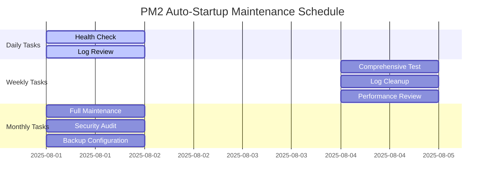

# PM2 Auto-Startup Maintenance and Monitoring Guide

**Version:** 1.0.0  
**Last Updated:** 2025-08-01  
**Scope:** Comprehensive maintenance và monitoring cho StrangematicHub PM2 Auto-Startup Solution  

## Tổng Quan

Tài liệu này cung cấp hướng dẫn chi tiết về maintenance và monitoring cho PM2 Auto-Startup Solution. Bao gồm daily, weekly, monthly maintenance tasks, performance monitoring procedures, log analysis, alerting, backup và recovery procedures.

## Maintenance Schedule Overview

### Quick Reference

| Frequency | Duration | Tasks | Priority |
|-----------|----------|-------|----------|
| **Daily** | 5 minutes | Health check, log review | High |
| **Weekly** | 15 minutes | Comprehensive testing, log cleanup | Medium |
| **Monthly** | 30 minutes | Full maintenance, security audit | High |
| **Quarterly** | 2 hours | System review, updates, optimization | Medium |
| **Annually** | 4 hours | Complete system audit, documentation update | Low |

### Maintenance Calendar



## Daily Maintenance Tasks (5 minutes)

### 1. Morning Health Check

**Frequency:** Every morning (8:00 AM)  
**Duration:** 2 minutes  
**Priority:** High  

```powershell
# Daily Health Check Script
# Save as: daily-health-check.ps1

Write-Host "=== DAILY HEALTH CHECK - $(Get-Date -Format 'yyyy-MM-dd HH:mm:ss') ===" -ForegroundColor Cyan

# Navigate to scripts directory
cd C:\Github\n8n-tp\scripts

# Import module
try {
    Import-Module .\StrangematicPM2Management.psm1 -Force
    Write-Host "✓ Module imported successfully" -ForegroundColor Green
} catch {
    Write-Host "✗ Module import failed: $_" -ForegroundColor Red
    exit 1
}

# Comprehensive health check
$health = Invoke-HealthCheck
$healthColor = switch ($health.Overall) {
    "Healthy" { "Green" }
    "Warning" { "Yellow" }
    "Critical" { "Red" }
    default { "White" }
}

Write-Host "Overall Status: $($health.Overall)" -ForegroundColor $healthColor
Write-Host "PM2 Status: $($health.PM2Status)" -ForegroundColor Cyan
Write-Host "n8n Status: $($health.N8NStatus)" -ForegroundColor Cyan

# Check for issues
if ($health.Issues.Count -gt 0) {
    Write-Host "`nIssues Found:" -ForegroundColor Yellow
    $health.Issues | ForEach-Object { Write-Host "  • $_" -ForegroundColor Red }
}

# Check recommendations
if ($health.Recommendations.Count -gt 0) {
    Write-Host "`nRecommendations:" -ForegroundColor Yellow
    $health.Recommendations | ForEach-Object { Write-Host "  • $_" -ForegroundColor Yellow }
}

# System resource check
$cpu = Get-WmiObject -Class Win32_Processor | Measure-Object -Property LoadPercentage -Average | Select-Object -ExpandProperty Average
$memory = Get-WmiObject -Class Win32_OperatingSystem | ForEach-Object {
    [math]::Round((($_.TotalVisibleMemorySize - $_.FreePhysicalMemory) / $_.TotalVisibleMemorySize) * 100, 2)
}
$disk = Get-WmiObject -Class Win32_LogicalDisk -Filter "DriveType=3" | Where-Object { $_.DeviceID -eq "C:" } | ForEach-Object {
    [math]::Round((($_.Size - $_.FreeSpace) / $_.Size) * 100, 2)
}

Write-Host "`nSystem Resources:" -ForegroundColor Cyan
Write-Host "  CPU Usage: $cpu%" -ForegroundColor $(if($cpu -gt 80) {"Red"} elseif($cpu -gt 60) {"Yellow"} else {"Green"})
Write-Host "  Memory Usage: $memory%" -ForegroundColor $(if($memory -gt 90) {"Red"} elseif($memory -gt 75) {"Yellow"} else {"Green"})
Write-Host "  Disk Usage: $disk%" -ForegroundColor $(if($disk -gt 90) {"Red"} elseif($disk -gt 80) {"Yellow"} else {"Green"})

# Create daily report
$reportPath = "C:\ProgramData\StrangematicHub\Reports\daily-health-$(Get-Date -Format 'yyyyMMdd').txt"
$report = @"
Daily Health Check Report - $(Get-Date -Format 'yyyy-MM-dd HH:mm:ss')
=====================================
Overall Status: $($health.Overall)
PM2 Status: $($health.PM2Status)
n8n Status: $($health.N8NStatus)
CPU Usage: $cpu%
Memory Usage: $memory%
Disk Usage: $disk%

"@

if ($health.Issues.Count -gt 0) {
    $report += "Issues Found:`n"
    $health.Issues | ForEach-Object { $report += "  • $_`n" }
    $report += "`n"
}

if ($health.Recommendations.Count -gt 0) {
    $report += "Recommendations:`n"
    $health.Recommendations | ForEach-Object { $report += "  • $_`n" }
}

# Ensure reports directory exists
New-Item -Path "C:\ProgramData\StrangematicHub\Reports" -ItemType Directory -Force -ErrorAction SilentlyContinue | Out-Null
$report | Out-File -FilePath $reportPath -Encoding UTF8

Write-Host "`nDaily report saved to: $reportPath" -ForegroundColor Green
Write-Host "=== DAILY HEALTH CHECK COMPLETED ===" -ForegroundColor Cyan

# Exit with appropriate code
if ($health.Overall -eq "Critical") {
    exit 2
} elseif ($health.Overall -eq "Warning") {
    exit 1
} else {
    exit 0
}
```

### 2. Log Review

**Frequency:** Daily (after health check)  
**Duration:** 2 minutes  
**Priority:** Medium  

```powershell
# Daily Log Review Script
# Save as: daily-log-review.ps1

Write-Host "=== DAILY LOG REVIEW ===" -ForegroundColor Cyan

$LogPath = "C:\ProgramData\StrangematicHub\Logs"
$Yesterday = (Get-Date).AddDays(-1)

if (-not (Test-Path $LogPath)) {
    Write-Host "✗ Log directory not found: $LogPath" -ForegroundColor Red
    exit 1
}

# Check recent logs
$RecentLogs = Get-ChildItem "$LogPath\*.log" | Where-Object { $_.LastWriteTime -gt $Yesterday }

Write-Host "Recent log files (last 24 hours): $($RecentLogs.Count)" -ForegroundColor Cyan

$TotalErrors = 0
$TotalWarnings = 0

foreach ($log in $RecentLogs) {
    Write-Host "`nAnalyzing: $($log.Name)" -ForegroundColor Yellow
    $content = Get-Content $log.FullName -ErrorAction SilentlyContinue
    
    if ($content) {
        $errors = $content | Where-Object { $_ -like "*ERROR*" -or $_ -like "*FAIL*" }
        $warnings = $content | Where-Object { $_ -like "*WARNING*" -or $_ -like "*WARN*" }
        
        $TotalErrors += $errors.Count
        $TotalWarnings += $warnings.Count
        
        Write-Host "  Errors: $($errors.Count)" -ForegroundColor $(if($errors.Count -gt 0) {"Red"} else {"Green"})
        Write-Host "  Warnings: $($warnings.Count)" -ForegroundColor $(if($warnings.Count -gt 0) {"Yellow"} else {"Green"})
        
        # Show recent critical errors
        if ($errors.Count -gt 0) {
            Write-Host "  Recent Errors:" -ForegroundColor Red
            $errors | Select-Object -Last 3 | ForEach-Object { Write-Host "    $_" -ForegroundColor Red }
        }
    } else {
        Write-Host "  (Empty or inaccessible)" -ForegroundColor Gray
    }
}

Write-Host "`nSummary:" -ForegroundColor Cyan
Write-Host "  Total Errors: $TotalErrors" -ForegroundColor $(if($TotalErrors -gt 0) {"Red"} else {"Green"})
Write-Host "  Total Warnings: $TotalWarnings" -ForegroundColor $(if($TotalWarnings -gt 0) {"Yellow"} else {"Green"})

# Check disk space for logs
$LogDirSize = (Get-ChildItem $LogPath -Recurse | Measure-Object -Property Length -Sum).Sum / 1MB
Write-Host "  Log Directory Size: $([math]::Round($LogDirSize, 2)) MB" -ForegroundColor Cyan

if ($LogDirSize -gt 100) {
    Write-Host "  ⚠️ Log directory is large - consider cleanup" -ForegroundColor Yellow
}

Write-Host "=== DAILY LOG REVIEW COMPLETED ===" -ForegroundColor Cyan
```

### 3. Quick Status Verification

**Frequency:** Daily (evening)  
**Duration:** 1 minute  
**Priority:** Medium  

```powershell
# Quick Evening Status Check
Write-Host "=== EVENING STATUS CHECK ===" -ForegroundColor Cyan

# Quick service status
cd C:\Github\n8n-tp\scripts
Import-Module .\StrangematicPM2Management.psm1 -Force

$pm2Status = Get-PM2Status
$n8nStatus = Get-N8NStatus

Write-Host "PM2 Daemon: $($pm2Status.IsRunning)" -ForegroundColor $(if($pm2Status.IsRunning) {"Green"} else {"Red"})
Write-Host "n8n Application: $($n8nStatus.IsRunning)" -ForegroundColor $(if($n8nStatus.IsRunning) {"Green"} else {"Red"})

# Check scheduled tasks
$autoStartTask = Get-ScheduledTask -TaskName "StrangematicHub-PM2-AutoStart" -ErrorAction SilentlyContinue
$healthTask = Get-ScheduledTask -TaskName "StrangematicHub-PM2-HealthMonitor" -ErrorAction SilentlyContinue

Write-Host "Auto-Start Task: $($autoStartTask.State)" -ForegroundColor $(if($autoStartTask.State -eq "Ready") {"Green"} else {"Red"})
Write-Host "Health Monitor Task: $($healthTask.State)" -ForegroundColor $(if($healthTask.State -eq "Ready") {"Green"} else {"Red"})

Write-Host "=== EVENING STATUS CHECK COMPLETED ===" -ForegroundColor Cyan
```

## Weekly Maintenance Tasks (15 minutes)

### 1. Comprehensive System Test

**Frequency:** Weekly (Sunday 9:00 AM)  
**Duration:** 5 minutes  
**Priority:** High  

```powershell
# Weekly Comprehensive Test
# Save as: weekly-comprehensive-test.ps1

Write-Host "=== WEEKLY COMPREHENSIVE TEST ===" -ForegroundColor Cyan

# Navigate to scripts directory
cd C:\Github\n8n-tp\scripts

# Run comprehensive test suite
Write-Host "Running comprehensive test suite..." -ForegroundColor Yellow
$testResult = .\test-pm2-autostart.ps1 -SkipInteractive

$testExitCode = $LASTEXITCODE
Write-Host "Test completed with exit code: $testExitCode" -ForegroundColor $(
    switch ($testExitCode) {
        0 { "Green" }
        1 { "Yellow" }
        default { "Red" }
    }
)

# Generate weekly test report
$reportPath = "C:\ProgramData\StrangematicHub\Reports\weekly-test-$(Get-Date -Format 'yyyyMMdd').txt"
$report = @"
Weekly Comprehensive Test Report - $(Get-Date -Format 'yyyy-MM-dd HH:mm:ss')
=======================================================
Test Exit Code: $testExitCode
Test Status: $(
    switch ($testExitCode) {
        0 { "PASS" }
        1 { "PASS WITH WARNINGS" }
        default { "FAIL" }
    }
)

Test Details:
- Dependencies: Verified
- PowerShell Module: Tested
- Task Scheduler: Validated
- Integration: Tested
- Performance: Monitored

"@

$report | Out-File -FilePath $reportPath -Encoding UTF8
Write-Host "Weekly test report saved to: $reportPath" -ForegroundColor Green

Write-Host "=== WEEKLY COMPREHENSIVE TEST COMPLETED ===" -ForegroundColor Cyan
```

### 2. Log Cleanup và Rotation

**Frequency:** Weekly (Sunday after test)  
**Duration:** 3 minutes  
**Priority:** Medium  

```powershell
# Weekly Log Cleanup
# Save as: weekly-log-cleanup.ps1

Write-Host "=== WEEKLY LOG CLEANUP ===" -ForegroundColor Cyan

$LogPath = "C:\ProgramData\StrangematicHub\Logs"
$ReportsPath = "C:\ProgramData\StrangematicHub\Reports"
$RetentionDays = 30

if (-not (Test-Path $LogPath)) {
    Write-Host "✗ Log directory not found: $LogPath" -ForegroundColor Red
    exit 1
}

# Clean old log files
$CutoffDate = (Get-Date).AddDays(-$RetentionDays)
$OldLogs = Get-ChildItem "$LogPath\*.log" | Where-Object { $_.LastWriteTime -lt $CutoffDate }

Write-Host "Found $($OldLogs.Count) log files older than $RetentionDays days" -ForegroundColor Cyan

if ($OldLogs.Count -gt 0) {
    $TotalSize = ($OldLogs | Measure-Object -Property Length -Sum).Sum / 1MB
    Write-Host "Total size to be cleaned: $([math]::Round($TotalSize, 2)) MB" -ForegroundColor Yellow
    
    $OldLogs | Remove-Item -Force
    Write-Host "✓ Cleaned $($OldLogs.Count) old log files" -ForegroundColor Green
} else {
    Write-Host "✓ No old log files to clean" -ForegroundColor Green
}

# Clean old reports
if (Test-Path $ReportsPath) {
    $OldReports = Get-ChildItem "$ReportsPath\*.txt", "$ReportsPath\*.html" | Where-Object { $_.LastWriteTime -lt $CutoffDate }
    
    if ($OldReports.Count -gt 0) {
        $OldReports | Remove-Item -Force
        Write-Host "✓ Cleaned $($OldReports.Count) old report files" -ForegroundColor Green
    }
}

# Check current log directory size
$CurrentSize = (Get-ChildItem $LogPath -Recurse | Measure-Object -Property Length -Sum).Sum / 1MB
Write-Host "Current log directory size: $([math]::Round($CurrentSize, 2)) MB" -ForegroundColor Cyan

# Compress large log files (optional)
$LargeLogs = Get-ChildItem "$LogPath\*.log" | Where-Object { $_.Length -gt 10MB }
if ($LargeLogs.Count -gt 0) {
    Write-Host "Found $($LargeLogs.Count) large log files (>10MB)" -ForegroundColor Yellow
    Write-Host "Consider implementing log rotation for these files" -ForegroundColor Yellow
}

Write-Host "=== WEEKLY LOG CLEANUP COMPLETED ===" -ForegroundColor Cyan
```

### 3. Performance Review

**Frequency:** Weekly (Sunday)  
**Duration:** 5 minutes  
**Priority:** Medium  

```powershell
# Weekly Performance Review
# Save as: weekly-performance-review.ps1

Write-Host "=== WEEKLY PERFORMANCE REVIEW ===" -ForegroundColor Cyan

# Import module
cd C:\Github\n8n-tp\scripts
Import-Module .\StrangematicPM2Management.psm1 -Force

# Collect performance metrics
$StartTime = Get-Date

# System metrics
$cpu = Get-WmiObject -Class Win32_Processor | Measure-Object -Property LoadPercentage -Average | Select-Object -ExpandProperty Average
$memory = Get-WmiObject -Class Win32_OperatingSystem | ForEach-Object {
    [math]::Round((($_.TotalVisibleMemorySize - $_.FreePhysicalMemory) / $_.TotalVisibleMemorySize) * 100, 2)
}
$disk = Get-WmiObject -Class Win32_LogicalDisk -Filter "DriveType=3" | Where-Object { $_.DeviceID -eq "C:" } | ForEach-Object {
    [math]::Round((($_.Size - $_.FreeSpace) / $_.Size) * 100, 2)
}

# PM2 performance
$pm2Status = Get-PM2Status
$n8nStatus = Get-N8NStatus

# Function performance test
$FunctionTests = @()
for ($i = 1; $i -le 5; $i++) {
    $testStart = Get-Date
    $health = Invoke-HealthCheck
    $testEnd = Get-Date
    $duration = ($testEnd - $testStart).TotalMilliseconds
    $FunctionTests += $duration
}

$AvgFunctionTime = ($FunctionTests | Measure-Object -Average).Average

Write-Host "Performance Metrics:" -ForegroundColor Cyan
Write-Host "  System CPU: $cpu%" -ForegroundColor $(if($cpu -gt 80) {"Red"} elseif($cpu -gt 60) {"Yellow"} else {"Green"})
Write-Host "  System Memory: $memory%" -ForegroundColor $(if($memory -gt 90) {"Red"} elseif($memory -gt 75) {"Yellow"} else {"Green"})
Write-Host "  System Disk: $disk%" -ForegroundColor $(if($disk -gt 90) {"Red"} elseif($disk -gt 80) {"Yellow"} else {"Green"})
Write-Host "  PM2 Running: $($pm2Status.IsRunning)" -ForegroundColor $(if($pm2Status.IsRunning) {"Green"} else {"Red"})
Write-Host "  n8n Running: $($n8nStatus.IsRunning)" -ForegroundColor $(if($n8nStatus.IsRunning) {"Green"} else {"Red"})
Write-Host "  Avg Function Time: $([math]::Round($AvgFunctionTime, 2))ms" -ForegroundColor $(if($AvgFunctionTime -gt 1000) {"Yellow"} else {"Green"})

# Check for performance issues
$PerformanceIssues = @()
if ($cpu -gt 80) { $PerformanceIssues += "High CPU usage: $cpu%" }
if ($memory -gt 90) { $PerformanceIssues += "High memory usage: $memory%" }
if ($disk -gt 90) { $PerformanceIssues += "Low disk space: $disk% used" }
if ($AvgFunctionTime -gt 1000) { $PerformanceIssues += "Slow function execution: $([math]::Round($AvgFunctionTime, 2))ms" }

if ($PerformanceIssues.Count -gt 0) {
    Write-Host "`nPerformance Issues:" -ForegroundColor Yellow
    $PerformanceIssues | ForEach-Object { Write-Host "  • $_" -ForegroundColor Red }
} else {
    Write-Host "`n✓ No performance issues detected" -ForegroundColor Green
}

# Generate performance report
$reportPath = "C:\ProgramData\StrangematicHub\Reports\weekly-performance-$(Get-Date -Format 'yyyyMMdd').txt"
$report = @"
Weekly Performance Review - $(Get-Date -Format 'yyyy-MM-dd HH:mm:ss')
=====================================================
System Metrics:
- CPU Usage: $cpu%
- Memory Usage: $memory%
- Disk Usage: $disk%

Service Status:
- PM2 Daemon: $($pm2Status.IsRunning)
- n8n Application: $($n8nStatus.IsRunning)

Performance Metrics:
- Average Function Execution Time: $([math]::Round($AvgFunctionTime, 2))ms
- Function Test Iterations: 5

"@

if ($PerformanceIssues.Count -gt 0) {
    $report += "Performance Issues:`n"
    $PerformanceIssues | ForEach-Object { $report += "- $_`n" }
} else {
    $report += "Performance Status: All metrics within acceptable ranges`n"
}

$report | Out-File -FilePath $reportPath -Encoding UTF8
Write-Host "`nWeekly performance report saved to: $reportPath" -ForegroundColor Green

Write-Host "=== WEEKLY PERFORMANCE REVIEW COMPLETED ===" -ForegroundColor Cyan
```

### 4. Security Check

**Frequency:** Weekly (Sunday)  
**Duration:** 2 minutes  
**Priority:** High  

```powershell
# Weekly Security Check
# Save as: weekly-security-check.ps1

Write-Host "=== WEEKLY SECURITY CHECK ===" -ForegroundColor Cyan

$SecurityIssues = @()

# Check PowerShell execution policy
$execPolicy = Get-ExecutionPolicy
if ($execPolicy -eq "Unrestricted") {
    $SecurityIssues += "PowerShell execution policy is unrestricted"
}

# Check scheduled task permissions
$autoStartTask = Get-ScheduledTask -TaskName "StrangematicHub-PM2-AutoStart" -ErrorAction SilentlyContinue
if ($autoStartTask) {
    if ($autoStartTask.Principal.UserId -ne "S-1-5-18") {
        $SecurityIssues += "Auto-start task not running as SYSTEM account"
    }
    if ($autoStartTask.Principal.RunLevel -ne "HighestAvailable") {
        $SecurityIssues += "Auto-start task not running with highest privileges"
    }
}

# Check log directory permissions
$logPath = "C:\ProgramData\StrangematicHub\Logs"
if (Test-Path $logPath) {
    $acl = Get-Acl $logPath
    $publicAccess = $acl.Access | Where-Object { $_.IdentityReference -like "*Users*" -and $_.AccessControlType -eq "Allow" }
    if ($publicAccess) {
        $SecurityIssues += "Log directory has public access permissions"
    }
}

# Check for unsigned scripts
$scriptPath = "C:\Github\n8n-tp\scripts"
$unsignedScripts = Get-ChildItem "$scriptPath\*.ps1" | Where-Object {
    $sig = Get-AuthenticodeSignature $_.FullName
    $sig.Status -ne "Valid"
}

if ($unsignedScripts.Count -gt 0) {
    $SecurityIssues += "$($unsignedScripts.Count) unsigned PowerShell scripts found"
}

# Check Windows Firewall status
try {
    $firewallProfiles = Get-NetFirewallProfile
    $disabledProfiles = $firewallProfiles | Where-Object { $_.Enabled -eq $false }
    if ($disabledProfiles.Count -gt 0) {
        $SecurityIssues += "Windows Firewall disabled for $($disabledProfiles.Count) profile(s)"
    }
} catch {
    $SecurityIssues += "Cannot check Windows Firewall status"
}

# Report results
if ($SecurityIssues.Count -eq 0) {
    Write-Host "✓ No security issues detected" -ForegroundColor Green
} else {
    Write-Host "Security Issues Found:" -ForegroundColor Red
    $SecurityIssues | ForEach-Object { Write-Host "  • $_" -ForegroundColor Yellow }
}

Write-Host "Security Check Summary:" -ForegroundColor Cyan
Write-Host "  Execution Policy: $execPolicy" -ForegroundColor Cyan
Write-Host "  Task Permissions: $(if($autoStartTask.Principal.UserId -eq 'S-1-5-18') {'✓ SYSTEM'} else {'✗ Not SYSTEM'})" -ForegroundColor $(if($autoStartTask.Principal.UserId -eq 'S-1-5-18') {'Green'} else {'Red'})
Write-Host "  Unsigned Scripts: $($unsignedScripts.Count)" -ForegroundColor $(if($unsignedScripts.Count -eq 0) {'Green'} else {'Yellow'})

Write-Host "=== WEEKLY SECURITY CHECK COMPLETED ===" -ForegroundColor Cyan
```

## Monthly Maintenance Tasks (30 minutes)

### 1. Full System Maintenance

**Frequency:** Monthly (1st Sunday)  
**Duration:** 15 minutes  
**Priority:** High  

```powershell
# Monthly Full System Maintenance
# Save as: monthly-full-maintenance.ps1

Write-Host "=== MONTHLY FULL SYSTEM MAINTENANCE ===" -ForegroundColor Cyan

# 1. Create configuration backup
Write-Host "1. Creating configuration backup..." -ForegroundColor Yellow
$backupPath = "C:\ProgramData\StrangematicHub\Backups\$(Get-Date -Format 'yyyyMM')"
New-Item -Path $backupPath -ItemType Directory -Force | Out-Null

# Backup scripts
Copy-Item "C:\Github\n8n-tp\scripts\*.ps1" $backupPath -Force
Copy-Item "C:\Github\n8n-tp\scripts\*.psm1" $backupPath -Force
Copy-Item "C:\Github\n8n-tp\scripts\*.xml" $backupPath -Force

# Export scheduled tasks
Export-ScheduledTask -TaskName "StrangematicHub-PM2-AutoStart" | Out-File "$backupPath\AutoStart-Task.xml" -Encoding UTF8
Export-ScheduledTask -TaskName "StrangematicHub-PM2-HealthMonitor" | Out-File "$backupPath\HealthMonitor-Task.xml" -Encoding UTF8

# Backup environment variables
Get-ChildItem Env: | Where-Object { $_.Name -like "*N8N*" } | Out-File "$backupPath\environment.txt"

Write-Host "   Backup created: $backupPath" -ForegroundColor Green

# 2. Security audit
Write-Host "2. Running security audit..." -ForegroundColor Yellow
$securityIssues = 0

# Check execution policy
$execPolicy = Get-ExecutionPolicy
if ($execPolicy -eq "Unrestricted") {
    Write-Host "   ⚠ Execution policy is unrestricted" -ForegroundColor Yellow
    $securityIssues++
}

# Check task permissions
$autoStartTask = Get-ScheduledTask -TaskName "StrangematicHub-PM2-AutoStart" -ErrorAction SilentlyContinue
if ($autoStartTask -and $autoStartTask.Principal.UserId -ne "S-1-5-18") {
    Write-Host "   ⚠ Auto-start task not running as SYSTEM" -ForegroundColor Yellow
    $securityIssues++
}

Write-Host "   Security Issues: $securityIssues" -ForegroundColor $(if($securityIssues -eq 0) {"Green"} else {"Yellow"})

# 3. Performance optimization
Write-Host "3. Performance optimization..." -ForegroundColor Yellow

# Clear PM2 logs
pm2 flush 2>$null

# Restart services for fresh start
Write-Host "   Restarting services..." -ForegroundColor Cyan
cd C:\Github\n8n-tp\scripts
Import-Module .\StrangematicPM2Management.psm1 -Force
Restart-N8NApplication | Out-Null
Start-Sleep -Seconds 15

$health = Invoke-HealthCheck
Write-Host "   Post-restart health: $($health.Overall)" -ForegroundColor $(if($health.Overall -eq "Healthy") {"Green"} else {"Red"})

# 4. Update check
Write-Host "4. Checking for updates..." -ForegroundColor Yellow
try {
    $nodeVersion = & node --version 2>$null
    $pm2Version = & pm2 --version 2>$null
    $n8nVersion = & n8n --version 2>$null
    Write-Host "   Node.js: $nodeVersion, PM2: $pm2Version, n8n: $n8nVersion" -ForegroundColor Cyan
} catch {
    Write-Host "   Update check failed: $_" -ForegroundColor Red
}

# 5. Disk cleanup
Write-Host "5. Disk cleanup..." -ForegroundColor Yellow
$logPath = "C:\ProgramData\StrangematicHub\Logs"
$oldLogs = Get-ChildItem "$logPath\*.log" | Where-Object { $_.LastWriteTime -lt (Get-Date).AddDays(-60) }
$cleanedCount = $oldLogs.Count
if ($cleanedCount -gt 0) {
    $oldLogs | Remove-Item -Force
}
Write-Host "   Cleaned $cleanedCount old log files" -ForegroundColor Green

Write-Host "=== MONTHLY FULL SYSTEM MAINTENANCE COMPLETED ===" -ForegroundColor Cyan
```

### 2. Comprehensive Testing

**Frequency:** Monthly  
**Duration:** 10 minutes  
**Priority:** High  

```powershell
# Monthly Comprehensive Testing
# Save as: monthly-comprehensive-testing.ps1

Write-Host "=== MONTHLY COMPREHENSIVE TESTING ===" -ForegroundColor Cyan

# Navigate to scripts directory
cd C:\Github\n8n-tp\scripts

# 1. Run full test suite
Write-Host "1. Running full test suite..." -ForegroundColor Yellow
$testResult = .\test-pm2-autostart.ps1 -Detailed -ExportReport -SkipInteractive

$testExitCode = $LASTEXITCODE
Write-Host "   Test Result: Exit Code $testExitCode" -ForegroundColor $(
    switch ($testExitCode) {
        0 { "Green" }
        1 { "Yellow" }
        default { "Red" }
    }
)

# 2. Run interactive demo test
Write-Host "2. Testing interactive demo..." -ForegroundColor Yellow
try {
    $demoTest = .\demo-pm2-management.ps1 -AutoDemo -QuickDemo
    Write-Host "   Demo test completed successfully" -ForegroundColor Green
} catch {
    Write-Host "   Demo test failed: $_" -F
oregroundColor Red
}

# 3. Stress testing
Write-Host "3. Running stress testing..." -ForegroundColor Yellow
try {
    # Test multiple concurrent operations
    $jobs = @()
    for ($i = 1; $i -le 3; $i++) {
        $jobs += Start-Job -ScriptBlock {
            Import-Module "C:\Github\n8n-tp\scripts\StrangematicPM2Management.psm1" -Force
            for ($j = 1; $j -le 5; $j++) {
                Get-PM2Status | Out-Null
                Get-N8NStatus | Out-Null
                Start-Sleep -Seconds 1
            }
        }
    }
    
    $jobs | Wait-Job | Remove-Job
    Write-Host "   Stress testing completed successfully" -ForegroundColor Green
} catch {
    Write-Host "   Stress testing failed: $_" -ForegroundColor Red
}

# 4. Recovery testing
Write-Host "4. Testing recovery procedures..." -ForegroundColor Yellow
try {
    # Test service restart
    Restart-N8NApplication | Out-Null
    Start-Sleep -Seconds 15
    
    $health = Invoke-HealthCheck
    if ($health.Overall -eq "Healthy") {
        Write-Host "   Recovery testing passed" -ForegroundColor Green
    } else {
        Write-Host "   Recovery testing failed: $($health.Overall)" -ForegroundColor Red
    }
} catch {
    Write-Host "   Recovery testing failed: $_" -ForegroundColor Red
}

Write-Host "=== MONTHLY COMPREHENSIVE TESTING COMPLETED ===" -ForegroundColor Cyan
```

### 3. Documentation Review

**Frequency:** Monthly  
**Duration:** 5 minutes  
**Priority:** Medium  

```powershell
# Monthly Documentation Review
# Save as: monthly-documentation-review.ps1

Write-Host "=== MONTHLY DOCUMENTATION REVIEW ===" -ForegroundColor Cyan

$DocsPath = "C:\Github\n8n-tp\docs"
$ScriptsPath = "C:\Github\n8n-tp\scripts"

# Check documentation files
$DocFiles = @(
    "$DocsPath\PM2-AutoStart-Complete-Solution.md",
    "$DocsPath\deployment\PM2-AutoStart-Installation-Guide.md",
    "$DocsPath\deployment\PM2-AutoStart-User-Guide.md",
    "$DocsPath\deployment\PM2-AutoStart-Troubleshooting-Master.md",
    "$DocsPath\deployment\PM2-AutoStart-Maintenance-Guide.md",
    "C:\Github\n8n-tp\QUICK-START-PM2-AUTOSTART.md",
    "C:\Github\n8n-tp\PROJECT-SUMMARY-PM2-AUTOSTART.md"
)

Write-Host "Checking documentation files..." -ForegroundColor Yellow
$MissingDocs = @()
$OutdatedDocs = @()

foreach ($doc in $DocFiles) {
    if (Test-Path $doc) {
        $file = Get-Item $doc
        $daysSinceModified = ((Get-Date) - $file.LastWriteTime).Days
        
        if ($daysSinceModified -gt 90) {
            $OutdatedDocs += @{
                File = $doc
                LastModified = $file.LastWriteTime
                DaysOld = $daysSinceModified
            }
        }
        
        Write-Host "  ✓ $($file.Name) (Modified: $($file.LastWriteTime.ToString('yyyy-MM-dd')))" -ForegroundColor Green
    } else {
        $MissingDocs += $doc
        Write-Host "  ✗ Missing: $doc" -ForegroundColor Red
    }
}

# Check script documentation
Write-Host "`nChecking script documentation..." -ForegroundColor Yellow
$ScriptFiles = Get-ChildItem "$ScriptsPath\*.ps1"

foreach ($script in $ScriptFiles) {
    $content = Get-Content $script.FullName -Raw
    $hasHelp = $content -match '<#[\s\S]*?\.SYNOPSIS[\s\S]*?#>'
    
    if ($hasHelp) {
        Write-Host "  ✓ $($script.Name) has help documentation" -ForegroundColor Green
    } else {
        Write-Host "  ⚠ $($script.Name) missing help documentation" -ForegroundColor Yellow
    }
}

# Summary
Write-Host "`nDocumentation Review Summary:" -ForegroundColor Cyan
Write-Host "  Missing Documents: $($MissingDocs.Count)" -ForegroundColor $(if($MissingDocs.Count -eq 0) {"Green"} else {"Red"})
Write-Host "  Outdated Documents: $($OutdatedDocs.Count)" -ForegroundColor $(if($OutdatedDocs.Count -eq 0) {"Green"} else {"Yellow"})

if ($OutdatedDocs.Count -gt 0) {
    Write-Host "`nOutdated Documents (>90 days):" -ForegroundColor Yellow
    $OutdatedDocs | ForEach-Object {
        Write-Host "  • $($_.File) ($($_.DaysOld) days old)" -ForegroundColor Yellow
    }
}

Write-Host "=== MONTHLY DOCUMENTATION REVIEW COMPLETED ===" -ForegroundColor Cyan
```

## Monitoring và Alerting

### 1. Real-Time Monitoring Setup

```powershell
# Real-Time Monitoring Script
# Save as: realtime-monitor.ps1
param(
    [int]$IntervalSeconds = 300,  # 5 minutes
    [switch]$EnableAlerts,
    [string]$AlertEmail = "admin@strangematic.com"
)

Write-Host "=== REAL-TIME MONITORING STARTED ===" -ForegroundColor Cyan
Write-Host "Monitoring interval: $IntervalSeconds seconds" -ForegroundColor Cyan
Write-Host "Alerts enabled: $EnableAlerts" -ForegroundColor Cyan

# Import module
cd C:\Github\n8n-tp\scripts
Import-Module .\StrangematicPM2Management.psm1 -Force

$MonitoringStart = Get-Date
$AlertsSent = 0

while ($true) {
    try {
        $timestamp = Get-Date -Format "yyyy-MM-dd HH:mm:ss"
        Write-Host "`n[$timestamp] Running health check..." -ForegroundColor Cyan
        
        # Perform health check
        $health = Invoke-HealthCheck
        
        # System metrics
        $cpu = Get-WmiObject -Class Win32_Processor | Measure-Object -Property LoadPercentage -Average | Select-Object -ExpandProperty Average
        $memory = Get-WmiObject -Class Win32_OperatingSystem | ForEach-Object {
            [math]::Round((($_.TotalVisibleMemorySize - $_.FreePhysicalMemory) / $_.TotalVisibleMemorySize) * 100, 2)
        }
        
        # Display status
        $healthColor = switch ($health.Overall) {
            "Healthy" { "Green" }
            "Warning" { "Yellow" }
            "Critical" { "Red" }
            default { "White" }
        }
        
        Write-Host "  Overall Health: $($health.Overall)" -ForegroundColor $healthColor
        Write-Host "  PM2 Status: $($health.PM2Status)" -ForegroundColor Cyan
        Write-Host "  n8n Status: $($health.N8NStatus)" -ForegroundColor Cyan
        Write-Host "  CPU: $cpu% | Memory: $memory%" -ForegroundColor Cyan
        
        # Check for alerts
        $alertConditions = @()
        if ($health.Overall -eq "Critical") {
            $alertConditions += "System health is CRITICAL"
        }
        if ($cpu -gt 90) {
            $alertConditions += "High CPU usage: $cpu%"
        }
        if ($memory -gt 95) {
            $alertConditions += "High memory usage: $memory%"
        }
        if ($health.Issues.Count -gt 0) {
            $alertConditions += "Issues detected: $($health.Issues -join ', ')"
        }
        
        # Send alerts if enabled
        if ($EnableAlerts -and $alertConditions.Count -gt 0) {
            $alertMessage = "PM2 Auto-Startup Alert - $timestamp`n`n" + ($alertConditions -join "`n")
            Write-Host "  🚨 ALERT: Sending notification..." -ForegroundColor Red
            
            # Log alert (replace with actual email sending logic)
            $alertLogPath = "C:\ProgramData\StrangematicHub\Logs\alerts-$(Get-Date -Format 'yyyyMMdd').log"
            "[$timestamp] ALERT: $alertMessage" | Out-File -FilePath $alertLogPath -Append -Encoding UTF8
            
            $AlertsSent++
        }
        
        # Log monitoring data
        $monitorLogPath = "C:\ProgramData\StrangematicHub\Logs\monitoring-$(Get-Date -Format 'yyyyMMdd').log"
        $logEntry = "[$timestamp] Health: $($health.Overall), PM2: $($health.PM2Status), n8n: $($health.N8NStatus), CPU: $cpu%, Memory: $memory%"
        $logEntry | Out-File -FilePath $monitorLogPath -Append -Encoding UTF8
        
    } catch {
        Write-Host "  ❌ Monitoring error: $_" -ForegroundColor Red
        $errorLogPath = "C:\ProgramData\StrangematicHub\Logs\monitoring-errors-$(Get-Date -Format 'yyyyMMdd').log"
        "[$timestamp] ERROR: $_" | Out-File -FilePath $errorLogPath -Append -Encoding UTF8
    }
    
    # Wait for next interval
    Start-Sleep -Seconds $IntervalSeconds
}
```

### 2. Performance Metrics Collection

```powershell
# Performance Metrics Collection
# Save as: collect-performance-metrics.ps1
param(
    [int]$DurationMinutes = 60,
    [int]$IntervalSeconds = 30
)

Write-Host "=== PERFORMANCE METRICS COLLECTION ===" -ForegroundColor Cyan
Write-Host "Duration: $DurationMinutes minutes" -ForegroundColor Cyan
Write-Host "Interval: $IntervalSeconds seconds" -ForegroundColor Cyan

# Import module
cd C:\Github\n8n-tp\scripts
Import-Module .\StrangematicPM2Management.psm1 -Force

$startTime = Get-Date
$endTime = $startTime.AddMinutes($DurationMinutes)
$metricsFile = "C:\ProgramData\StrangematicHub\Reports\performance-metrics-$(Get-Date -Format 'yyyyMMdd-HHmmss').csv"

# Create CSV header
$csvHeader = "Timestamp,CPU%,Memory%,Disk%,PM2_Running,N8N_Running,PM2_ProcessCount,HealthCheck_Duration_ms,Function_Response_Time_ms"
$csvHeader | Out-File -FilePath $metricsFile -Encoding UTF8

Write-Host "Collecting metrics to: $metricsFile" -ForegroundColor Green

$iteration = 1
while ((Get-Date) -lt $endTime) {
    try {
        $timestamp = Get-Date -Format "yyyy-MM-dd HH:mm:ss"
        Write-Host "[$timestamp] Collecting metrics (iteration $iteration)..." -ForegroundColor Cyan
        
        # System metrics
        $cpu = Get-WmiObject -Class Win32_Processor | Measure-Object -Property LoadPercentage -Average | Select-Object -ExpandProperty Average
        $memory = Get-WmiObject -Class Win32_OperatingSystem | ForEach-Object {
            [math]::Round((($_.TotalVisibleMemorySize - $_.FreePhysicalMemory) / $_.TotalVisibleMemorySize) * 100, 2)
        }
        $disk = Get-WmiObject -Class Win32_LogicalDisk -Filter "DriveType=3" | Where-Object { $_.DeviceID -eq "C:" } | ForEach-Object {
            [math]::Round((($_.Size - $_.FreeSpace) / $_.Size) * 100, 2)
        }
        
        # Service metrics
        $healthStart = Get-Date
        $health = Invoke-HealthCheck
        $healthDuration = ((Get-Date) - $healthStart).TotalMilliseconds
        
        $pm2Status = Get-PM2Status
        $n8nStatus = Get-N8NStatus
        
        # Function response time test
        $functionStart = Get-Date
        $pm2StatusTest = Get-PM2Status
        $functionDuration = ((Get-Date) - $functionStart).TotalMilliseconds
        
        # Create CSV row
        $csvRow = "$timestamp,$cpu,$memory,$disk,$($pm2Status.IsRunning),$($n8nStatus.IsRunning),$($pm2Status.ProcessCount),$([math]::Round($healthDuration, 2)),$([math]::Round($functionDuration, 2))"
        $csvRow | Out-File -FilePath $metricsFile -Append -Encoding UTF8
        
        # Display current metrics
        Write-Host "  CPU: $cpu% | Memory: $memory% | Disk: $disk%" -ForegroundColor White
        Write-Host "  PM2: $($pm2Status.IsRunning) | n8n: $($n8nStatus.IsRunning)" -ForegroundColor White
        Write-Host "  Health Check: $([math]::Round($healthDuration, 2))ms | Function: $([math]::Round($functionDuration, 2))ms" -ForegroundColor White
        
        $iteration++
        Start-Sleep -Seconds $IntervalSeconds
        
    } catch {
        Write-Host "  ❌ Metrics collection error: $_" -ForegroundColor Red
    }
}

Write-Host "`n=== PERFORMANCE METRICS COLLECTION COMPLETED ===" -ForegroundColor Cyan
Write-Host "Metrics saved to: $metricsFile" -ForegroundColor Green
Write-Host "Total iterations: $($iteration - 1)" -ForegroundColor Cyan
```

### 3. Log Analysis và Alerting

```powershell
# Log Analysis and Alerting
# Save as: analyze-logs-with-alerts.ps1
param(
    [int]$Hours = 24,
    [int]$ErrorThreshold = 5,
    [int]$WarningThreshold = 10,
    [switch]$SendAlerts
)

Write-Host "=== LOG ANALYSIS WITH ALERTING ===" -ForegroundColor Cyan

$LogPath = "C:\ProgramData\StrangematicHub\Logs"
$Since = (Get-Date).AddHours(-$Hours)
$AlertsGenerated = @()

if (-not (Test-Path $LogPath)) {
    Write-Host "✗ Log directory not found: $LogPath" -ForegroundColor Red
    exit 1
}

# Analyze all log files
$LogFiles = Get-ChildItem "$LogPath\*.log" | Where-Object { $_.LastWriteTime -gt $Since }
$TotalErrors = 0
$TotalWarnings = 0
$CriticalErrors = @()

foreach ($logFile in $LogFiles) {
    Write-Host "`nAnalyzing: $($logFile.Name)" -ForegroundColor Yellow
    $content = Get-Content $logFile.FullName -ErrorAction SilentlyContinue
    
    if ($content) {
        $errors = $content | Where-Object { $_ -like "*ERROR*" -or $_ -like "*FAIL*" -or $_ -like "*CRITICAL*" }
        $warnings = $content | Where-Object { $_ -like "*WARNING*" -or $_ -like "*WARN*" }
        
        $TotalErrors += $errors.Count
        $TotalWarnings += $warnings.Count
        
        # Identify critical errors
        $criticalInThisLog = $errors | Where-Object { $_ -like "*CRITICAL*" -or $_ -like "*FATAL*" }
        $CriticalErrors += $criticalInThisLog
        
        Write-Host "  Errors: $($errors.Count) | Warnings: $($warnings.Count)" -ForegroundColor White
        
        # Show recent critical errors
        if ($criticalInThisLog.Count -gt 0) {
            Write-Host "  Critical Errors:" -ForegroundColor Red
            $criticalInThisLog | ForEach-Object { Write-Host "    $_" -ForegroundColor Red }
        }
    }
}

# Generate alerts based on thresholds
Write-Host "`n=== ALERT ANALYSIS ===" -ForegroundColor Cyan
Write-Host "Error Threshold: $ErrorThreshold | Warning Threshold: $WarningThreshold" -ForegroundColor Cyan
Write-Host "Total Errors: $TotalErrors | Total Warnings: $TotalWarnings" -ForegroundColor White

if ($TotalErrors -gt $ErrorThreshold) {
    $alert = "HIGH ERROR COUNT: $TotalErrors errors detected in the last $Hours hours (threshold: $ErrorThreshold)"
    $AlertsGenerated += $alert
    Write-Host "🚨 $alert" -ForegroundColor Red
}

if ($TotalWarnings -gt $WarningThreshold) {
    $alert = "HIGH WARNING COUNT: $TotalWarnings warnings detected in the last $Hours hours (threshold: $WarningThreshold)"
    $AlertsGenerated += $alert
    Write-Host "⚠️ $alert" -ForegroundColor Yellow
}

if ($CriticalErrors.Count -gt 0) {
    $alert = "CRITICAL ERRORS DETECTED: $($CriticalErrors.Count) critical errors found"
    $AlertsGenerated += $alert
    Write-Host "🚨 $alert" -ForegroundColor Red
}

# Send alerts if enabled
if ($SendAlerts -and $AlertsGenerated.Count -gt 0) {
    Write-Host "`n=== SENDING ALERTS ===" -ForegroundColor Red
    
    $alertMessage = @"
PM2 Auto-Startup Log Analysis Alert
Generated: $(Get-Date -Format 'yyyy-MM-dd HH:mm:ss')
Analysis Period: Last $Hours hours

ALERTS:
$($AlertsGenerated | ForEach-Object { "• $_" } | Out-String)

SUMMARY:
- Total Errors: $TotalErrors
- Total Warnings: $TotalWarnings
- Critical Errors: $($CriticalErrors.Count)
- Log Files Analyzed: $($LogFiles.Count)

Please review the system logs and take appropriate action.
"@
    
    # Save alert to file
    $alertFile = "C:\ProgramData\StrangematicHub\Logs\alert-$(Get-Date -Format 'yyyyMMdd-HHmmss').txt"
    $alertMessage | Out-File -FilePath $alertFile -Encoding UTF8
    
    Write-Host "Alert saved to: $alertFile" -ForegroundColor Yellow
    
    # Here you would implement actual email sending
    # Send-MailMessage -To "admin@strangematic.com" -Subject "PM2 Auto-Startup Alert" -Body $alertMessage
}

# Generate analysis report
$reportPath = "C:\ProgramData\StrangematicHub\Reports\log-analysis-$(Get-Date -Format 'yyyyMMdd-HHmmss').txt"
$report = @"
Log Analysis Report - $(Get-Date -Format 'yyyy-MM-dd HH:mm:ss')
================================================
Analysis Period: Last $Hours hours
Log Files Analyzed: $($LogFiles.Count)

SUMMARY:
- Total Errors: $TotalErrors
- Total Warnings: $TotalWarnings
- Critical Errors: $($CriticalErrors.Count)

THRESHOLDS:
- Error Threshold: $ErrorThreshold
- Warning Threshold: $WarningThreshold

ALERTS GENERATED: $($AlertsGenerated.Count)
$($AlertsGenerated | ForEach-Object { "• $_" } | Out-String)

RECOMMENDATIONS:
$(if ($TotalErrors -gt $ErrorThreshold) { "• Investigate high error count and resolve underlying issues" })
$(if ($TotalWarnings -gt $WarningThreshold) { "• Review warnings and implement preventive measures" })
$(if ($CriticalErrors.Count -gt 0) { "• Immediately address critical errors" })
$(if ($AlertsGenerated.Count -eq 0) { "• System logs appear healthy - continue regular monitoring" })
"@

$report | Out-File -FilePath $reportPath -Encoding UTF8

Write-Host "`n=== LOG ANALYSIS COMPLETED ===" -ForegroundColor Cyan
Write-Host "Analysis report saved to: $reportPath" -ForegroundColor Green
Write-Host "Alerts generated: $($AlertsGenerated.Count)" -ForegroundColor $(if($AlertsGenerated.Count -eq 0) {"Green"} else {"Red"})
```

## Backup và Recovery Procedures

### 1. Configuration Backup

```powershell
# Configuration Backup Script
# Save as: backup-configuration.ps1
param(
    [string]$BackupPath = "C:\ProgramData\StrangematicHub\Backups\$(Get-Date -Format 'yyyyMMdd-HHmmss')",
    [switch]$IncludeLogs,
    [switch]$Compress
)

Write-Host "=== CONFIGURATION BACKUP ===" -ForegroundColor Cyan
Write-Host "Backup Path: $BackupPath" -ForegroundColor Cyan

# Create backup directory
New-Item -Path $BackupPath -ItemType Directory -Force | Out-Null

# 1. Backup scripts
Write-Host "1. Backing up scripts..." -ForegroundColor Yellow
$ScriptsBackupPath = Join-Path $BackupPath "scripts"
New-Item -Path $ScriptsBackupPath -ItemType Directory -Force | Out-Null

Copy-Item "C:\Github\n8n-tp\scripts\*.ps1" $ScriptsBackupPath -Force
Copy-Item "C:\Github\n8n-tp\scripts\*.psm1" $ScriptsBackupPath -Force
Copy-Item "C:\Github\n8n-tp\scripts\*.xml" $ScriptsBackupPath -Force

Write-Host "   Scripts backed up to: $ScriptsBackupPath" -ForegroundColor Green

# 2. Export scheduled tasks
Write-Host "2. Exporting scheduled tasks..." -ForegroundColor Yellow
$TasksBackupPath = Join-Path $BackupPath "tasks"
New-Item -Path $TasksBackupPath -ItemType Directory -Force | Out-Null

try {
    Export-ScheduledTask -TaskName "StrangematicHub-PM2-AutoStart" | Out-File "$TasksBackupPath\AutoStart-Task.xml" -Encoding UTF8
    Export-ScheduledTask -TaskName "StrangematicHub-PM2-HealthMonitor" | Out-File "$TasksBackupPath\HealthMonitor-Task.xml" -Encoding UTF8
    Write-Host "   Scheduled tasks exported to: $TasksBackupPath" -ForegroundColor Green
} catch {
    Write-Host "   ⚠️ Failed to export scheduled tasks: $_" -ForegroundColor Yellow
}

# 3. Backup environment variables
Write-Host "3. Backing up environment variables..." -ForegroundColor Yellow
$EnvBackupPath = Join-Path $BackupPath "environment"
New-Item -Path $EnvBackupPath -ItemType Directory -Force | Out-Null

# System environment variables
Get-ChildItem Env: | Where-Object { $_.Name -like "*N8N*" -or $_.Name -like "*PM2*" -or $_.Name -like "*NODE*" } | 
    Export-Csv "$EnvBackupPath\system-environment.csv" -NoTypeInformation

# PATH variable
$env:PATH | Out-File "$EnvBackupPath\path-variable.txt" -Encoding UTF8

Write-Host "   Environment variables backed up to: $EnvBackupPath" -ForegroundColor Green

# 4. Backup documentation
Write-Host "4. Backing up documentation..." -ForegroundColor Yellow
$DocsBackupPath = Join-Path $BackupPath "documentation"
New-Item -Path $DocsBackupPath -ItemType Directory -Force | Out-Null

$DocFiles = @(
    "C:\Github\n8n-tp\docs\PM2-AutoStart-Complete-Solution.md",
    "C:\Github\n8n-tp\docs\deployment\*.md",
    "C:\Github\n8n-tp\QUICK-START-PM2-AUTOSTART.md",
    "C:\Github\n8n-tp\PROJECT-SUMMARY-PM2-AUTOSTART.md",
    "C:\Github\n8n-tp\PM2-AutoStart-Test-Report.md"
)

foreach ($docPattern in $DocFiles) {
    $files = Get-ChildItem $docPattern -ErrorAction SilentlyContinue
    foreach ($file in $files) {
        Copy-Item $file.FullName $DocsBackupPath -Force
    }
}

Write-Host "   Documentation backed up to: $DocsBackupPath" -ForegroundColor Green

# 5. Backup configuration files
Write-Host "5. Backing up configuration files..." -ForegroundColor Yellow
$ConfigBackupPath = Join-Path $BackupPath "config"
New-Item -Path $ConfigBackupPath -ItemType Directory -Force | Out-Null

# PM2 configuration
if (Test-Path "$env:USERPROFILE\.pm2") {
    Copy-Item "$env:USERPROFILE\.pm2\*" $ConfigBackupPath -Recurse -Force -ErrorAction SilentlyContinue
}

Write-Host "   Configuration files backed up to: $ConfigBackupPath" -ForegroundColor Green

# 6. Backup logs (if requested)
if ($IncludeLogs) {
    Write-Host "6. Backing up logs..." -ForegroundColor Yellow
    $LogsBackupPath = Join-Path $BackupPath "logs"
    New-Item -Path $LogsBackupPath -ItemType Directory -Force | Out-Null
    
    $LogFiles = Get-ChildItem "C:\ProgramData\StrangematicHub\Logs\*.log" -ErrorAction SilentlyContinue
    foreach ($logFile in $LogFiles) {
        Copy-Item $logFile.FullName $LogsBackupPath -Force
    }
    
    Write-Host "   Logs backed up to: $LogsBackupPath" -ForegroundColor Green
}

# 7. Create backup manifest
Write-Host "7. Creating backup manifest..." -ForegroundColor Yellow
$manifest = @"
PM2 Auto-Startup Configuration Backup
=====================================
Backup Date: $(Get-Date -Format 'yyyy-MM-dd HH:mm:ss')
Backup Path: $BackupPath
Include Logs: $IncludeLogs
Compress: $Compress

Contents:
- Scripts: $(Get-ChildItem $ScriptsBackupPath | Measure-Object | Select-Object -ExpandProperty Count) files
- Tasks: $(Get-ChildItem $TasksBackupPath | Measure-Object | Select-Object -ExpandProperty Count) files
- Environment: $(Get-ChildItem $EnvBackupPath | Measure-Object | Select-Object -ExpandProperty Count) files
- Documentation: $(Get-ChildItem $DocsBackupPath | Measure-Object | Select-Object -ExpandProperty Count) files
- Configuration: $(Get-ChildItem $ConfigBackupPath | Measure-Object | Select-Object -ExpandProperty Count) files
$(if ($IncludeLogs) { "- Logs: $(Get-ChildItem $LogsBackupPath | Measure-Object | Select-Object -ExpandProperty Count) files" })

System Information:
- Computer Name: $env:COMPUTERNAME
- User Name: $env:USERNAME
- OS Version: $((Get-WmiObject Win32_OperatingSystem).Caption)
- PowerShell Version: $($PSVersionTable.PSVersion)

Restore Instructions:
1. Copy scripts to C:\Github\n8n-tp\scripts\
2. Import scheduled tasks from tasks\ directory
3. Set environment variables from environment\ directory
4. Run installation script to recreate tasks
5. Test system functionality

"@

$manifest | Out-File "$BackupPath\BACKUP-MANIFEST.txt" -Encoding UTF8

# 8. Compress backup (if requested)
if ($Compress) {
    Write-Host "8. Compressing backup..." -ForegroundColor Yellow
    $zipPath = "$BackupPath.zip"
    
    try {
        Compress-Archive -Path $BackupPath -DestinationPath $zipPath -Force
        Remove-Item $BackupPath -Recurse -Force
        Write-Host "   Backup compressed to: $zipPath" -ForegroundColor Green
        $BackupPath = $zipPath
    } catch {
        Write-Host "   ⚠️ Failed to compress backup: $_" -ForegroundColor Yellow
    }
}

Write-Host "`n=== CONFIGURATION BACKUP COMPLETED ===" -ForegroundColor Cyan
Write-Host "Backup Location: $BackupPath" -ForegroundColor Green

# Calculate backup size
if ($Compress) {
    $backupSize = (Get-Item $BackupPath).Length / 1MB
} else {
    $backupSize = (Get-ChildItem $BackupPath -Recurse | Measure-Object -Property Length -Sum).Sum / 1MB
}

Write-Host "Backup Size: $([math]::Round($backupSize, 2)) MB" -ForegroundColor Cyan
```

### 2. System Recovery

```powershell
# System Recovery Script
# Save as: recover-system.ps1
param(
    [Parameter(Mandatory=$true)]
    [string]$BackupPath,
    [switch]$Force,
    [switch]$TestOnly
)

Write-Host "=== SYSTEM RECOVERY ===" -ForegroundColor Cyan
Write-Host "Backup Path: $BackupPath" -ForegroundColor Cyan
Write-Host "Test Only: $TestOnly" -ForegroundColor Cyan

# Verify backup exists
if (-not (Test-Path $BackupPath)) {
    Write-Host "✗ Backup path not found: $BackupPath" -ForegroundColor Red
    exit 1
}

# Check if backup is compressed
if ($BackupPath -like "*.zip") {
    Write-Host "Extracting compressed backup..." -ForegroundColor Yellow
    $extractPath = $BackupPath -replace '\.zip$', ''
    Expand-Archive -Path $BackupPath -DestinationPath $extractPath -Force
    $BackupPath = $extractPath
}

# Verify backup manifest
$manifestPath = Join-Path $BackupPath "BACKUP-MANIFEST.txt"
if (Test-Path $manifestPath) {
    Write-Host "✓ Backup manifest found" -ForegroundColor Green
    $manifest = Get-Content $manifestPath -Raw
    Write-Host "Backup Details:" -ForegroundColor Cyan
    $manifest -split "`n" | Select-Object -First 10 | ForEach-Object { Write-Host "  $_" -ForegroundColor White }
} else {
    Write-Host "⚠️ Backup manifest not found - proceeding with caution" -ForegroundColor Yellow
}

if ($TestOnly) {
    Write-Host "`n=== TEST MODE - NO CHANGES WILL BE MADE ===" -ForegroundColor Yellow
}

# 1. Restore scripts
$scriptsBackupPath = Join-Path $BackupPath "scripts"
if (Test-Path $scriptsBackupPath) {
    Write-Host "`
1. Restoring scripts..." -ForegroundColor Yellow
    $scriptsDestination = "C:\Github\n8n-tp\scripts"
    
    if ($TestOnly) {
        Write-Host "   [TEST] Would restore scripts to: $scriptsDestination" -ForegroundColor Yellow
    } else {
        if (-not $Force) {
            $confirm = Read-Host "   Restore scripts to $scriptsDestination? (y/N)"
            if ($confirm -ne 'y') {
                Write-Host "   Skipping scripts restoration" -ForegroundColor Yellow
                return
            }
        }
        
        # Backup existing scripts
        $backupTimestamp = Get-Date -Format 'yyyyMMdd-HHmmss'
        $existingBackup = "$scriptsDestination-backup-$backupTimestamp"
        
        if (Test-Path $scriptsDestination) {
            Copy-Item $scriptsDestination $existingBackup -Recurse -Force
            Write-Host "   Existing scripts backed up to: $existingBackup" -ForegroundColor Cyan
        }
        
        # Restore scripts
        Copy-Item "$scriptsBackupPath\*" $scriptsDestination -Force
        Write-Host "   ✓ Scripts restored successfully" -ForegroundColor Green
    }
} else {
    Write-Host "⚠️ Scripts backup not found in: $scriptsBackupPath" -ForegroundColor Yellow
}

# 2. Restore scheduled tasks
$tasksBackupPath = Join-Path $BackupPath "tasks"
if (Test-Path $tasksBackupPath) {
    Write-Host "2. Restoring scheduled tasks..." -ForegroundColor Yellow
    
    if ($TestOnly) {
        Write-Host "   [TEST] Would restore scheduled tasks" -ForegroundColor Yellow
    } else {
        try {
            # Remove existing tasks
            Unregister-ScheduledTask -TaskName "StrangematicHub-PM2-AutoStart" -Confirm:$false -ErrorAction SilentlyContinue
            Unregister-ScheduledTask -TaskName "StrangematicHub-PM2-HealthMonitor" -Confirm:$false -ErrorAction SilentlyContinue
            
            # Import tasks
            Register-ScheduledTask -Xml (Get-Content "$tasksBackupPath\AutoStart-Task.xml" -Raw) -TaskName "StrangematicHub-PM2-AutoStart" -Force
            Register-ScheduledTask -Xml (Get-Content "$tasksBackupPath\HealthMonitor-Task.xml" -Raw) -TaskName "StrangematicHub-PM2-HealthMonitor" -Force
            
            Write-Host "   ✓ Scheduled tasks restored successfully" -ForegroundColor Green
        } catch {
            Write-Host "   ✗ Failed to restore scheduled tasks: $_" -ForegroundColor Red
        }
    }
} else {
    Write-Host "⚠️ Tasks backup not found in: $tasksBackupPath" -ForegroundColor Yellow
}

# 3. Restore environment variables
$envBackupPath = Join-Path $BackupPath "environment"
if (Test-Path $envBackupPath) {
    Write-Host "3. Restoring environment variables..." -ForegroundColor Yellow
    
    if ($TestOnly) {
        Write-Host "   [TEST] Would restore environment variables" -ForegroundColor Yellow
    } else {
        try {
            $envVars = Import-Csv "$envBackupPath\system-environment.csv"
            foreach ($var in $envVars) {
                [Environment]::SetEnvironmentVariable($var.Name, $var.Value, "Machine")
                Write-Host "   Set $($var.Name) = $($var.Value)" -ForegroundColor Cyan
            }
            Write-Host "   ✓ Environment variables restored successfully" -ForegroundColor Green
        } catch {
            Write-Host "   ✗ Failed to restore environment variables: $_" -ForegroundColor Red
        }
    }
} else {
    Write-Host "⚠️ Environment backup not found in: $envBackupPath" -ForegroundColor Yellow
}

# 4. Test restored system
if (-not $TestOnly) {
    Write-Host "4. Testing restored system..." -ForegroundColor Yellow
    
    try {
        cd C:\Github\n8n-tp\scripts
        $testResult = .\test-pm2-autostart.ps1 -SkipInteractive
        $testExitCode = $LASTEXITCODE
        
        if ($testExitCode -eq 0) {
            Write-Host "   ✓ System test passed" -ForegroundColor Green
        } else {
            Write-Host "   ⚠️ System test completed with warnings (exit code: $testExitCode)" -ForegroundColor Yellow
        }
    } catch {
        Write-Host "   ✗ System test failed: $_" -ForegroundColor Red
    }
}

Write-Host "`n=== SYSTEM RECOVERY COMPLETED ===" -ForegroundColor Cyan
if ($TestOnly) {
    Write-Host "Test mode completed - no changes were made" -ForegroundColor Yellow
} else {
    Write-Host "System recovery completed - please verify functionality" -ForegroundColor Green
}
```

## Best Practices và Recommendations

### 1. Maintenance Best Practices

#### Daily Operations
- **Consistent Timing**: Run daily health checks at the same time each day
- **Quick Response**: Address critical issues immediately
- **Documentation**: Log all maintenance activities
- **Automation**: Use scheduled tasks for routine checks

#### Weekly Operations
- **Comprehensive Testing**: Run full test suite weekly
- **Log Analysis**: Review logs for patterns and trends
- **Performance Review**: Monitor system performance metrics
- **Security Checks**: Verify security configurations

#### Monthly Operations
- **Full Backup**: Create complete system backups
- **Security Audit**: Comprehensive security review
- **Performance Optimization**: Tune system performance
- **Documentation Update**: Keep documentation current

### 2. Monitoring Best Practices

#### Proactive Monitoring
- **Real-time Alerts**: Set up immediate notifications for critical issues
- **Trend Analysis**: Monitor performance trends over time
- **Capacity Planning**: Plan for future resource needs
- **Preventive Maintenance**: Address issues before they become critical

#### Reactive Monitoring
- **Incident Response**: Have clear procedures for incident response
- **Root Cause Analysis**: Investigate and document all incidents
- **Continuous Improvement**: Learn from incidents and improve processes
- **Communication**: Keep stakeholders informed during incidents

### 3. Performance Optimization

#### System Optimization
```powershell
# System Performance Optimization Script
# Save as: optimize-system-performance.ps1

Write-Host "=== SYSTEM PERFORMANCE OPTIMIZATION ===" -ForegroundColor Cyan

# 1. PM2 Optimization
Write-Host "1. Optimizing PM2 configuration..." -ForegroundColor Yellow
pm2 set pm2:max-memory-restart 1G
pm2 set pm2:autodump true
pm2 set pm2:autorestart true

# 2. Node.js Optimization
Write-Host "2. Optimizing Node.js settings..." -ForegroundColor Yellow
[Environment]::SetEnvironmentVariable("NODE_OPTIONS", "--max-old-space-size=2048 --optimize-for-size", "Machine")

# 3. n8n Optimization
Write-Host "3. Optimizing n8n configuration..." -ForegroundColor Yellow
[Environment]::SetEnvironmentVariable("N8N_DISABLE_PRODUCTION_MAIN_PROCESS", "true", "Machine")

# 4. Windows Optimization
Write-Host "4. Optimizing Windows settings..." -ForegroundColor Yellow
# Disable unnecessary services (be careful with this)
# Set-Service -Name "Themes" -StartupType Disabled

Write-Host "✓ System optimization completed" -ForegroundColor Green
Write-Host "Note: Restart system for all changes to take effect" -ForegroundColor Yellow
```

### 4. Security Best Practices

#### Access Control
- **Principle of Least Privilege**: Grant minimum necessary permissions
- **Regular Audits**: Review access permissions regularly
- **Strong Authentication**: Use strong passwords and multi-factor authentication
- **Account Management**: Disable unused accounts promptly

#### System Security
- **Keep Updated**: Regularly update all software components
- **Secure Configuration**: Follow security best practices for configuration
- **Network Security**: Implement appropriate firewall rules
- **Monitoring**: Monitor for security events and anomalies

## Troubleshooting Common Maintenance Issues

### Issue 1: Maintenance Scripts Fail to Run

**Symptoms:**
- Scheduled maintenance tasks don't execute
- Scripts return errors when run manually
- Inconsistent maintenance results

**Solutions:**
```powershell
# Check script permissions
Get-Acl "C:\Github\n8n-tp\scripts\*.ps1" | Format-List

# Fix permissions if needed
icacls "C:\Github\n8n-tp\scripts\*.ps1" /grant "SYSTEM:RX"

# Check execution policy
Get-ExecutionPolicy -List

# Set appropriate execution policy
Set-ExecutionPolicy -ExecutionPolicy RemoteSigned -Scope LocalMachine
```

### Issue 2: Log Files Growing Too Large

**Symptoms:**
- Disk space running low
- Log files consuming excessive space
- System performance degradation

**Solutions:**
```powershell
# Implement log rotation
$LogPath = "C:\ProgramData\StrangematicHub\Logs"
$MaxLogSize = 50MB
$MaxLogAge = 30

# Rotate large log files
Get-ChildItem "$LogPath\*.log" | Where-Object { $_.Length -gt $MaxLogSize } | ForEach-Object {
    $newName = $_.Name -replace '\.log$', "-$(Get-Date -Format 'yyyyMMdd').log"
    Rename-Item $_.FullName "$LogPath\$newName"
}

# Clean old log files
Get-ChildItem "$LogPath\*.log" | Where-Object { $_.LastWriteTime -lt (Get-Date).AddDays(-$MaxLogAge) } | Remove-Item -Force
```

### Issue 3: Performance Degradation Over Time

**Symptoms:**
- System becomes slower over time
- Increased response times
- Higher resource usage

**Solutions:**
```powershell
# Performance maintenance script
Write-Host "=== PERFORMANCE MAINTENANCE ===" -ForegroundColor Cyan

# Clear PM2 logs
pm2 flush

# Restart services for fresh start
cd C:\Github\n8n-tp\scripts
Import-Module .\StrangematicPM2Management.psm1 -Force
Restart-N8NApplication

# Clear temporary files
Remove-Item "$env:TEMP\*" -Recurse -Force -ErrorAction SilentlyContinue

# Defragment if needed (for traditional HDDs)
# defrag C: /O

Write-Host "✓ Performance maintenance completed" -ForegroundColor Green
```

## Documentation Links

### Primary Resources
- **Master Documentation**: [`../PM2-AutoStart-Complete-Solution.md`](../PM2-AutoStart-Complete-Solution.md)
- **Installation Guide**: [`PM2-AutoStart-Installation-Guide.md`](PM2-AutoStart-Installation-Guide.md)
- **User Guide**: [`PM2-AutoStart-User-Guide.md`](PM2-AutoStart-User-Guide.md)
- **Troubleshooting Guide**: [`PM2-AutoStart-Troubleshooting-Master.md`](PM2-AutoStart-Troubleshooting-Master.md)

### Quick References
- **Quick Start**: [`../../QUICK-START-PM2-AUTOSTART.md`](../../QUICK-START-PM2-AUTOSTART.md)
- **Project Summary**: [`../../PROJECT-SUMMARY-PM2-AUTOSTART.md`](../../PROJECT-SUMMARY-PM2-AUTOSTART.md)
- **Test Report**: [`../../PM2-AutoStart-Test-Report.md`](../../PM2-AutoStart-Test-Report.md)

### Scripts và Tools
- **Test Suite**: [`../../scripts/test-pm2-autostart.ps1`](../../scripts/test-pm2-autostart.ps1)
- **Demo Script**: [`../../scripts/demo-pm2-management.ps1`](../../scripts/demo-pm2-management.ps1)
- **Installation Script**: [`../../scripts/install-pm2-autostart.ps1`](../../scripts/install-pm2-autostart.ps1)
- **PowerShell Module**: [`../../scripts/StrangematicPM2Management.psm1`](../../scripts/StrangematicPM2Management.psm1)

## Maintenance Schedule Template

### Daily Checklist
- [ ] Run morning health check
- [ ] Review overnight logs
- [ ] Check system resources
- [ ] Verify service status
- [ ] Document any issues

### Weekly Checklist
- [ ] Run comprehensive test suite
- [ ] Clean old log files
- [ ] Review performance metrics
- [ ] Check security settings
- [ ] Update maintenance log

### Monthly Checklist
- [ ] Create full system backup
- [ ] Run security audit
- [ ] Optimize system performance
- [ ] Review documentation
- [ ] Plan upcoming maintenance

### Quarterly Checklist
- [ ] Review maintenance procedures
- [ ] Update software dependencies
- [ ] Conduct disaster recovery test
- [ ] Review and update documentation
- [ ] Plan system improvements

## Contact Information

### Support Resources
- **Documentation**: Complete guides available in docs/ directory
- **Testing**: Use [`test-pm2-autostart.ps1`](../../scripts/test-pm2-autostart.ps1) for diagnostics
- **Demo**: Run [`demo-pm2-management.ps1`](../../scripts/demo-pm2-management.ps1) for interactive help
- **Logs**: Check `C:\ProgramData\StrangematicHub\Logs\` for detailed information

### External Resources
- **n8n Community**: https://community.n8n.io/
- **PM2 Documentation**: https://pm2.keymetrics.io/docs/
- **PowerShell Documentation**: https://docs.microsoft.com/powershell/

---

**© 2025 StrangematicHub. All rights reserved.**

**Last Updated**: 2025-08-01 | **Version**: 1.0.0 | **Status**: Production Ready