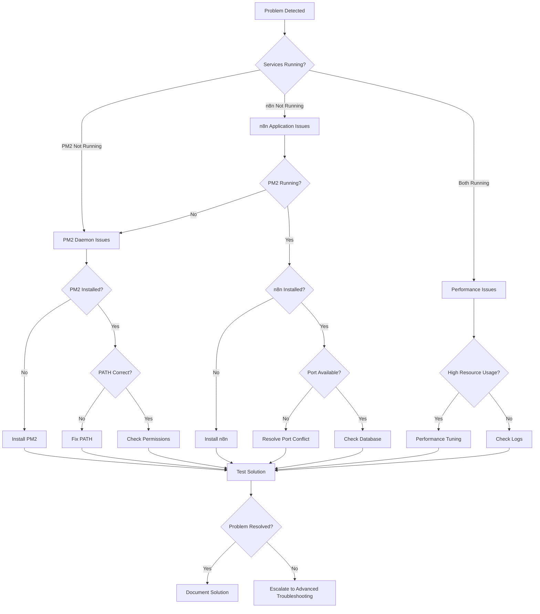

# PM2 Auto-Startup Troubleshooting Master Guide

**Version:** 1.0.0  
**Last Updated:** 2025-08-01  
**Scope:** Comprehensive troubleshooting cho StrangematicHub PM2 Auto-Startup Solution  

## Tổng Quan

Tài liệu này cung cấp hướng dẫn troubleshooting toàn diện cho tất cả các vấn đề có thể xảy ra với PM2 Auto-Startup Solution. Bao gồm error codes, diagnostic procedures, recovery workflows, và emergency procedures.

## Quick Diagnostic Commands

### Essential Status Checks
```powershell
# Import module và check status
cd C:\Github\n8n-tp\scripts
Import-Module .\StrangematicPM2Management.psm1 -Force

# Quick health check
Invoke-HealthCheck

# Individual service status
Get-PM2Status
Get-N8NStatus

# Task scheduler status
Get-ScheduledTask -TaskName "*StrangematicHub*"
```

### Emergency Recovery Commands
```powershell
# Emergency service restart
Reset-PM2
Start-Sleep -Seconds 10
Start-PM2Daemon
Start-N8NApplication

# Task scheduler reset
.\install-pm2-autostart.ps1 -Uninstall
.\install-pm2-autostart.ps1 -Force
```

## Error Code Reference

### System Error Codes

| Error Code | Description | Severity | Category |
|------------|-------------|----------|----------|
| **1033** | Service did not respond to start/control request | Critical | Windows Service |
| **1053** | Service did not respond in timely fashion | High | Windows Service |
| **2** | System cannot find file specified | High | File System |
| **5** | Access denied | High | Permissions |
| **87** | Parameter is incorrect | Medium | Configuration |
| **1056** | Instance of service is already running | Low | Service State |

### PM2 Error Codes

| Error Code | Description | Common Cause | Solution |
|------------|-------------|--------------|----------|
| **ENOENT** | PM2 executable not found | PATH issue | Reinstall PM2, check PATH |
| **EACCES** | Permission denied | File permissions | Run as Administrator |
| **EADDRINUSE** | Port already in use | Port conflict | Check port 5678, kill conflicting process |
| **ESRCH** | No such process | PM2 daemon not running | Start PM2 daemon |
| **EPERM** | Operation not permitted | Insufficient privileges | Run with elevated privileges |

### n8n Error Codes

| Error Code | Description | Common Cause | Solution |
|------------|-------------|--------------|----------|
| **ECONNREFUSED** | Connection refused | Database not available | Check PostgreSQL connection |
| **ENOTFOUND** | Module not found | Missing dependencies | Run `npm install -g n8n` |
| **EADDRINUSE** | Address already in use | Port 5678 occupied | Change port or kill process |
| **ETIMEDOUT** | Connection timeout | Network issues | Check network connectivity |

## Troubleshooting Decision Tree



## Category 1: Installation và Setup Issues

### Issue 1.1: Task Scheduler Tasks Not Created

**Symptoms:**
```
ERROR: Scheduled task creation failed
Access denied when creating scheduled task
```

**Diagnostic Steps:**
```powershell
# Check if running as Administrator
$CurrentPrincipal = New-Object Security.Principal.WindowsPrincipal([Security.Principal.WindowsIdentity]::GetCurrent())
$IsAdmin = $CurrentPrincipal.IsInRole([Security.Principal.WindowsBuiltInRole]::Administrator)
Write-Host "Running as Administrator: $IsAdmin"

# Check Task Scheduler service
Get-Service -Name "Schedule" | Select-Object Status, StartType

# Check existing tasks
Get-ScheduledTask -TaskName "*StrangematicHub*" -ErrorAction SilentlyContinue
```

**Solutions:**
1. **Run PowerShell as Administrator**
   ```powershell
   # Right-click PowerShell → "Run as Administrator"
   ```

2. **Check Task Scheduler Service**
   ```powershell
   # Start Task Scheduler service if stopped
   Start-Service -Name "Schedule"
   Set-Service -Name "Schedule" -StartupType Automatic
   ```

3. **Manual Task Creation**
   ```powershell
   # Force reinstall tasks
   cd C:\Github\n8n-tp\scripts
   .\install-pm2-autostart.ps1 -Uninstall
   .\install-pm2-autostart.ps1 -Force
   ```

4. **Group Policy Check**
   ```powershell
   # Check if Group Policy blocks task creation
   # Run: gpedit.msc → Computer Configuration → Windows Settings → Security Settings → Local Policies → User Rights Assignment
   ```

### Issue 1.2: PowerShell Execution Policy Restrictions

**Symptoms:**
```
Execution of scripts is disabled on this system
File cannot be loaded because running scripts is disabled
```

**Diagnostic Steps:**
```powershell
# Check current execution policy
Get-ExecutionPolicy -List

# Check if scripts are signed
Get-AuthenticodeSignature "C:\Github\n8n-tp\scripts\*.ps1"
```

**Solutions:**
1. **Set Execution Policy**
   ```powershell
   # For current user
   Set-ExecutionPolicy -ExecutionPolicy RemoteSigned -Scope CurrentUser
   
   # For local machine (requires Administrator)
   Set-ExecutionPolicy -ExecutionPolicy RemoteSigned -Scope LocalMachine
   ```

2. **Bypass for Specific Scripts**
   ```powershell
   # Run with bypass
   PowerShell.exe -ExecutionPolicy Bypass -File "script.ps1"
   ```

3. **Unblock Downloaded Files**
   ```powershell
   # Unblock all scripts
   Get-ChildItem "C:\Github\n8n-tp\scripts\*.ps1" | Unblock-File
   ```

### Issue 1.3: Missing Dependencies

**Symptoms:**
```
Node.js not found
PM2 executable not found
n8n command not recognized
```

**Diagnostic Steps:**
```powershell
# Check Node.js
node --version
npm --version

# Check PM2
pm2 --version
pm2 list

# Check n8n
n8n --version

# Check PATH environment variable
$env:PATH -split ';' | Where-Object { $_ -like "*node*" -or $_ -like "*npm*" }
```

**Solutions:**
1. **Install Node.js**
   ```powershell
   # Download from https://nodejs.org/
   # Install LTS version
   # Verify installation
   node --version
   npm --version
   ```

2. **Install PM2**
   ```powershell
   # Install globally
   npm install -g pm2
   
   # Verify installation
   pm2 --version
   pm2 startup
   ```

3. **Install n8n**
   ```powershell
   # Install globally
   npm install -g n8n
   
   # Verify installation
   n8n --version
   ```

4. **Fix PATH Issues**
   ```powershell
   # Get npm global path
   $npmPath = npm config get prefix
   
   # Add to PATH if missing
   $currentPath = [Environment]::GetEnvironmentVariable("PATH", "Machine")
   if ($currentPath -notlike "*$npmPath*") {
       [Environment]::SetEnvironmentVariable("PATH", "$currentPath;$npmPath", "Machine")
   }
   ```

## Category 2: Service Startup Issues

### Issue 2.1: PM2 Daemon Won't Start

**Symptoms:**
```
PM2 daemon is not running
PM2 ping failed
Error: PM2 not responding
```

**Diagnostic Steps:**
```powershell
# Check PM2 status
pm2 ping
pm2 list
pm2 status

# Check for PM2 processes
Get-Process -Name "*pm2*" -ErrorAction SilentlyContinue

# Check PM2 logs
pm2 logs --lines 50
```

**Solutions:**
1. **Kill và Restart PM2**
   ```powershell
   # Kill all PM2 processes
   pm2 kill
   
   # Wait and restart
   Start-Sleep -Seconds 5
   pm2 ping
   ```

2. **Clear PM2 Configuration**
   ```powershell
   # Clear PM2 dump file
   pm2 kill
   Remove-Item "$env:USERPROFILE\.pm2\dump.pm2" -ErrorAction SilentlyContinue
   
   # Restart PM2
   pm2 ping
   ```

3. **Check File Permissions**
   ```powershell
   # Check PM2 directory permissions
   $pm2Dir = "$env:USERPROFILE\.pm2"
   if (Test-Path $pm2Dir) {
       Get-Acl $pm2Dir | Format-List
   }
   
   # Fix permissions if needed
   icacls $pm2Dir /grant "$env:USERNAME:(OI)(CI)F" /T
   ```

4. **Reinstall PM2**
   ```powershell
   # Uninstall và reinstall PM2
   npm uninstall -g pm2
   npm install -g pm2
   pm2 startup
   ```

### Issue 2.2: n8n Application Won't Start

**Symptoms:**
```
n8n application failed to start
Error 1033: Service did not respond
n8n process exits immediately
```

**Diagnostic Steps:**
```powershell
# Check if PM2 is running
Get-PM2Status

# Check n8n process in PM2
pm2 list
pm2 show n8n

# Check n8n logs
pm2 logs n8n --lines 50

# Test n8n manually
n8n start --tunnel
```

**Solutions:**
1. **Check PM2 Daemon First**
   ```powershell
   # Ensure PM2 is running
   $pm2Status = Get-PM2Status
   if (-not $pm2Status.IsRunning) {
       Start-PM2Daemon
       Start-Sleep -Seconds 5
   }
   ```

2. **Port Conflict Resolution**
   ```powershell
   # Check if port 5678 is in use
   Get-NetTCPConnection -LocalPort 5678 -ErrorAction SilentlyContinue
   
   # Kill process using port 5678
   $process = Get-NetTCPConnection -LocalPort 5678 -ErrorAction SilentlyContinue
   if ($process) {
       Stop-Process -Id $process.OwningProcess -Force
   }
   ```

3. **Database Connection Issues**
   ```powershell
   # Test PostgreSQL connection
   Test-NetConnection -ComputerName localhost -Port 5432
   
   # Check n8n database configuration
   $env:DB_TYPE = "postgresdb"
   $env:DB_POSTGRESDB_HOST = "localhost"
   $env:DB_POSTGRESDB_PORT = "5432"
   ```

4. **Environment Variables**
   ```powershell
   # Set required environment variables
   [Environment]::SetEnvironmentVariable("N8N_HOST", "0.0.0.0", "Machine")
   [Environment]::SetEnvironmentVariable("N8N_PORT", "5678", "Machine")
   [Environment]::SetEnvironmentVariable("N8N_PROTOCOL", "http", "Machine")
   [Environment]::SetEnvironmentVariable("WEBHOOK_URL", "http://strangematic.com", "Machine")
   ```

5. **Manual n8n Start Test**
   ```powershell
   # Test n8n startup manually
   cd C:\Github\n8n-tp
   n8n start --tunnel
   
   # If successful, restart via PM2
   pm2 stop n8n
   pm2 start n8n
   ```

### Issue 2.3: Services Start But Crash Immediately

**Symptoms:**
```
Services start successfully but exit within seconds
PM2 shows "errored" status
High restart count in PM2
```

**Diagnostic Steps:**
```powershell
# Check PM2 process details
pm2 monit
pm2 show n8n

# Check error logs
pm2 logs n8n --err --lines 50

# Check system event logs
Get-WinEvent -LogName Application -MaxEvents 50 | Where-Object { $_.ProviderName -eq "StrangematicHub" }
```

**Solutions:**
1. **Memory Issues**
   ```powershell
   # Check available memory
   Get-WmiObject -Class Win32_OperatingSystem | Select-Object TotalVisibleMemorySize, FreePhysicalMemory
   
   # Set PM2 memory limit
   pm2 set pm2:max-memory-restart 1G
   ```

2. **Configuration Issues**
   ```powershell
   # Reset n8n configuration
   pm2 stop n8n
   pm2 delete n8n
   
   # Restart with clean configuration
   Start-N8NApplication
   ```

3. **Dependency Issues**
   ```powershell
   # Reinstall n8n dependencies
   npm install -g n8n --force
   
   # Clear npm cache
   npm cache clean --force
   ```

## Category 3: Task Scheduler Issues

### Issue 3.1: Tasks Exist But Don't Execute

**Symptoms:**
```
Scheduled tasks are created but never run
Task shows "Ready" but last run time is "Never"
Task history shows no execution attempts
```

**Diagnostic Steps:**
```powershell
# Check task status
Get-ScheduledTask -TaskName "StrangematicHub-PM2-AutoStart" | Get-ScheduledTaskInfo

# Check task triggers
$task = Get-ScheduledTask -TaskName "StrangematicHub-PM2-AutoStart"
$task.Triggers

# Check task history
Get-WinEvent -LogName "Microsoft-Windows-TaskScheduler/Operational" -MaxEvents 50
```

**Solutions:**
1. **Enable Task**
   ```powershell
   # Enable disabled tasks
   Enable-ScheduledTask -TaskName "StrangematicHub-PM2-AutoStart"
   Enable-ScheduledTask -TaskName "StrangematicHub-PM2-HealthMonitor"
   ```

2. **Fix Task Triggers**
   ```powershell
   # Recreate tasks with proper triggers
   .\install-pm2-autostart.ps1 -Uninstall
   .\install-pm2-autostart.ps1 -Force
   ```

3. **Check Task Account**
   ```powershell
   # Verify task runs as SYSTEM
   $task = Get-ScheduledTask -TaskName "StrangematicHub-PM2-AutoStart"
   Write-Host "Task runs as: $($task.Principal.UserId)"
   
   # Should be "S-1-5-18" (SYSTEM)
   ```

4. **Manual Task Test**
   ```powershell
   # Test task manually
   Start-ScheduledTask -TaskName "StrangematicHub-PM2-AutoStart"
   
   # Check execution result
   Get-ScheduledTask -TaskName "StrangematicHub-PM2-AutoStart" | Get-ScheduledTaskInfo
   ```

### Issue 3.2: Tasks Execute But Fail

**Symptoms:**
```
Task shows last result: 0x1 (failure)
Task executes but services don't start
Error messages in task history
```

**Diagnostic Steps:**
```powershell
# Check task execution logs
Get-WinEvent -LogName "Microsoft-Windows-TaskScheduler/Operational" | Where-Object { $_.TaskDisplayName -like "*StrangematicHub*" }

# Check application event logs
Get-WinEvent -LogName Application | Where-Object { $_.ProviderName -eq "StrangematicHub" }

# Manual script execution test
PowerShell.exe -NoProfile -ExecutionPolicy Bypass -File "C:\Github\n8n-tp\scripts\pm2-auto-startup.ps1"
```

**Solutions:**
1. **Script Path Issues**
   ```powershell
   # Verify script paths in task actions
   $task = Get-ScheduledTask -TaskName "StrangematicHub-PM2-AutoStart"
   $task.Actions
   
   # Update paths if incorrect
   $action = New-ScheduledTaskAction -Execute "PowerShell.exe" -Argument "-NoProfile -ExecutionPolicy Bypass -File `"C:\Github\n8n-tp\scripts\pm2-auto-startup.ps1`""
   Set-ScheduledTask -TaskName "StrangematicHub-PM2-AutoStart" -Action $action
   ```

2. **Working Directory Issues**
   ```powershell
   # Set correct working directory
   $action = New-ScheduledTaskAction -Execute "PowerShell.exe" -Argument "-NoProfile -ExecutionPolicy Bypass -File `"C:\Github\n8n-tp\scripts\pm2-auto-startup.ps1`"" -WorkingDirectory "C:\Github\n8n-tp\scripts"
   Set-ScheduledTask -TaskName "StrangematicHub-PM2-AutoStart" -Action $action
   ```

3. **Environment Variables**
   ```powershell
   # Ensure SYSTEM account has access to required environment variables
   # Check PATH for Node.js và npm
   ```

4. **Permissions Issues**
   ```powershell
   # Check script file permissions
   Get-Acl "C:\Github\n8n-tp\scripts\pm2-auto-startup.ps1"
   
   # Grant SYSTEM account read access
   icacls "C:\Github\n8n-tp\scripts\pm2-auto-startup.ps1" /grant "SYSTEM:R"
   ```

## Category 4: Performance và Resource Issues

### Issue 4.1: High CPU Usage

**Symptoms:**
```
System becomes slow after PM2/n8n startup
High CPU usage by Node.js processes
System responsiveness issues
```

**Diagnostic Steps:**
```powershell
# Check CPU usage
Get-WmiObject -Class Win32_Processor | Measure-Object -Property LoadPercentage -Average

# Check process CPU usage
Get-Process -Name "node" | Select-Object ProcessName, CPU, WorkingSet

# Check PM2 process details
pm2 monit
```

**Solutions:**
1. **Limit PM2 Resources**
   ```powershell
   # Set CPU limit for n8n
   pm2 stop n8n
   pm2 start n8n --max-cpu 50
   
   # Set memory limit
   pm2 set pm2:max-memory-restart 1G
   ```

2. **Optimize n8n Configuration**
   ```powershell
   # Set n8n environment variables for performance
   [Environment]::SetEnvironmentVariable("N8N_DISABLE_PRODUCTION_MAIN_PROCESS", "true", "Machine")
   [Environment]::SetEnvironmentVariable("NODE_OPTIONS", "--max-old-space-size=2048", "Machine")
   ```

3. **Check for Runaway Processes**
   ```powershell
   # Find high CPU processes
   Get-Process | Sort-Object CPU -Descending | Select-Object -First 10
   
   # Kill problematic processes if needed
   Stop-Process -Name "problematic-process" -Force
   ```

### Issue 4.2: Memory Leaks

**Symptoms:**
```
Memory usage continuously increases
System runs out of memory over time
PM2 processes consume excessive RAM
```

**Diagnostic Steps:**
```powershell
# Monitor memory usage over time
Get-Process -Name "node" | Select-Object ProcessName, WorkingSet, VirtualMemorySize

# Check system memory
Get-WmiObject -Class Win32_OperatingSystem | Select-Object TotalVisibleMemorySize, FreePhysicalMemory

# PM2 memory monitoring
pm2 monit
```

**Solutions:**
1. **Enable Memory Restart**
   ```powershell
   # Set automatic restart on memory limit
   pm2 set pm2:max-memory-restart 1G
   pm2 restart n8n
   ```

2. **Regular Restarts**
   ```powershell
   # Schedule regular n8n restarts
   pm2 set pm2:cron-restart "0 2 * * *"  # Restart at 2 AM daily
   ```

3. **Memory Optimization**
   ```powershell
   # Optimize Node.js memory settings
   [Environment]::SetEnvironmentVariable("NODE_OPTIONS", "--max-old-space-size=2048 --optimize-for-size", "Machine")
   ```

## Category 5: Network và Connectivity Issues

### Issue 5.1: Port Conflicts

**Symptoms:**
```
Error: listen EADDRINUSE :::5678
Port 5678 is already in use
n8n web interface not accessible
```

**Diagnostic Steps:**
```powershell
# Check what's using port 5678
Get-NetTCPConnection -LocalPort 5678 -ErrorAction SilentlyContinue

# Find process using the port
netstat -ano | findstr :5678

# Check n8n configuration
$env:N8N_PORT
```

**Solutions:**
1. **Kill Conflicting Process**
   ```powershell
   # Find và kill process using port 5678
   $connection = Get-NetTCPConnection -LocalPort 5678 -ErrorAction SilentlyContinue
   if ($connection) {
       Stop-Process -Id $connection.OwningProcess -Force
   }
   ```

2. **Change n8n Port**
   ```powershell
   # Set different port for n8n
   [Environment]::SetEnvironmentVariable("N8N_PORT", "5679", "Machine")
   
   # Restart n8n
   Restart-N8NApplication
   ```

3. **Check Firewall Rules**
   ```powershell
   # Check Windows Firewall
   Get-NetFirewallRule | Where-Object { $_.DisplayName -like "*5678*" }
   
   # Create firewall rule if needed
   New-NetFirewallRule -DisplayName "n8n" -Direction Inbound -Protocol TCP -LocalPort 5678 -Action Allow
   ```

### Issue 5.2: Database Connection Issues

**Symptoms:**
```
Error: connect ECONNREFUSED 127.0.0.1:5432
Database connection failed
n8n cannot connect to PostgreSQL
```

**Diagnostic Steps:**
```powershell
# Test PostgreSQL connection
Test-NetConnection -ComputerName localhost -Port 5432

# Check PostgreSQL service
Get-Service -Name "*postgresql*"

# Check n8n database configuration
Get-ChildItem Env: | Where-Object { $_.Name -like "*DB*" }
```

**Solutions:**
1. **Start PostgreSQL Service**
   ```powershell
   # Find và start PostgreSQL service
   $pgService = Get-Service -Name "*postgresql*" | Select-Object -First 1
   if ($pgService -and $pgService.Status -ne "Running") {
       Start-Service $pgService.Name
   }
   ```

2. **Configure Database Connection**
   ```powershell
   # Set database environment variables
   [Environment]::SetEnvironmentVariable("DB_TYPE", "postgresdb", "Machine")
   [Environment]::SetEnvironmentVariable("DB_POSTGRESDB_HOST", "localhost", "Machine")
   [Environment]::SetEnvironmentVariable("DB_POSTGRESDB_PORT", "5432", "Machine")
   [Environment]::SetEnvironmentVariable("DB_POSTGRESDB_DATABASE", "n8n", "Machine")
   [Environment]::SetEnvironmentVariable("DB_POSTGRESDB_USER", "n8n", "Machine")
   ```

3. **Use SQLite Instead**
   ```powershell
   # Switch to SQLite for simpler setup
   [Environment]::SetEnvironmentVariable("DB_TYPE", "sqlite", "Machine")
   [Environment]::SetEnvironmentVariable("DB_SQLITE_DATABASE", "C:\ProgramData\n8n\database.sqlite", "Machine")
   ```

## Category 6: Logging và Monitoring Issues

### Issue 6.1: Missing Log Files

**Symptoms:**
```
Log files not created
Empty log directories
No logging output from scripts
```

**Diagnostic Steps:**
```powershell
# Check log directory
Test-Path "C:\ProgramData\StrangematicHub\Logs"
Get-ChildItem "C:\ProgramData\StrangematicHub\Logs" -ErrorAction SilentlyContinue

# Check directory permissions
Get-Acl "C:\ProgramData\StrangematicHub\Logs"

# Test logging manually
Write-EventLog -LogName Application -Source "StrangematicHub" -EventId 1000 -Message "Test log entry"
```

**Solutions:**
1. **Create Log Directory**
   ```powershell
   # Create log directory with proper permissions
   New-Item -Path "C:\ProgramData\StrangematicHub\Logs" -ItemType Directory -Force
   
   # Set permissions for SYSTEM account
   icacls "C:\ProgramData\StrangematicHub\Logs" /grant "SYSTEM:(OI)(CI)F"
   ```

2. **Create Event Log Source**
   ```powershell
   # Create event log source as Administrator
   New-EventLog -LogName Application -Source "StrangematicHub"
   ```

3. **Fix Script Logging**
   ```powershell
   # Verify scripts have logging enabled
   # Check if log paths are correct in scripts
   ```

### Issue 6.2: Health Monitor Not Working

**Symptoms:**
```
Health monitor task exists but not executing
No health monitor logs generated
Health checks not running automatically
```

**Diagnostic Steps:**
```powershell
# Check health monitor task
Get-ScheduledTask -TaskName "StrangematicHub-PM2-HealthMonitor" | Get-ScheduledTaskInfo

# Test health monitor manually
cd C:\Github\n8n-tp\scripts
.\pm2-health-monitor.ps1 -RunOnce

# Check task triggers
$task = Get-ScheduledTask -TaskName "StrangematicHub-PM2-HealthMonitor"
$task.Triggers
```

**Solutions:**
1. **Fix Task Triggers**
   ```powershell
   # Recreate health monitor task
   Unregister-ScheduledTask -TaskName "StrangematicHub-PM2-HealthMonitor" -Confirm:$false
   
   # Reinstall with correct triggers
   .\install-pm2-autostart.ps1 -Force
   ```

2. **Manual Health Monitor Test**
   ```powershell
   # Test health monitor script
   PowerShell.exe -NoProfile -ExecutionPolicy Bypass -File "C:\Github\n8n-tp\scripts\pm2-health-monitor.ps1" -RunOnce
   ```

3. **Check Script Permissions**
   ```powershell
   # Ensure SYSTEM can execute health monitor
   icacls "C:\Github\n8n-tp\scripts\pm2-health-monitor.ps1" /grant "SYSTEM:RX"
   ```

## Emergency Recovery Procedures

### Emergency Procedure 1: Complete System Reset

**When to Use:** All services are down, multiple failures, system in unknown state

```powershell
Write-Host "=== EMERGENCY SYSTEM RESET ===" -ForegroundColor Red
Write-Host "This will stop all services and restart them" -ForegroundColor Yellow

# Step 1: Kill all PM2 processes
Write-Host "1. Killing PM2 processes..." -ForegroundColor Cyan
pm2 kill
Get-Process -Name "*pm2*" -ErrorAction SilentlyContinue | Stop-Process -Force

# Step 2: Stop any remaining n8n processes
Write-Host "2. Stopping n8n processes..." -ForegroundColor Cyan
Get-Process -Name "node" -ErrorAction SilentlyContinue | Where-Object { $_.CommandLine -like "*n8n*" } | Stop-Process -Force

# Step 3: Clear PM2 logs và cache
Write-Host "3. Clearing PM2 logs..." -ForegroundColor Cyan
pm2 flush
Remove-Item "$env:USERPROFILE\.pm2\dump.pm2" -ErrorAction SilentlyContinue

# Step 4: Wait for cleanup
Write-Host "4. Waiting for cleanup..." -ForegroundColor Cyan
Start-Sleep -Seconds 10

# Step 5: Restart services
Write-Host "5. Restarting services..." -ForegroundColor Cyan
cd C:\Github\n8n-tp\scripts
Import-Module .\StrangematicPM2Management.psm1 -Force
Start-PM2Daemon
Start-Sleep -Seconds 5
Start-N8NApplication

# Step 6: Verify
Write-Host "6. Verifying system..." -ForegroundColor Cyan
Start-Sleep -Seconds 15
$health = Invoke-HealthCheck
Write-Host "System Status: $($health.Overall)" -ForegroundColor $(if($health.Overall -eq "Healthy") {"Green"} else {"Red"})
```

### Emergency Procedure 2: Task Scheduler Reset

**When to Use:** Tasks not executing, task configuration corrupted

```powershell
Write-Host "=== TASK SCHEDULER RESET ===" -ForegroundColor Yellow

# Step 1: Remove existing tasks
Write-Host "1. Removing existing tasks..." -ForegroundColor Cyan
Unregister-ScheduledTask -TaskName "StrangematicHub-PM2-AutoStart" -Confirm:$false -ErrorAction SilentlyContinue
Unregister-ScheduledTask -TaskName "StrangematicHub-PM2-HealthMonitor" -Confirm:$false -ErrorAction SilentlyContinue

# Step 2: Clean event log source
Write-Host "2. Cleaning event log source..." -ForegroundColor Cyan
Remove-EventLog -Source "StrangematicHub" -ErrorAction SilentlyContinue

# Step 3: Recreate tasks
Write-Host "3. Recreating tasks..." -ForegroundColor Cyan
cd C:\Github\n8n-tp\scripts
.\install-pm2-autostart.ps1 -Force

# Step 4: Verify tasks
Write-Host "4. Verifying tasks..." -ForegroundColor Cyan
Get-ScheduledTask -TaskName "*StrangematicHub*" | Select-Object TaskName, State
```

### Emergency Procedure 3: Complete Reinstallation

**When to Use:** Multiple component failures, corrupted installation

```powershell
Write-Host "=== COMPLETE
REINSTALLATION ===" -ForegroundColor Red
Write-Host "This will remove and reinstall the entire solution" -ForegroundColor Yellow

# Step 1: Stop all services
Write-Host "1. Stopping all services..." -ForegroundColor Cyan
pm2 kill
Get-Process -Name "node" -ErrorAction SilentlyContinue | Stop-Process -Force

# Step 2: Remove scheduled tasks
Write-Host "2. Removing scheduled tasks..." -ForegroundColor Cyan
cd C:\Github\n8n-tp\scripts
.\install-pm2-autostart.ps1 -Uninstall

# Step 3: Clean directories
Write-Host "3. Cleaning directories..." -ForegroundColor Cyan
Remove-Item "C:\ProgramData\StrangematicHub" -Recurse -Force -ErrorAction SilentlyContinue
Remove-Item "$env:USERPROFILE\.pm2" -Recurse -Force -ErrorAction SilentlyContinue

# Step 4: Reinstall dependencies
Write-Host "4. Reinstalling dependencies..." -ForegroundColor Cyan
npm install -g pm2 --force
npm install -g n8n --force

# Step 5: Reinstall solution
Write-Host "5. Reinstalling solution..." -ForegroundColor Cyan
.\install-pm2-autostart.ps1 -Force

# Step 6: Test installation
Write-Host "6. Testing installation..." -ForegroundColor Cyan
.\test-pm2-autostart.ps1 -SkipInteractive
```

## Diagnostic Tools và Scripts

### Quick Diagnostic Script

Tạo script để chạy tất cả diagnostic checks:

```powershell
# Save as: quick-diagnostic.ps1
Write-Host "=== PM2 AUTO-STARTUP QUICK DIAGNOSTIC ===" -ForegroundColor Cyan

# Import module
try {
    Import-Module "C:\Github\n8n-tp\scripts\StrangematicPM2Management.psm1" -Force
    Write-Host "✓ Module imported successfully" -ForegroundColor Green
} catch {
    Write-Host "✗ Module import failed: $_" -ForegroundColor Red
}

# Check dependencies
Write-Host "`n--- Dependencies Check ---" -ForegroundColor Yellow
@("node", "pm2", "n8n") | ForEach-Object {
    try {
        $version = & $_ --version 2>$null
        if ($LASTEXITCODE -eq 0) {
            Write-Host "✓ $_`: $version" -ForegroundColor Green
        } else {
            Write-Host "✗ $_`: Not found" -ForegroundColor Red
        }
    } catch {
        Write-Host "✗ $_`: Error checking" -ForegroundColor Red
    }
}

# Check services
Write-Host "`n--- Services Check ---" -ForegroundColor Yellow
try {
    $pm2Status = Get-PM2Status
    Write-Host "PM2 Daemon: $($pm2Status.IsRunning)" -ForegroundColor $(if($pm2Status.IsRunning) {"Green"} else {"Red"})
    
    $n8nStatus = Get-N8NStatus
    Write-Host "n8n Application: $($n8nStatus.IsRunning)" -ForegroundColor $(if($n8nStatus.IsRunning) {"Green"} else {"Red"})
} catch {
    Write-Host "✗ Service check failed: $_" -ForegroundColor Red
}

# Check scheduled tasks
Write-Host "`n--- Scheduled Tasks Check ---" -ForegroundColor Yellow
@("StrangematicHub-PM2-AutoStart", "StrangematicHub-PM2-HealthMonitor") | ForEach-Object {
    $task = Get-ScheduledTask -TaskName $_ -ErrorAction SilentlyContinue
    if ($task) {
        Write-Host "✓ $_`: $($task.State)" -ForegroundColor $(if($task.State -eq "Ready") {"Green"} else {"Yellow"})
    } else {
        Write-Host "✗ $_`: Not found" -ForegroundColor Red
    }
}

# Check ports
Write-Host "`n--- Port Check ---" -ForegroundColor Yellow
$port5678 = Get-NetTCPConnection -LocalPort 5678 -ErrorAction SilentlyContinue
if ($port5678) {
    Write-Host "✓ Port 5678: In use (Process: $($port5678.OwningProcess))" -ForegroundColor Green
} else {
    Write-Host "⚠ Port 5678: Available" -ForegroundColor Yellow
}

# Health check
Write-Host "`n--- Health Check ---" -ForegroundColor Yellow
try {
    $health = Invoke-HealthCheck
    Write-Host "Overall Status: $($health.Overall)" -ForegroundColor $(
        switch ($health.Overall) {
            "Healthy" { "Green" }
            "Warning" { "Yellow" }
            "Critical" { "Red" }
            default { "White" }
        }
    )
    
    if ($health.Issues.Count -gt 0) {
        Write-Host "Issues:" -ForegroundColor Red
        $health.Issues | ForEach-Object { Write-Host "  • $_" -ForegroundColor Red }
    }
} catch {
    Write-Host "✗ Health check failed: $_" -ForegroundColor Red
}

Write-Host "`n=== DIAGNOSTIC COMPLETED ===" -ForegroundColor Cyan
```

### Log Analysis Script

```powershell
# Save as: analyze-logs.ps1
param(
    [int]$Hours = 24,
    [switch]$ShowErrors,
    [switch]$ShowWarnings
)

Write-Host "=== LOG ANALYSIS (Last $Hours hours) ===" -ForegroundColor Cyan

$LogPath = "C:\ProgramData\StrangematicHub\Logs"
$Since = (Get-Date).AddHours(-$Hours)

if (-not (Test-Path $LogPath)) {
    Write-Host "✗ Log directory not found: $LogPath" -ForegroundColor Red
    exit 1
}

# Analyze auto-startup logs
$StartupLogs = Get-ChildItem "$LogPath\pm2-auto-startup-*.log" | Where-Object { $_.LastWriteTime -gt $Since }
Write-Host "`n--- Auto-Startup Logs ---" -ForegroundColor Yellow
if ($StartupLogs) {
    foreach ($log in $StartupLogs) {
        Write-Host "File: $($log.Name)" -ForegroundColor Cyan
        $content = Get-Content $log.FullName
        
        if ($ShowErrors) {
            $errors = $content | Where-Object { $_ -like "*ERROR*" -or $_ -like "*FAIL*" }
            if ($errors) {
                Write-Host "  Errors:" -ForegroundColor Red
                $errors | ForEach-Object { Write-Host "    $_" -ForegroundColor Red }
            }
        }
        
        if ($ShowWarnings) {
            $warnings = $content | Where-Object { $_ -like "*WARNING*" -or $_ -like "*WARN*" }
            if ($warnings) {
                Write-Host "  Warnings:" -ForegroundColor Yellow
                $warnings | ForEach-Object { Write-Host "    $_" -ForegroundColor Yellow }
            }
        }
        
        $successCount = ($content | Where-Object { $_ -like "*SUCCESS*" }).Count
        $errorCount = ($content | Where-Object { $_ -like "*ERROR*" -or $_ -like "*FAIL*" }).Count
        Write-Host "  Summary: $successCount successes, $errorCount errors" -ForegroundColor White
    }
} else {
    Write-Host "  No recent startup logs found" -ForegroundColor Yellow
}

# Analyze health monitor logs
$HealthLogs = Get-ChildItem "$LogPath\pm2-health-monitor-*.log" | Where-Object { $_.LastWriteTime -gt $Since }
Write-Host "`n--- Health Monitor Logs ---" -ForegroundColor Yellow
if ($HealthLogs) {
    foreach ($log in $HealthLogs) {
        Write-Host "File: $($log.Name)" -ForegroundColor Cyan
        $content = Get-Content $log.FullName
        
        $healthyCount = ($content | Where-Object { $_ -like "*Healthy*" }).Count
        $criticalCount = ($content | Where-Object { $_ -like "*Critical*" }).Count
        $warningCount = ($content | Where-Object { $_ -like "*Warning*" }).Count
        
        Write-Host "  Health Status: $healthyCount healthy, $warningCount warnings, $criticalCount critical" -ForegroundColor White
    }
} else {
    Write-Host "  No recent health monitor logs found" -ForegroundColor Yellow
}

# Check Windows Event Logs
Write-Host "`n--- Windows Event Logs ---" -ForegroundColor Yellow
try {
    $events = Get-WinEvent -LogName Application -MaxEvents 100 | Where-Object { 
        $_.ProviderName -eq "StrangematicHub" -and $_.TimeCreated -gt $Since 
    }
    
    if ($events) {
        $infoCount = ($events | Where-Object { $_.LevelDisplayName -eq "Information" }).Count
        $warningCount = ($events | Where-Object { $_.LevelDisplayName -eq "Warning" }).Count
        $errorCount = ($events | Where-Object { $_.LevelDisplayName -eq "Error" }).Count
        
        Write-Host "  Event Summary: $infoCount info, $warningCount warnings, $errorCount errors" -ForegroundColor White
        
        if ($ShowErrors -and $errorCount -gt 0) {
            Write-Host "  Recent Errors:" -ForegroundColor Red
            $events | Where-Object { $_.LevelDisplayName -eq "Error" } | Select-Object -First 5 | ForEach-Object {
                Write-Host "    [$($_.TimeCreated)] $($_.Message)" -ForegroundColor Red
            }
        }
    } else {
        Write-Host "  No recent StrangematicHub events found" -ForegroundColor Yellow
    }
} catch {
    Write-Host "  ✗ Cannot access Windows Event Log: $_" -ForegroundColor Red
}

Write-Host "`n=== LOG ANALYSIS COMPLETED ===" -ForegroundColor Cyan
```

## Common Error Patterns và Solutions

### Pattern 1: Intermittent Failures

**Symptoms:** Services work sometimes but fail randomly

**Root Causes:**
- Resource contention
- Network connectivity issues
- Timing issues during startup

**Solutions:**
```powershell
# Increase startup delays
# In pm2-auto-startup.ps1, increase retry delays
$RetryDelaySeconds = 180  # Increase from 120 to 180

# Add more robust health checks
# Implement exponential backoff
```

### Pattern 2: Weekend/Holiday Failures

**Symptoms:** System works during weekdays but fails on weekends

**Root Causes:**
- Scheduled maintenance windows
- Different network configurations
- Backup processes interfering

**Solutions:**
```powershell
# Check for scheduled tasks that might interfere
Get-ScheduledTask | Where-Object { $_.State -eq "Ready" -and $_.TaskName -like "*backup*" }

# Adjust health monitor frequency during maintenance windows
```

### Pattern 3: After Windows Updates

**Symptoms:** System stops working after Windows updates

**Root Causes:**
- Task Scheduler settings reset
- PowerShell execution policy changes
- Service account permissions changed

**Solutions:**
```powershell
# Post-update verification script
Write-Host "=== POST-UPDATE VERIFICATION ===" -ForegroundColor Cyan

# Check execution policy
$execPolicy = Get-ExecutionPolicy
if ($execPolicy -eq "Restricted") {
    Write-Host "⚠ Execution policy reset to Restricted" -ForegroundColor Yellow
    Set-ExecutionPolicy -ExecutionPolicy RemoteSigned -Scope LocalMachine
}

# Verify scheduled tasks
$tasks = Get-ScheduledTask -TaskName "*StrangematicHub*"
if ($tasks.Count -eq 0) {
    Write-Host "⚠ Scheduled tasks missing - reinstalling" -ForegroundColor Yellow
    .\install-pm2-autostart.ps1 -Force
}

# Test system
.\test-pm2-autostart.ps1 -SkipInteractive
```

## Support Escalation Matrix

### Level 1: Self-Service
- Use Quick Start Guide
- Run diagnostic scripts
- Check common issues in this guide
- Use interactive demo for learning

### Level 2: Advanced Troubleshooting
- Run comprehensive test suite
- Analyze logs with provided scripts
- Use emergency recovery procedures
- Check Windows Event Logs

### Level 3: Expert Support
- Contact system administrator
- Provide diagnostic output
- Include log files và test reports
- Document steps taken

### Level 4: Development Support
- Report bugs in solution
- Request feature enhancements
- Provide improvement suggestions
- Contribute to documentation

## Documentation Links

### Primary Resources
- **Master Documentation**: [`../PM2-AutoStart-Complete-Solution.md`](../PM2-AutoStart-Complete-Solution.md)
- **Installation Guide**: [`PM2-AutoStart-Installation-Guide.md`](PM2-AutoStart-Installation-Guide.md)
- **User Guide**: [`PM2-AutoStart-User-Guide.md`](PM2-AutoStart-User-Guide.md)
- **Quick Start**: [`../../QUICK-START-PM2-AUTOSTART.md`](../../QUICK-START-PM2-AUTOSTART.md)

### Tools và Scripts
- **Test Suite**: [`../../scripts/test-pm2-autostart.ps1`](../../scripts/test-pm2-autostart.ps1)
- **Demo Script**: [`../../scripts/demo-pm2-management.ps1`](../../scripts/demo-pm2-management.ps1)
- **Installation Script**: [`../../scripts/install-pm2-autostart.ps1`](../../scripts/install-pm2-autostart.ps1)

### External Resources
- **n8n Community**: https://community.n8n.io/
- **PM2 Documentation**: https://pm2.keymetrics.io/docs/
- **PowerShell Documentation**: https://docs.microsoft.com/powershell/

---

**© 2025 StrangematicHub. All rights reserved.**

**Last Updated**: 2025-08-01 | **Version**: 1.0.0 | **Status**: Production Ready