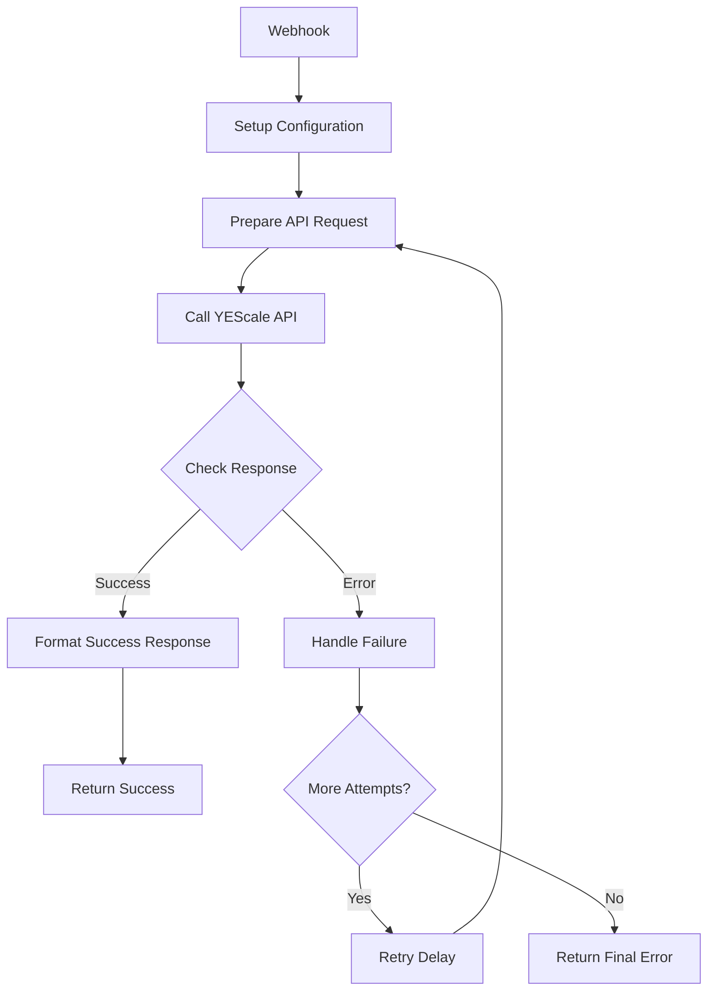

# YEScale API Fallback Workflow Template

## 📋 Tổng quan

Template này cung cấp một workflow n8n hoàn chỉnh để tích hợp với YEScale API với cơ chế fallback thông minh. Khi một model AI fail, workflow sẽ tự động thử các model khác theo thứ tự ưu tiên được cấu hình.

## 🎯 Tính năng chính

- ✅ **Multi-model Fallback**: Tự động thử các model khác khi có lỗi
- ✅ **Group-based Organization**: Tổ chức API keys theo groups (grok, chatgpt, claude)
- ✅ **Intelligent Retry**: Exponential backoff và retry logic
- ✅ **Comprehensive Error Handling**: Xử lý đầy đủ các loại lỗi
- ✅ **Performance Monitoring**: Tracking usage và performance metrics
- ✅ **Flexible Configuration**: Dễ dàng thêm/xóa models và groups

## 📁 Cấu trúc thư mục

```
workflow template/
├── README.md                           # File này
├── YEScale-API-Config.md              # Tài liệu cấu hình API
├── YEScale-Fallback-Workflow.json     # File workflow để import
├── Setup-Guide.md                     # Hướng dẫn cài đặt chi tiết
└── Test-Examples.md                   # Các ví dụ test
```

## 🚀 Quick Start

### 1. Cài đặt nhanh
```bash
# 1. Import workflow vào n8n
# Mở http://localhost:5678 → Import from File → Chọn YEScale-Fallback-Workflow.json

# 2. Cấu hình environment variables
export YESCALE_GROK_API_KEY="your_grok_api_key"
export YESCALE_CHATGPT_API_KEY="your_chatgpt_api_key"
export YESCALE_CLAUDE_API_KEY="your_claude_api_key"

# 3. Activate workflow trong n8n UI
```

### 2. Test nhanh
```bash
curl -X POST http://localhost:5678/webhook/yescale-chat \
  -H "Content-Type: application/json" \
  -d '{"message": "Hello, how are you?"}'
```

## 🏗️ Kiến trúc Workflow



## 📋 Workflow Nodes

| Node | Chức năng |
|------|-----------|
| **Webhook** | Nhận POST requests từ clients |
| **Setup Configuration** | Cấu hình API groups và models |
| **Prepare API Request** | Chuẩn bị request cho model hiện tại |
| **Call YEScale API** | Gọi YEScale API endpoint |
| **Check API Response** | Kiểm tra success/failure |
| **Format Success Response** | Format response khi thành công |
| **Handle Failure** | Xử lý lỗi và chuẩn bị retry |
| **Retry Delay** | Delay giữa các lần retry |
| **Return Success/Error** | Trả response về client |

## 🔧 Cấu hình

### API Groups mặc định:
```javascript
{
  grok: {
    apiKey: '{{$env.YESCALE_GROK_API_KEY}}',
    models: ['grok-3-beta', 'grok-4-0709']
  },
  chatgpt: {
    apiKey: '{{$env.YESCALE_CHATGPT_API_KEY}}',
    models: ['gpt-4o', 'gpt-4o-mini', 'gpt-3.5-turbo']
  },
  claude: {
    apiKey: '{{$env.YESCALE_CLAUDE_API_KEY}}',
    models: ['claude-3-5-sonnet-20241022', 'claude-3-5-haiku-20241022']
  }
}
```

### Fallback sequence:
1. grok-3-beta
2. grok-4-0709
3. gpt-4o
4. gpt-4o-mini
5. gpt-3.5-turbo
6. claude-3-5-sonnet-20241022
7. claude-3-5-haiku-20241022

## 📤 API Usage

### Request Format:
```json
{
  "message": "Your prompt here",
  "temperature": 0.7,
  "max_tokens": 1000
}
```

### Response Format (Success):
```json
{
  "success": true,
  "model_used": "grok-3-beta",
  "group_used": "grok",
  "attempt_number": 1,
  "total_attempts": 7,
  "response": "AI response content...",
  "usage": {
    "prompt_tokens": 10,
    "completion_tokens": 50,
    "total_tokens": 60
  },
  "timestamp": "2025-01-27T00:04:43.000Z"
}
```

### Response Format (Error):
```json
{
  "success": false,
  "error": "All models failed",
  "attempts_made": 7,
  "total_attempts": 7,
  "last_error": "Rate limit exceeded",
  "timestamp": "2025-01-27T00:04:43.000Z"
}
```

## 🧪 Testing

### Basic Test:
```bash
curl -X POST http://localhost:5678/webhook/yescale-chat \
  -H "Content-Type: application/json" \
  -d '{"message": "Explain quantum computing"}'
```

### Fallback Test:
Tạm thời thay API key không hợp lệ để test fallback mechanism.

### Load Test:
Sử dụng script Python trong `Test-Examples.md` để test concurrent requests.

## 📊 Monitoring

### Key Metrics:
- **Response Time**: Thời gian phản hồi trung bình
- **Success Rate**: Tỷ lệ requests thành công
- **Model Usage**: Distribution của các models được sử dụng
- **Fallback Rate**: Tần suất cần fallback
- **Error Types**: Phân loại các lỗi

### Logging:
Workflow logs chi tiết các events qua console.log:
- Failed attempts với lý do
- Retry delays và timings
- Model selection decisions

## 🔒 Security

- ✅ API keys stored in environment variables
- ✅ No API keys exposed in responses
- ✅ Input validation và sanitization
- ✅ Rate limiting considerations
- ✅ Error messages không leak sensitive info

## 🚀 Production Considerations

### Performance:
- **Timeout**: 30s cho mỗi API call
- **Retry Delay**: Exponential backoff (max 5s)
- **Concurrent Requests**: Tested with 10+ concurrent

### Scalability:
- Workflow có thể handle multiple concurrent requests
- Stateless design cho easy horizontal scaling
- Memory usage tối ưu

### Reliability:
- Comprehensive error handling
- Graceful degradation with fallbacks
- Health check endpoint có thể thêm

## 🛠️ Customization

### Thêm Model Group:
```javascript
// Trong Setup Configuration node
anthropic: {
  apiKey: '{{$env.YESCALE_ANTHROPIC_API_KEY}}',
  models: ['claude-3-opus', 'claude-3-sonnet']
}
```

### Custom Response Format:
Chỉnh sửa node "Format Success Response" theo format mong muốn.

### Custom Retry Logic:
Thay đổi exponential backoff trong node "Retry Delay".

## 📚 Tài liệu chi tiết

- **[Setup-Guide.md](Setup-Guide.md)**: Hướng dẫn cài đặt từng bước
- **[YEScale-API-Config.md](YEScale-API-Config.md)**: Chi tiết về YEScale API
- **[Test-Examples.md](Test-Examples.md)**: Các test cases và scripts

## 🐛 Troubleshooting

### Common Issues:

1. **Webhook không hoạt động**
   - Check workflow activated
   - Verify n8n running on correct port
   - Check firewall settings

2. **API Keys invalid**
   - Verify environment variables set correctly
   - Check API key permissions on YEScale
   - Verify quota/limits

3. **All models failing**
   - Check YEScale service status
   - Verify model names are correct
   - Check request format compliance

4. **Slow response times**
   - Review retry delays
   - Optimize model selection order
   - Check network latency

## 📞 Support

### Debug Steps:
1. Check n8n execution logs
2. Verify API keys và quota
3. Test individual models manually
4. Check network connectivity

### Log Analysis:
- Node execution times
- Error messages và types
- Retry patterns
- Model success rates

## 🔄 Updates

### Version History:
- **v1.0**: Initial release với basic fallback
- **v1.1**: Added exponential backoff
- **v1.2**: Improved error handling
- **v1.3**: Added monitoring metrics

### Future Enhancements:
- [ ] Health check endpoint
- [ ] Advanced load balancing
- [ ] Cost optimization features
- [ ] Real-time monitoring dashboard

## 📄 License

This template is provided as-is for educational và commercial use.

---

**Developed for YEScale API Integration**  
**Compatible with n8n version 1.0+**  
**Last updated: January 27, 2025**
